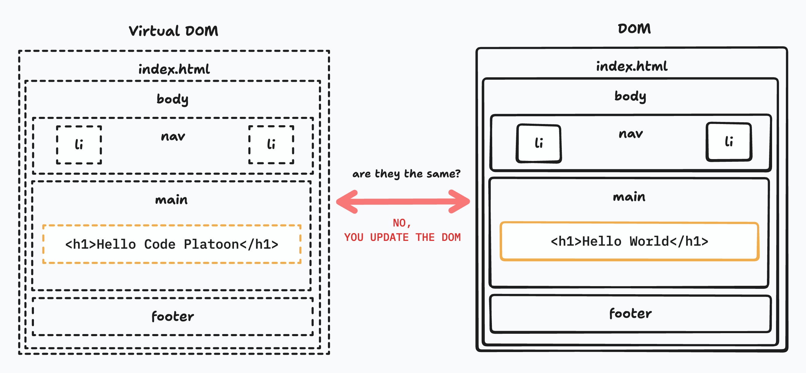

# The useState Hook

## Intro

In this lecture, we introduce the `useState` hook, a fundamental tool in React for managing component state. State allows components to “remember” information between renders and automatically update the UI when that information changes. This is a shift from vanilla DOM manipulation, where developers manually update elements, to letting React handle updates declaratively.

We will enhance our Pokemon Card application by replacing direct DOM manipulation with state management, making the app more maintainable, predictable, and reactive.

---

## The Virtual DOM and the `useState` Hook



React’s Virtual DOM allows the library to efficiently determine what changes need to be applied to the real DOM. The `useState` hook works in tandem with the Virtual DOM: whenever state changes, React recalculates the minimal changes required to update the UI. Unlike manually creating elements with JavaScript, state updates automatically trigger re-renders without needing explicit DOM queries.

This declarative approach ensures the UI always reflects the current state, reducing bugs caused by stale or inconsistent DOM manipulation.

> Think of it as if the `useState` hook is activated then the Virtual DOM will check the DOM

---

## Updating the Pokemon Card Application

We will now refactor our existing Pokemon Card application to use `useState`. The goals are to:

- Track the user input for the Pokemon name.
- Track the list of fetched Pokemon.
- Automatically update the UI whenever state changes.

---

### Creating the `pokemonName` State

The first step is to create state to track the value typed into the input field. We import `useState` from React and initialize it with an empty string.

```jsx
import { useState } from "react";

function App() {
  const [pokemonName, setPokemonName] = useState('');
  ...
```

This line creates a state variable `pokemonName` and a setter function `setPokemonName`. The variable holds the current input value, while the setter updates it whenever the user types.

> useState() returns a VARIABLE(reference) & a FUNCTION(setter)

---

#### Applying it to the Input Element

Next, we connect this state to the input element by using the `value` and `onChange` props.

```jsx
<input 
  name="pokemonName" 
  type="text" 
  placeholder="Pokemon Name" 
  value={pokemonName}
  onChange={(e)=>setPokemonName(e.target.value)}
/>
```

The `value` prop ensures the input reflects the current state, and `onChange` updates the state whenever the user types. This creates a **controlled component**, meaning the input’s value is now driven by React state rather than the DOM directly. It's essentially a "hand-off" of responsibilities from the DOM to the Virtual DOM allowing our React Code to easily update the UI.

---

#### Using `pokemonName` within our Request

We replace the previous form-based extraction of the input value with the `pokemonName` state when making requests to the PokeAPI:

```jsx
  const addCard = async(event) =>{
    event.preventDefault()
    try{
      let searchUrl = `https://pokeapi.co/api/v2/pokemon/${pokemonName}`
      let response = await axios.get(searchUrl)
      console.log(response.data)
      setPokemonName('')
    } catch(err) {
      console.error(err)
    }
  }
```

The application now directly reads from the state instead of querying the DOM. You'll notice everything up to this point works pretty much the same.

---

### Creating the `pokemonsData` State

To track all Pokemon cards added, we introduce an array state called `pokemonsData`:

```jsx
const [pokemonsData, setPokemonsData] = useState([])
```

Whenever a new Pokemon is fetched, we update this array using the setter function. This way later on, we can map through the data and render HTML per each data entry within the array.

---

#### Adding Data to the Array by Deconstruction

When we receive a response from Axios, we add the new Pokemon to the array while preserving existing data. We use the spread operator (`...`) to combine the current array with the new data. Again we want to *preserve* existing data so we create a copy of the current state values through deconstruction.

Here's a simple application of it before we see it in action:

```jsx
const [nums, setNums] = useState([1,2,3])

setNums([...nums,4]) === setNums([1,2,3,4])
```

Now lets apply it to the `pokemonsData`

```jsx
  const addCard = async(event) =>{
    event.preventDefault()
    try{
      let searchUrl = `https://pokeapi.co/api/v2/pokemon/${pokemonName}`
      let response = await axios.get(searchUrl)
      setPokemonsData([...pokemonsData, response.data])
      setPokemonName('')
    } catch(err) {
      console.error(err)
    }
  }
```

This triggers a re-render, updating the UI with all fetched Pokemon. If there's anything depending on the state of `pokemonsData`.

---

#### Mapping Through the `pokemonsData` Array

We replace the manual `generateCard` function with JSX mapping. React automatically creates UI elements for each Pokemon in the array. Remember the *map* method is a short and efficient way to iterate through an array.

```jsx
<div id="cardHolder">
  {pokemonsData.map((data)=>(
    <div key={data.id}>
      <h2>{data.name}</h2>
      
      <button>
        remove
      </button>
    </div>
  ))}
</div>
```

---

##### Why we No Longer Need the `generateCard` Function

Previously, `generateCard` manually created and appended DOM nodes. With `useState` and JSX mapping, React handles DOM updates automatically. The UI now reflects the state at all times, making manual DOM manipulation unnecessary.

---

#### Removing Data from the Array with Filter

The remove button uses `filter` to create a new array excluding the Pokemon to remove, then updates state which triggers the Virtual DOM to compare itself against the DOM and cause an update to the UI:

```jsx
<button 
  onClick={
    ()=>setPokemonsData(
      pokemonsData.filter((prevData)=>
        prevData.name !== data.name
      )
    )
}>
  remove
</button>
```

React re-renders the list, effectively removing the card from the UI without directly touching the DOM.

---

### Mental Model

Think of `useState` as a source of truth for a component’s data. Rather than manually querying and modifying DOM elements, we declare **what the UI should look like given the state**, and React takes care of updating the DOM to match. Every time state changes, React efficiently re-renders only what is necessary.

By combining multiple state variables (`pokemonName` for input, `pokemonsData` for the card list), we can manage complex UI interactions while keeping the code simple and declarative.

---

## Conclusion

The `useState` hook introduces a shift from imperative DOM manipulation to declarative UI rendering. By the end of this lecture, students will understand how to:

* Create and update state variables with `useState`
* Use state to control form inputs
* Maintain an array of items (Pokemons) and dynamically render them
* Update the UI automatically whenever state changes
* Remove elements by updating state rather than manipulating the DOM manually

This foundational knowledge sets the stage for later lessons on `useEffect` and more advanced React hooks.
