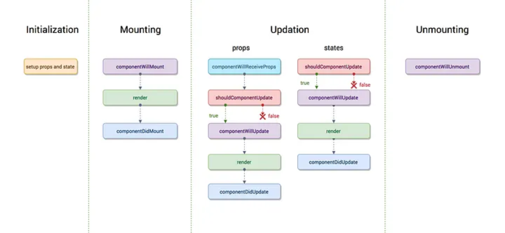

# The useEffect Hook

## Intro

In this lecture, we introduce the `useEffect` hook, which allows React components to run side effects—operations that interact with the outside world or perform work after rendering. Unlike `useState`, which manages local data, `useEffect` manages **timing and effects**, such as fetching data, logging, or subscribing to events.  

We will enhance the Pokemon Card application to fetch data automatically when the component mounts, while maintaining the reactive state from the previous lesson. This will demonstrate the power of `useEffect` and how it can replace manual DOM event listeners and lifecycle management from vanilla JS.

---

## What is `useEffect`

`useEffect` is a hook that runs a function **after the component renders**. Effects can include asynchronous requests, interacting with the DOM, setting timers, or performing calculations that need to occur outside of rendering logic.  

The key benefit is **decoupling side effects from rendering**, allowing React to manage UI updates efficiently.

```jsx
import { useEffect } from "react";
```

### Writing our First `useEffect`

```js
useEffect(() => {
  console.log("Hello form useEffect");
}, []);
```

The syntax of `useEffect` may look a bit confusing, but we can break it down to see it as a function that takes in two arguments. The first positional argument is a function that the `useEffect` will execute and the second positional argument is an array known as a Dependency Array which is meant for holding *state* variables.

```js
const sayHello = () => (console.log("Hello from useEffect"));

useEffect(sayHello, [])
```

---

#### Why the Dependency Array Matters

The dependency array defines **when the effect should run**:

1. **Empty array `[]`** – runs only once after the initial render. Use this for initialization logic, like fetching data on mount.
2. **Array with state variables `[pokemonName]`** – runs whenever `pokemonName` changes. Useful for effects tied to state or props.
3. **No array** – runs after every render. Rarely needed, can lead to unnecessary network requests or performance issues.

---

## Component Mounting, Re-Rendering(Updating), and Unmounting



To understand why `useEffect` exists and how the dependency list controls its behavior, we must first understand a component’s lifecycle. While React no longer exposes lifecycle methods directly in functional components, the lifecycle still exists conceptually and is managed through hooks.

### Component Mounting

A component **mounts** when React renders it for the first time and inserts its elements into the browser’s DOM. This happens when the component is first encountered in the application tree, such as when the app loads or when conditional rendering causes a component to appear.

During mounting, React executes the component function, evaluates the JSX, creates the Virtual DOM representation, and then commits the result to the real DOM. After this initial render completes, `useEffect` callbacks are allowed to run.

This is why an effect with an empty dependency array runs only once. The effect is scheduled after the first render and never re-runs, effectively behaving like a “run on mount” operation.

```js
useEffect(() => {
  console.log("Component mounted");
}, []);
```

#### Fetching Pokemon on Component Mount

We want to automatically fetch a default Pokemon when the component loads. Using `useEffect` allows us to run the request **once when the component mounts**. We will have to update a couple of things to get this to work properly and leverage our current code. 

```jsx
const [pokemonName, setPokemonName] = useState("pikachu");

const addCard = async (event=null) => {
  event && event.preventDefault();
  ...
}

useEffect(() => {
  addCard()
}, []);
```

Notice the empty dependency list `[]`. This tells React to run this effect only once after the initial render, mimicking a "componentDidMount" behavior and never executing again.

---

### Component Re-Rendering

A component **re-renders** whenever its state or props change. Re-rendering does not mean the component is removed or recreated; it means the component function is re-executed to determine what the UI should look like next.

During a re-render, React compares the new Virtual DOM output with the previous one and updates only what changed in the real DOM. After each re-render, `useEffect` may run again depending on its dependency list.

When dependencies are provided, React checks whether any of those values changed since the previous render. If they did, the effect runs again. If they did not, the effect is skipped.

---

#### Seeing the Current Value of a State Variable

```js
useEffect(() => {
  console.log(`Runs when pokemonName changes: ${pokemonName}`);
}, [pokemonName]);
```

This makes the dependency list a **contract** between the developer and React, explicitly stating which values should trigger side effects. Here, the effect **re-runs only when `pokemonName` changes**. Without this dependency, the effect could run too often, causing redundant requests and slowing the app.

---

### Component Unmounting

A component **unmounts** when React removes it from the DOM. This can occur when navigating away from a page, conditionally hiding a component, or replacing it with another component.

Unmounting is important because any ongoing side effects—such as timers, event listeners, or subscriptions—must be cleaned up. If they are not, they continue running even though the component no longer exists, leading to memory leaks and unexpected behavior.

React allows cleanup logic by returning a function from `useEffect`. This cleanup function runs either when the component unmounts or right before the effect runs again due to a dependency change.

```js
useEffect(() => {
  const interval = setInterval(() => {
    console.log("Running...");
  }, 1000);

  return () => {
    clearInterval(interval);
    console.log("Component unmounted or effect re-ran");
  };
}, []);
```

In this example, the cleanup function ensures that the interval is cleared when the component unmounts, preventing background execution after the component is gone.

---

## Mental Model

Mounting determines **when effects are allowed to run**, re-rendering determines **when effects may re-run**, and unmounting determines **when cleanup must occur**. The dependency array is the mechanism that ties effects to specific phases of a component’s lifecycle.

Understanding this lifecycle explains why `useEffect` behaves differently depending on its dependency list and why React requires explicit cleanup logic rather than performing it automatically.

* `useEffect` is for **side effects** and **timing of code execution**, not for rendering.
* The **dependency array** controls **when the effect runs** and prevents unnecessary re-execution.
* Cleanup functions remove resources before effects re-run or the component unmounts.
* By combining `useState` and `useEffect`, components can maintain internal state while performing asynchronous tasks safely and declaratively.

---

## Conclusion

The `useEffect` hook is a cornerstone of React for performing side effects and managing asynchronous operations. Students now understand:

* How to fetch data on component mount using `useEffect`
* The role of the dependency array in controlling effect execution
* How to safely handle repeated effects or cleanup operations
* How `useEffect` integrates with `useState` to build dynamic, reactive applications

This knowledge prepares students to build applications that interact with APIs, manage timers, or respond to state changes without manually controlling the DOM or lifecycle events.
