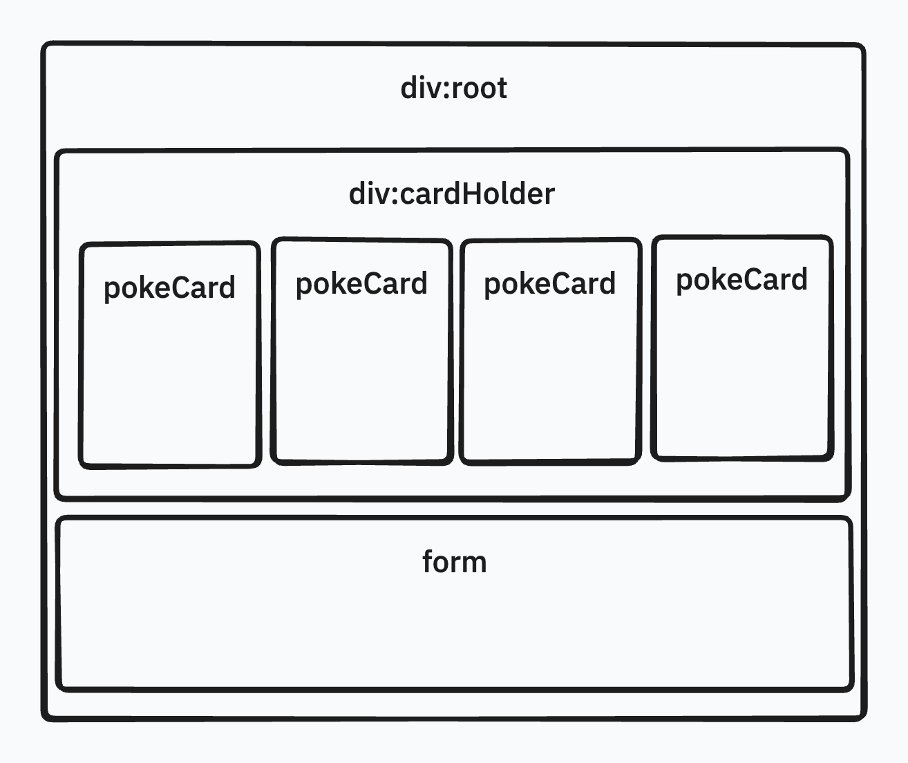
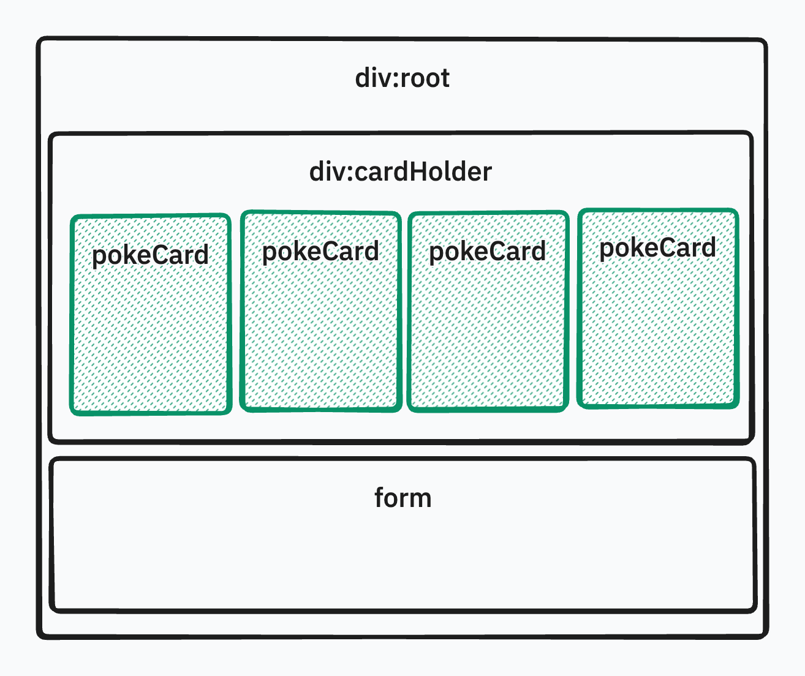

# Components and Props

## Intro

Up to this point, our React application has lived entirely inside a single component: `App`. While this works for small experiments, it does not scale well as applications grow. As more UI elements, logic, and state are added, a single file quickly becomes difficult to reason about, maintain, and extend. This lecture introduces **components** as the primary organizational tool in React and **props** as the mechanism that allows those components to communicate with one another.

The goal of this lecture is not simply to “move code around,” but to understand how React applications are intentionally broken into smaller, reusable, and predictable units.

---

## What is a Component



A component in React is a JavaScript function that returns JSX and represents a **single, reusable piece of UI**. Conceptually, you can think of a component as a blueprint for a section of the screen. Each time React renders that component, it produces a new instance of that UI based on the data it receives.

In your current application, `App` is already a component. It manages application-level state, performs data fetching, and renders the entire interface. While this is acceptable early on, it mixes responsibilities. The Pokémon card UI, the form, and the state logic are all tightly coupled.

### What problem do Components Fix

Components solve the problem of **separation of concerns at the UI level** just like in algorithms, we want to enforce the Don't Repeat Yourself and Single Responsibility Principles. Instead of one large component doing everything, each component focuses on a single responsibility. This makes the code easier to read, easier to debug, and easier to reuse.

In our Pokémon application, each rendered Pokémon card has the same structure and behavior. Duplicating that JSX inline inside `.map()` works, but it ties the visual representation of a card directly to the `App` component. By extracting that logic into its own component, we gain clarity and reusability.

---

### Building a PokemonCard Component Skeleton

The first step is to identify repeated JSX. In `App.jsx`, the JSX inside the `.map()` callback represents a single Pokémon card. That is our signal that a new component should exist.



A common project structure in React places components inside a `components` directory within `src`. Each component typically lives in its own file, named after the component itself. Following this convention, note that component files should be in camelCase and with an uppercase letter to start, we can create:

```sh
src/
  components/
    PokemonCard.jsx
```

A minimal component skeleton looks like this:

```jsx
function PokemonCard() {
  return (
    <div>
      <h2>pokemon name</h2>
      
      <button>remove</button>
    </div>
  );
}

export default PokemonCard;
```

At this stage, the component does not yet know *which* Pokémon it represents. That information will come from **props**. In order to apply it and have it render within `App.jsx` now is by importing and calling the function as if it was a self closing html tag.

```jsx
<div id="cardHolder">
  {pokemonsData.map((data) => (
    <PokemonCard key={data.id} />
  ))}
</div>
```

> This action makes `App.jsx` the *PARENT* of `PokemonCard.jsx`

---

## What are Props

Props (short for “properties”) are how data flows **into** a component. They allow a parent component to configure a child component by passing values into it, much like arguments passed into a function.

From a mental model perspective, props are **read-only inputs**. A component receives props, uses them to render UI, and does not mutate them directly. This unidirectional data flow is a foundational principle of React and is what makes applications predictable.

---

### Why utilize Props

Props allow components to remain **generic and reusable**. Instead of hardcoding Pokémon-specific data inside `PokemonCard`, we can design it to accept any Pokémon object. This means the same component can render Pikachu, Bulbasaur, or any other Pokémon without modification.

This separation also reinforces the idea that `App` is responsible for managing state and data, while child components are responsible for presentation.

---

### Calling props within Component

When a component receives props, they are provided as the first argument to the function. React automatically passes an object containing all provided attributes.

```jsx
function PokemonCard(props) {
  return (
    <div>
      <h2>{props.data.name}</h2>
      
      <button>remove</button>
    </div>
  );
}
```

Here, `props.data` represents the Pokémon object passed in from `App`.

Inside `App.jsx`, the component is now used like this:

```jsx
<PokemonCard key={data.id} data={data} />
```

At this point, the JSX in `App` becomes cleaner, and the responsibility for rendering a Pokémon card is fully delegated.

---

### Deconstructing Props Syntax

While accessing `props.data` is perfectly valid, React developers commonly use **destructuring** to improve readability and reduce repetition.

Instead of this:

```jsx
function PokemonCard(props) {
  return <h2>{props.data.name}</h2>;
}
```

We can destructure immediately:

```jsx
function PokemonCard({ data }) {
  return <h2>{data.name}</h2>;
}
```

This syntax makes it clear which props the component expects and keeps JSX concise. As components grow, destructuring becomes increasingly important for clarity.

---

## Conclusion

Components and props form the backbone of React application architecture. Components allow us to break complex interfaces into manageable, reusable pieces, while props enable controlled communication between those pieces. By extracting a `PokemonCard` component from `App`, we move closer to idiomatic React design, where state lives high in the tree and presentation is delegated downward.

In the next lecture, we will build on this foundation by introducing **component-level state**, exploring when state should live in a parent component versus when it belongs inside a child component, and how that decision impacts data flow and application behavior.
