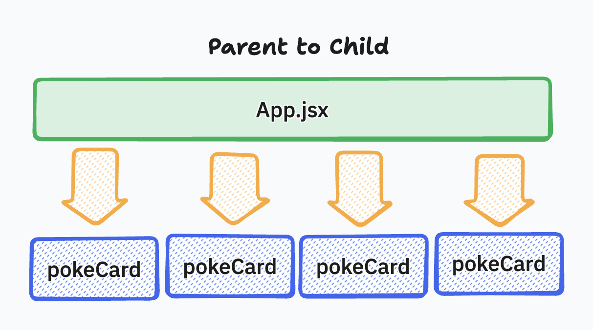

# Component Level State

## Intro

In the previous lecture, we introduced components and props as a way to break a React application into smaller, reusable pieces. At that stage, all state still lived in the `App` component, and child components were purely presentational. While this is a valid and often recommended starting point, real-world applications require a more nuanced approach to state ownership.

This lecture focuses on **component-level state**, exploring when state should live in a parent component and when it should be owned by an individual child. Understanding this distinction is critical to building scalable React applications and avoiding tightly coupled or overly complex data flows.

---

## Parent to Child Relationship



React applications are structured as a tree of components. Data flows **downward** from parent components to child components through props. This one-way flow ensures that application state remains predictable and easier to debug.

A parent component is responsible for determining *what* data exists and *who* should receive it. Child components are responsible for rendering UI based on that data and, when necessary, notifying the parent that something has changed.

### Data Flow

In our Pokémon application, `App` acts as the parent component that owns the array of Pokémon data. Each `PokemonCard` is a child component that receives a single Pokémon object as a prop. This means `App` decides which Pokémon exist, while each card decides how that Pokémon is displayed.

This distinction becomes especially important once we introduce interactive behavior that may or may not affect other components.

---

## Adding State to Components

State represents data that can change over time and trigger a re-render. The key design question is not *how* to add state, but *where* that state should live.

### Displaying Shiny Sprite For All Cards (Parent State Level)

If the goal is to toggle **all Pokémon cards** between their default and shiny sprites at the same time, the state controlling that behavior must live in the parent component. This is because multiple child components depend on the same piece of information.

In this scenario, a single boolean state in `App` would be passed down as a prop to every `PokemonCard`. When the value changes, React re-renders all children consistently. This reinforces the idea that shared behavior belongs at the highest common ancestor.

```jsx
// App.jsx

function App() {
  const [shiny, setShiny] = useState(false)
  ...

  return (
    ...
      <div id="cardHolder">
        {pokemonsData.map((data) => (
          <PokemonCard key={data.id} data={data} setShiny={setShiny} shiny={shiny}/>
        ))}
      </div>
    ...
  )
}

// PokemonCard
function PokemonCard({data, shiny, setShiny}) {

  return (
    <div>
      <h2>{data.name}</h2>
      
      <button onClick={()=>setShiny(!shiny)}>
        {shiny ? 'un-shine':'shine'}
      </button>
      <button>remove</button>
    </div>
  );
}

export default PokemonCard;
```

You can see how the value of *shiny* is shared upon all children of App.jsx

---

### Displaying Shiny Sprite For Individual Card (Child State Level)

If the goal is to allow **each Pokémon card** to independently toggle its shiny state, the responsibility shifts to the child component. In this case, the shiny state does not affect any other card and does not need to be known by the parent.

This is where component-level state becomes appropriate. Each `PokemonCard` manages its own `shiny` value:

```jsx
import { useState } from "react";

function PokemonCard({ data }) {
  const [shiny, setShiny] = useState(false);

  return (
    <div>
      <h2>{data.name}</h2>
      
      <button onClick={() => setShiny(!shiny)}>
        {shiny ? "un-shine" : "shine"}
      </button>
      <button>remove</button>
    </div>
  );
}

export default PokemonCard;
```

Each card now owns its own display logic, making the UI more flexible and the code easier to reason about.

---

## When should a state live at parent vs child

| Scenario                               | Best Location for State | Reasoning                                        |
| -------------------------------------- | ----------------------- | ------------------------------------------------ |
| State affects multiple components      | Parent                  | Keeps shared behavior consistent and centralized |
| State affects only one component       | Child                   | Reduces unnecessary prop drilling                |
| Parent needs to react to state changes | Parent                  | Enables coordinated updates                      |
| State is purely visual or local        | Child                   | Improves encapsulation                           |
| Multiple children must stay in sync    | Parent                  | Prevents conflicting UI states                   |

This table is not a strict rulebook, but a decision-making guide. When in doubt, start by lifting state up, then refactor downward when isolation becomes beneficial.

---

## Creating the FormComponent

The Pokémon form is another opportunity to practice state placement. The input value, submit handler, and request logic all work together to add new Pokémon to the application. Because this logic directly affects the parent’s state (`pokemonsData`), the form component should not own the Pokémon array itself.

A common pattern is to extract a `FormComponent` that manages **local input state**, while delegating submission behavior back to the parent via props. This reinforces the idea that components can manage *how* data is collected without owning *where* that data ultimately lives.

```js
//PokemonFrom.jsx
import { useState } from "react";

const PokemonForm = ({addCard}) => {
  const [pokemonName, setPokemonName] = useState('');

  return (
    <form onSubmit={(event) => [addCard(pokemonName, event), setPokemonName('')]}>
        <input
          name="pokemonName"
          type="text"
          placeholder="Pokemon Name"
          value={pokemonName}
          onChange={(e) => setPokemonName(e.target.value)}
        />
        <button type="submit">Add Card</button>
      </form>
  )
}

export default PokemonForm;

// App.jsx

const addCard = async (name, event=null) => {
  event && event.preventDefault();
  try {
    let searchUrl = `https://pokeapi.co/api/v2/pokemon/${name}`;
    let response = await axios.get(searchUrl);
    setPokemonsData([...pokemonsData, response.data]);
  } catch (err) {
    console.error(err);
  }
};
```

This review process mirrors real-world React development, where components are continuously refactored to balance clarity, responsibility, and reuse.

---

## Conclusion

Component-level state allows React applications to scale by placing responsibility where it naturally belongs. Parent components manage shared data and coordination, while child components manage isolated, local behavior. By understanding and applying this distinction, developers can avoid unnecessary complexity and build interfaces that are easier to reason about.

With components, props, hooks, and state placement now established, students are prepared to build more modular, maintainable React applications that follow professional design patterns rather than ad-hoc solutions.
