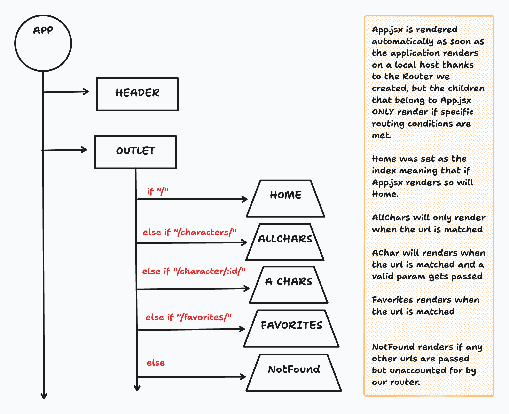
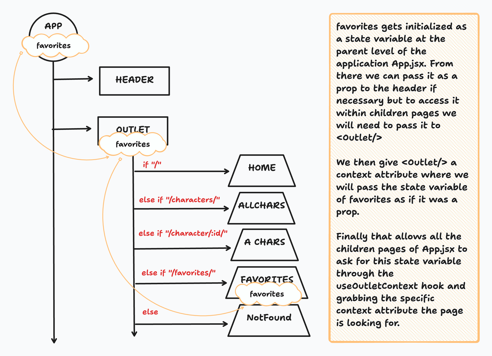

# `useOutletContext`

## Introduction

In this lesson, you'll learn how to use `useOutletContext` provided by React Router's `react-router-dom` library. `useOutletContext` is a powerful tool for managing and accessing routing-related data in your React application, helping you avoid prop drilling and simplify the sharing of routing information.

---

## What is `useOutletContext`?

`useOutletContext` is a hook provided by React Router's `react-router-dom` library. It allows you to access context data related to the currently matched route and route parameters without having to pass them down through props. It simplifies the way you access and share routing information throughout your application.

---

## What is Prop Drilling?

**Prop drilling** is the process of passing data from a component to its child components by chaining props. When you have deeply nested components that need access to the same data, it can become cumbersome to pass props down through each layer of the component tree. This can lead to less maintainable and harder-to-read code.

---

### Code Example of Prop Drilling

```jsx
// ParentComponent.js
import React from 'react';
import ChildComponent from './ChildComponent';

const ParentComponent = ({ data }) => {
  return (
    <div>
      <ChildComponent data={data} />
    </div>
  );
};

// ChildComponent.js
import React from 'react';
import GrandchildComponent from './GrandchildComponent';

const ChildComponent = ({ data }) => {
  return (
    <div>
      <GrandchildComponent data={data} />
    </div>
  );
};

// GrandchildComponent.js
import React from 'react';

const GrandchildComponent = ({ data }) => {
  return (
    <div>
      <p>Data: {data}</p>
    </div>
  );
};
```

In the above example, `data` is passed down through multiple layers, which can become unwieldy as the component tree grows.

---

## What Problem Does `useOutletContext` Solve and How?

`useOutletContext` solves the problem of prop drilling when dealing with routing-related information. It provides a way to access context data from the current matched route, including route parameters and data, without having to pass this information explicitly through component props.

### When Should `useOutletContext` Be Used?

You should consider using `useOutletContext` when:

- Your application has complex route structures with many nested components that need access to routing information.
- You want to simplify the sharing of route-related data among components.
- You want to avoid the complexities of prop drilling and improve code maintainability.

---

## Code Example: Utilizing `useOutletContext`

Let's update the PokemonCard project to leverage this hook and provide a better user experience with our application.

### The Problem: State Resets on Page Navigation

In the current PokemonCard project, `HomePage.jsx` manages the Pokémon list state:

```jsx
const [pokemonsData, setPokemonsData] = useState([]);
```

Every time `HomePage` mounts, it initializes this state and fetches Pikachu. If you navigate away and come back:

* `HomePage` **unmounts**
* Its local state (`pokemonsData`) is **lost**
* When remounting, the state resets to its initial value

This happens because **state in a component only lives while that component is mounted**. Once the component unmounts, all its local state is discarded.

---

### The Solution: Lift State Up to App.jsx

To preserve Pokémon data across navigation, we need to keep the state variable within a component that is never unmounted while our application is being rendered. This means we must do the following:

1. Move the `pokemonsData` state from `HomePage.jsx` to `App.jsx` (the layout component that remains mounted)
2. Pass state and updater functions to child pages using **Outlet context**

This way, even if `HomePage` unmounts, the data persists in `App.jsx`.

---

### Passing down the Context

At this point we know that children pages within the router are connected to `App.jsx` through `<Outlet/>`... but how exactly does that look?



Now that we see that how can we pass a state variable named `favorites` and set as a list to multiple pages within the Outlet? Thats where outlet context comes in. The state variable is passed to the outlet as `context` and accessed by the children of `App.jsx` as necessary.



---

### Step 1: Update App.jsx

```jsx
import { useState } from "react";
import { Outlet, Link } from "react-router-dom";
import "./App.css";

function App() {
  const [pokemonsData, setPokemonsData] = useState([]);

  const addData = (data) => {
    setPokemonsData([...pokemonsData, data]);
  };

  const updateData = (data, shiny) => {
    setPokemonsData(
      pokemonsData.map((pokemon) =>
        pokemon.id === data.id ? { ...pokemon, shiny: shiny } : pokemon
      )
    );
  };

  const rmData = (data) => {
    setPokemonsData(pokemonsData.filter((prevData) => prevData.id !== data.id));
  };

  return (
    <>
      <h1>Pokemon Cards</h1>
      <nav>
        <Link to="/">Home</Link> | <Link to="/about">About</Link>
      </nav>
      {/* Pass state and functions down via Outlet context */}
      <Outlet context={{ pokemonsData, addData, rmData, updateData }} />
    </>
  );
}

export default App;
```

Now, all functions manipulating the state of `pokemonsData` **live in App.jsx**, which **never unmounts**. Any page that consumes them will have access to the same data.

---

### Step 2: Update HomePage.jsx to Use Outlet Context

```jsx
import { useEffect } from "react";
import axios from "axios";
import PokemonCard from "../components/PokemonCard";
import PokemonForm from "../components/PokemonForm";
import { useOutletContext } from "react-router-dom";

const HomePage = () => {
  const {pokemonsData, addData, rmData, updateData} = useOutletContext()

  const addCard = async (name, event = null) => {
    event && event.preventDefault();
    try {
      let searchUrl = `https://pokeapi.co/api/v2/pokemon/${name}`;
      let response = await axios.get(searchUrl);
      addData(response.data);
    } catch (err) {
      console.error(err);
    }
  };

  useEffect(() => {
    if (pokemonsData.length === 0){
      addCard("Pikachu");
    }
  }, []);

  return (
    <>
      <div id="cardHolder">
        {pokemonsData.map((data) => (
          <PokemonCard key={data.id} data={data} rmData={rmData} updateData={updateData}/>
        ))}
      </div>
      <PokemonForm addCard={addCard} />
    </>
  );
}

export default HomePage;
```

Notice that we **no longer define `pokemonsData` locally in HomePage**. Instead, we **consume it from App.jsx via Outlet context** along with all functions tasked with manipulating the state, so it persists across navigation.

---

### Step 3: Updating the PokemonCard Component

Now we can pass down the functions manipulating the state through props from the `HomePage.jsx` to the `PokemonCard.jsx`:

```jsx
import { useState } from "react";
import { useNavigate } from "react-router-dom";

function PokemonCard({ data, rmData, updateData }) {
  const [shiny, setShiny] = useState(data.shiny ? data.shiny : false);
  const navigate = useNavigate();

  const handleShine = () => {
    updateData(data, !shiny)
    setShiny(!shiny)
  }


  return (
    <div>
      <h2>{data.name}</h2>
      
      <button onClick={handleShine}>
        {shiny ? "un-shine" : "shine"}
      </button>

      <button onClick={() => navigate(`/pokemon/${data.id}`)}>
        See Details
      </button>
      <button onClick={()=>rmData(data)}>
        Remove
      </button>
    </div>
  );
}

export default PokemonCard;
```

Now our *shiny* state also persists across the entire application.

---

#### Mental Model

* **HomePage**: mounts/unmounts as users navigate
* **App.jsx**: always mounted, acts as a layout and context provider
* **Outlet context**: allows pages to access state/functions from App.jsx without prop drilling
* **State persists** because it's lifted to a component that **never unmounts**

```
App.jsx (layout)
 └── Outlet
      └── HomePage (uses context)
              └── PokemonCard (uses props)
```

---

## Conclusion

In this lesson, you learned about `useOutletContext`, a valuable tool for managing and accessing routing information in your React application. It helps you avoid prop drilling and simplifies the sharing of routing data among components. By using `useOutletContext`, you can improve code maintainability and enhance the organization of your routing-related code.
