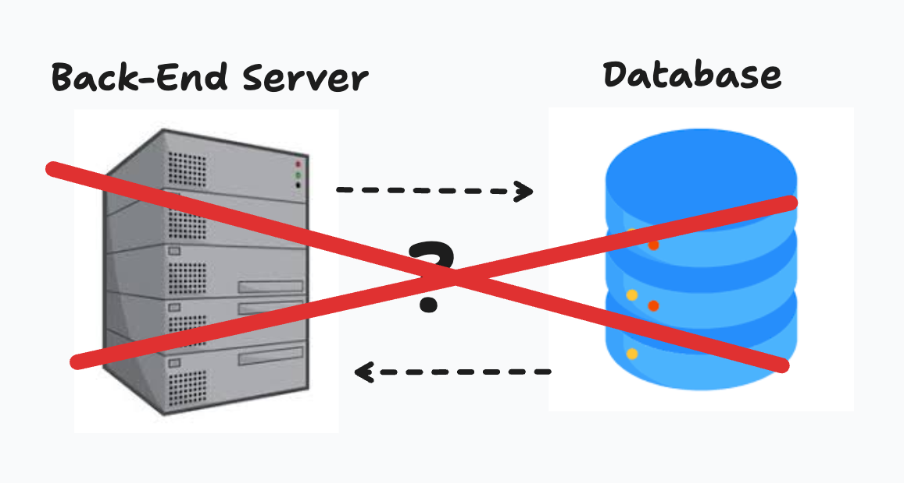
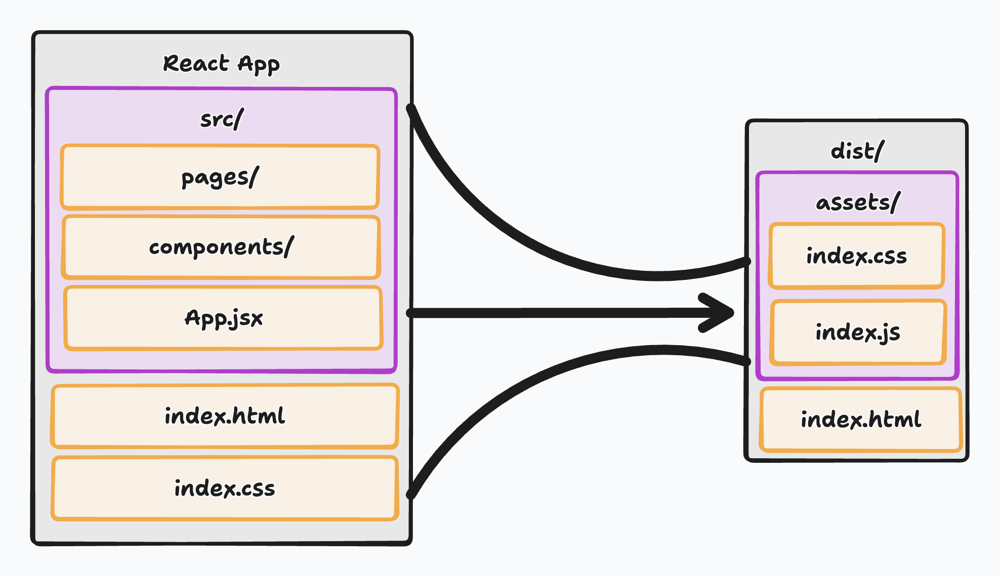
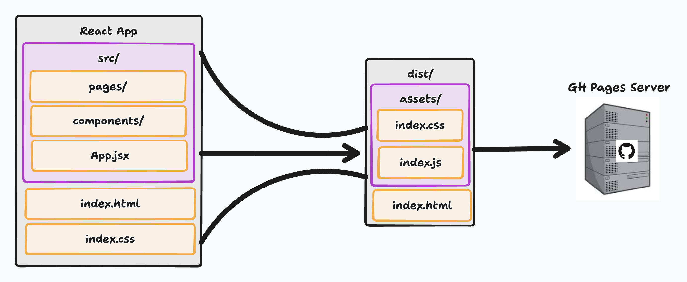

# GitHub Pages

## Introduction

Before we can automate deployments with CI/CD, we need to understand **where** and **how** our application will be deployed. In this lecture, we’ll focus on **GitHub Pages**, a free hosting service provided by GitHub that is ideal for deploying **static front-end applications** such as React apps built with Vite.

By the end of this lesson, students will understand what static sites are, how GitHub Pages works, and how to correctly configure a React + Vite application for deployment.

---

## What Are Static Sites?

A **static site** consists of files that can be served directly by a web server without any server-side computation. These files typically include:

- HTML
- CSS
- JavaScript
- Images and other assets

When a user visits a static site, the server simply returns these files as-is. This means the server holds no Back-End logic so it has no way of resolving URL interactions naturally, we will go further into this concept shortly.

### Key Characteristics of Static Sites



- No backend server logic, meaning all logic must happen within your React code. A concept of security that we haven't discussed until now is secret keys, routes, variables, etc. None of these secrets can be securely stored within your application since all Front-End code is exposed to our user.
- No server-side databases, meaning that data retention for manual refresh must be stored in an alternative location. We won't go into this concept within this lecture but note that most, if not all, browsers provide the capability to store values as _cookies_ or variables within _localStorage_.
- Fast load times, since there is no server side logic being executed the browser can quickly provide static files and maintain the UI at a fantastic speed.
- Easy to deploy and host, again this is only one side of our stack so naturally it's deployment will be a lot easier than if we were deploying a Full-Stack application.
- Ideal for front-end SPAs (Single Page Applications), although we built pages with React Router DOM it's important to understand the browser is never actually sending a request for a new page, therefore we never leave the SPA behavior.

React applications become **static sites after build time**—once compiled, they are just HTML, CSS, and JavaScript files. This process is managed by Vite's innate roll-up capabilities where it takes all of your react code and compresses them onto index.js, index.html, and index.css. We will talk about this more in depth here shortly.

> Think back to our Vanilla JS applications these were very much Static Sites

---

## What Are GitHub Pages?


**GitHub Pages** is a hosting service provided by GitHub that allows you to deploy static websites directly from a GitHub repository. Although it provides an extremely simplified process for the everyday developer, there's quite a complicated process that happens in the background. When executing our command for deployment Github would have conducted the following:

- A `gh-pages` branch would have been created and it will be manages as our _dep/prod_ branch. Essentially, the version of our code that is living within this branch is the code our users will be interacting with. This allows developers to continue development on other branches without breaking the current UI.
- A `/docs` folder holding our applications _static_ representation would have been created and uploaded to GH pages.
- The root of a repository, is where the hosting of our React Application will be executed.

### Why GitHub Pages?

You may be asking yourself, well why _GitHub Pages_? There's hundreds of other ways to host your application but Github Pages provides all of the following:

- Free hosting, and hosting management
- Implicit tight integration with GitHub
- Ideal for portfolios, demos, documentation, and course projects
- Works well with automated CI/CD pipelines

---

## React Applications in Deployment

When deploying a React application, especially with Vite, there are a few **important concepts** to understand. For example as previously discussed our server on GH Pages will be unable to resolve url pattern requests meaning we need to account for mocking this behavior and allowing the browser to rely on our code to resolve url patterns instead.

---

### The `dist` Directory



Before we start talking about deployment we need to understand how we can create our React application as a simple static project for our browser to easily interpret and host. Execute the following command:

```bash
npm run build
```

This command will utilize the built in Vite Roll Up to essentially _compress_ all of your code into 3 files: index.js, index.css, and index.html. You'll find that these files placed are now inside the `dist/` directory which should be located at the same level as `src/`.

👉 **Only the contents of `dist/` are deployed** — not your source code, this doesn't mean that your source code is not available and can't be found by inspecting file contents. It's still there otherwise the browser would be incapable to render your application.

---

### BrowserRouter Is Not Suitable for GitHub Pages

GitHub Pages does **not support server-side routing** the server is only equipped to respond to the route of `/`. This means all other routes will be unresolved and cause a server side error by Github Pages.

This causes a problem with `BrowserRouter` since it heavily relies on the server to handle routes like:

```
/pokemon/25
/about
```

When a user refreshes or directly visits one of these URLs on GitHub Pages a request is sent to GitHub Pages and it looks for a physical file at that path but since this is a SPA the file does not exist nor does any other path and this causes the user gets a **404 error**.

---

### HashRouter for Deployment, BrowserRouter for Development

To solve this, for the time being, we will utilize _HashRouter_ in our deployment environment and _BrowserRouter_ within our development environment.

Well don't take this as a one off answer, this won't always be the case. The reason we are enforcing this method is due to our applications _deployment architecture_ if we had a server like _nginx_ we could continue utilizing _BrowserRouter_ and specify to nginx where to route requests to and we will this other type of architecture later on.

- **`BrowserRouter` for local development**
- **`HashRouter` for GitHub Pages deployment**

#### How HashRouter Works

Turns out browser url patterns come with a built in feature for ignoring text after a key character. Everything after the `#` is handled entirely by the browser and React Router—GitHub Pages never sees it. This means that by calling HashRouter the following becomes true.

Instead of:

```bash
/pokemon/25
```

The URL becomes:

```bash
/#/pokemon/25
```

#### Configuring our Environment

Now we understand the problem, and the solution, but this exchange between BrowserRouter and HashRouter needs to happen dynamically otherwise deployment could turn into a nightmare. Luckily, frameworks provide us a way to set Environment variables and utilize their values for conditional logic within our code.

In order for this to work you must create a `.env` file. Typically this file would not be tracked by your git history but at this stage it won't harm us. After creating this file add the following:

```bash
VITE_PROD=true
```

We will utilize this _environment variable_ to conditionally switch between Browser and HashRouter.

> NOTE any environment variables in a Vite project must be written as VITE\_<NAME>

#### Conditional Router Setup

```jsx
import { BrowserRouter, HashRouter } from "react-router-dom";

const PROD = JSON.parse(import.meta.env.VITE_PROD)

const createRouter = PROD ? createHashRouter : createBrowserRouter

const router = createRouter([
  ...
])
```

Let's break this down so we understand what's going on:

- `const PROD = JSON.parse(import.meta.env.VITE_PROD)`: Here we create a constant variable named *PROD* and give it the value of the environment variable *VITE_PROD*
    - `import.meta.env.VITE_PROD`: Here we are grabbing the value of *VITE_PROD* from our environment which defaults to a string value.
    - `JSON.parse()`: Takes the string value of "true" and turns it into the boolean value of True.
- `const createRouter = PROD ? createHashRouter : createBrowserRouter`: Here we create a constant variable named *createRouter* which will be set to *HashRouter* if *PROD* is true else *BrowserRouter*.

---

## Deploying Your React Project

To easily deploy our React and Vite application we can utilize the `gh-pages` node package. This gives us a very straight forward command to launch our site

### Step 1: Install `gh-pages`

```bash
npm install gh-pages --save-dev
```

---

### Step 2: Configure `package.json`

```json
"scripts": {
  "predeploy": "npm run build",
  "deploy": "gh-pages -d dist"
}
```

The command `predeploy` will build the `dist` directory while the command `deploy` will now publish the `dist/` directory to the `gh-pages` branch

---

### Step 3: Configure Vite Base Path

By default, GitHub Pages hosts your site under:

```
https://username.github.io/REPOSITORY_NAME/
```

There is a way to change this but that information is our of scope for this lecture. Now this means we must adjust our Vite Project to account for the default BASE in `vite.config.js`:

```js
export default defineConfig({
  base: "/YOUR_REPOSITORY_NAME", //< DON'T ADD A CLOSING SLASH
  plugins: [react()],
});
```

⚠️ This step is **required**, or your assets will fail to load in production.

---

### Step 4: Deploy



```bash
npm run deploy
```

This straight forward command will conduct the following behavior:

1. Build the application
2. Create/update the `gh-pages` branch
3. Publish the static files
4. Make the site live on GitHub Pages

**CHECKOUT THE ACTIONS TAB OF YOUR REPOSITORY TO VIEW THE WORKFLOWS OUTCOME**

---

## Mental Model

```sh
React Source Code
       ↓
npm run build
       ↓
dist/ (static files)
       ↓
gh-pages branch
       ↓
GitHub Pages Hosting
```

GitHub Pages does **not** run React—it only serves the built files.

---

## Conclusion

In this lesson, you learned:

- What static sites are and why React apps qualify after build time
- How GitHub Pages hosts static content
- Why `BrowserRouter` breaks on GitHub Pages
- How `HashRouter` solves client-side routing issues
- How to configure and deploy a Vite + React project using `gh-pages`

This knowledge forms the foundation for **automated deployments**. In the next lecture, we will build a **GitHub Actions CI/CD pipeline** that automatically builds and deploys our React application to GitHub Pages on every push.
