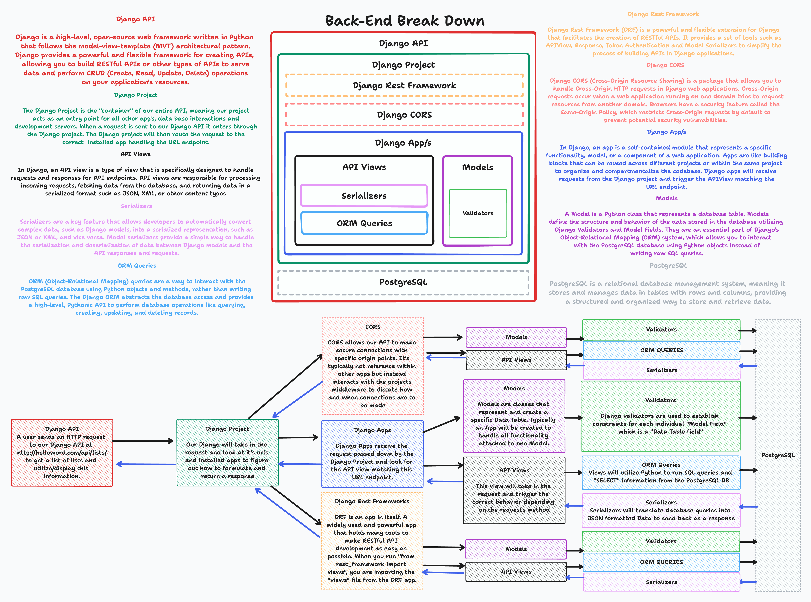

# Back-End Development

## What are we trying to accomplish?

In this module, our goal is to develop a **production-ready understanding of back-end systems** using Django and Django REST Framework. You will learn how data is modeled, validated, stored, exposed, secured, optimized, and observed within a modern API-driven application. Rather than focusing only on writing endpoints, this module emphasizes **how backend components work together**—databases, ORM layers, serializers, authentication, and server-side infrastructure—to support real-world applications at scale.

By the end of this module, you will be able to design and implement robust APIs, reason about data integrity and relationships, secure endpoints with authentication, and apply performance and observability techniques such as caching and logging. These skills mirror the responsibilities of professional backend engineers building maintainable, scalable, and reliable services.

---

## Lessons

1. [Relational Database Management Systems](./1-rdbms/README.md)
2. [Intro to Django ORM](./2-intro-to-django-orm/README.md)
3. [Validators and Serializers](./3-validators-and-serializers/README.md)
4. [Relationships & the Django Server](./4-associations-and-django-server/README.md)
5. [API Views & Testing](./5-api-views-and-testing/README.md)
6. [CRUD](./6-create-read-update-delete/README.md)
7. [User Authentication](./7-user-authentication/README.md)
8. [Server Side API's](./8-server-side-apis/README.md)
9. [Server Side Caching & Logging](./9-caching-logging/README.md)

---

## Module Topics

- Relational data modeling and database constraints
- Django models, migrations, and QuerySets
- Data validation and serialization with DRF
- One-to-one, one-to-many, and many-to-many relationships
- Django request/response lifecycle
- RESTful API design and endpoint testing
- Full CRUD workflows and data persistence
- Authentication and authorization strategies
- Token-based authentication and protected routes
- Server-side integration with third-party APIs
- Performance optimization through server-side caching
- Observability and debugging with server-side logging
- Production-minded backend architecture and best practices
