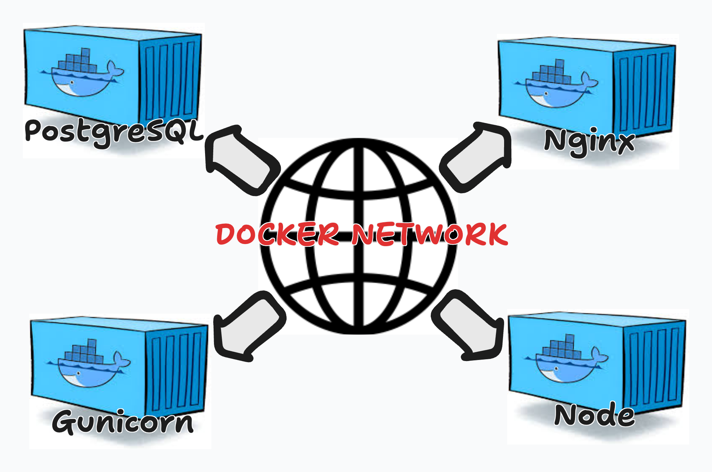

# Intro to Docker-Composed

## Introduction

Up to this point, you’ve learned how to containerize individual applications using Dockerfiles. That skill is essential—but real-world applications are almost never a single container. Modern full-stack systems are composed of **multiple services** that must run together: a frontend, a backend API, and a database at minimum. Managing these services independently quickly becomes brittle, repetitive, and error-prone.

This is where **Docker Compose** enters the picture. Docker Compose allows us to define, configure, and run **multi-container applications as a single unit**, making local development environments predictable, reproducible, and closer to production reality.

---

## What and Why Docker Compose



Docker Compose was created to solve the problem of **orchestrating multiple related containers** that must communicate with one another.

Without Docker Compose, developers must:

- Manually build and run each container
- Manually create and manage Docker networks
- Remember container names and ports
- Start containers in the correct order
- Re-run long `docker run` commands every time something changes

Docker Compose solves this by introducing:

- **A single declarative configuration file** (`docker-compose.yml`)
- **Service definitions** that describe how each container runs
- **Automatic networking** between services
- **Deterministic startup behavior**

Instead of thinking in terms of containers, Compose encourages you to think in terms of **services**—a backend service, a database service, a frontend service—each with a clear role.

### Docker Networks (Implicit but Critical)

One of Docker Compose’s most powerful features is that it automatically creates a **private Docker network** for your application. Every service defined in the compose file can reach every other service using the **service name as a hostname**.

This means:

- `backend` can connect to `db`
- Django can connect to PostgreSQL using `db:5432`
- No hard-coded IP addresses
- No manual network creation

This behavior mirrors how services communicate in production container orchestration systems like Kubernetes.

---

### Multiple Linked Containers vs Docker Compose

| Concept | Independent Containers | Docker Compose |
|------|----------------------|----------------|
| Startup | Manual order required | `depends_on` manages order |
| Networking | Manual bridge creation | Automatic network |
| Hostnames | IP-based or brittle | Service-name based |
| Configuration | CLI flags per container | Single YAML file |
| Reproducibility | Low | High |
| Developer Experience | Fragile | Predictable |

Docker Compose replaces a collection of shell commands with **one source of truth**.

---

## Back-End Docker Compose

### Why We No Longer Need a PostgreSQL Dockerfile

PostgreSQL is a **production-grade service** with an official Docker image maintained by the PostgreSQL team. Writing a custom Dockerfile for Postgres:

- Adds unnecessary complexity
- Increases maintenance burden
- Provides no real benefit

Instead, Docker Compose allows us to configure Postgres **directly in the compose file** using the official image and environment variables.

This mirrors real-world production usage, where databases are treated as managed services rather than custom-built containers.

---

### Production-Minded Backend Behavior

Even in development, our application should behave *as if* it were production-adjacent.

This means:

- Django should **not** be served via `runserver`
- We should use a real WSGI server
- The container should run a long-lived, stable process

For this reason, we introduce **Gunicorn** and add it to `requirements.txt`:

```bash
pip install gunicorn
pip freeze > requirements.txt
```

Gunicorn replaces Django’s development server and prepares us for real deployment environments.

#### What is Gunicorn

Gunicorn (short for **Green Unicorn**) is a **production-grade Python WSGI HTTP server** whose primary role is to **run Django applications in a performant, stable, and scalable way**. Django itself includes a lightweight development server (`runserver`), but that server is intentionally not designed for real-world traffic—it lacks robust process management, efficient concurrency handling, and security hardening. Gunicorn fills this gap by acting as the **application server** that understands the WSGI (Web Server Gateway Interface) standard, which is the contract Django uses to receive HTTP requests and return HTTP responses. When deployed, Gunicorn loads your Django project’s `wsgi.py` entry point and translates incoming HTTP requests into Python calls that Django can process, then sends Django’s responses back to the client.

In a typical hosting setup, Gunicorn sits **between Django and a reverse proxy such as Nginx**. Nginx handles concerns like TLS/SSL termination, serving static files, request buffering, and protecting the application from malformed or malicious requests. Gunicorn focuses solely on **executing Django code efficiently**. It does this by managing multiple **worker processes** (and optionally threads or async workers), allowing the application to handle many concurrent requests without blocking. If one worker crashes due to a bug or unexpected input, Gunicorn can automatically restart it, improving the overall resilience of the system. This process-based concurrency model is especially important for Django, which is traditionally synchronous and benefits from multiple workers to fully utilize available CPU cores.

From a deployment perspective, Gunicorn is crucial because it enables **predictable performance under load** and **clean separation of responsibilities**. Django remains responsible for business logic, authentication, ORM interactions, and API responses, while Gunicorn handles process lifecycle, request routing to workers, and graceful restarts during deployments. In containerized or cloud environments (such as Docker Compose, ECS, or Kubernetes), Gunicorn is commonly used as the **primary entry point** for the Django service, ensuring the application starts consistently and can scale horizontally by adjusting worker counts or running additional containers. In short, Gunicorn is the production engine that makes Django suitable for real-world hosting—bridging the gap between Django’s Python code and the high-performance web infrastructure required in modern deployments.

---

## docker-compose.yml

Below is the **end-state Docker Compose configuration** for the backend and database services:

```yml
version: "3.9"

services:
  db:
    image: postgres:15
    container_name: postgres-container
    environment:
      POSTGRES_DB: task_db
      POSTGRES_USER: franciscoavila
      POSTGRES_PASSWORD: password
    ports:
      - "5433:5432"

  backend:
    build: ./server
    container_name: django-container
    command: sh -c "gunicorn task_api.wsgi --bind 0.0.0.0:8000 --reload"
    ports:
      - "8000:8000"
    volumes:
      - ./server:/app
    depends_on:
      - db
```

---

### Breaking Down the Compose File

#### Version

```yml
version: "3.9"
```

Defines the Compose file format. Version 3+ is standard and widely supported.

---

#### Database Service

```yml
db:
  image: postgres:15
```

Uses the official PostgreSQL image—no Dockerfile required.

```yml
container_name: postgres-container
```

This name is critical because Django references it as the database host.

```yml
environment:
  POSTGRES_DB: task_db
  POSTGRES_USER: cp_user
  POSTGRES_PASSWORD: password
```

Postgres bootstraps itself using these environment variables. Meaning there will be a database named *task_db* and a user *cp_user* with a password of *password*.

```yml
ports:
  - "5433:5432"
```

Generates links between a port within the host machine and the port within the container

* `5432` is Postgres *inside* the container
* `5433` is Postgres *on your host machine*

This avoids conflicts with any locally installed PostgreSQL and clearly demonstrates **host vs container ports**.

---

#### Backend Service

```yml
build: ./server
```

This states there is a *Dockerfile* within the directory of *server* that should be utilized to build an image to run this container. Here is the *Dockerfile* to be placed within your *server* directory:

```Dockerfile
FROM python:3.13-trixie

WORKDIR /app

RUN pip install --upgrade pip

COPY requirements.txt .

RUN  pip install -r requirements.txt

COPY . .

CMD ["gunicorn", "task_api.wsgi", "--bind", "0.0.0.0:8000"]
```

> NOTE: There should only be ONE Dockerfile within *server*

Now let's continue onto the next command within the `docker-compose.yml` file.

```yml
command: sh -c "gunicorn task_api.wsgi --bind 0.0.0.0:8000 --reload"
```

* Uses Gunicorn instead of `runserver`
* `--reload` preserves development ergonomics, meaning that a *hot reload* will happen if any files within the *server* directory change.
* Binds to all interfaces so Docker can expose the port

```yml
volumes:
  - ./server:/app
```

Mounts the local server directory into the container so code changes reflect immediately.

```yml
depends_on:
  - db
```

Ensures the database container starts before Django. This avoids any issues where the Django container could be built and the postgres container would fail.

---

### Handling Secrets

Hardcoding credentials is acceptable for learning—but not for real systems. We wouldn't want to expose things like secret keys or our database information. With that said let's create a `.env` file within the *server* directory that we can reference within our *docker-compose.yml* file to build our application and add the following key value pairs onto the file:

```env
POSTGRES_DB=task_db
POSTGRES_USER=cp_user
POSTGRES_PASSWORD=password
```

Now we can tell our `docker-compose.yml` where this env file is located so it may load environment variables from it when building it's images:

```yml
db:
  image: postgres:15
  container_name: postgres-container
  env_file:
    - ./server/.env
  ports:
    - "5433:5432"

backend:
  build: ./server
  container_name: django-container
  command: sh -c "gunicorn task_api.wsgi --bind 0.0.0.0:8000 --reload"
  env_file:
    - ./server/.env
  ports:
    - "8000:8000"
  volumes:
    - ./server:/app
  depends_on:
    - db
```

This will automatically load all of the environment variables within the .env file onto the environment of both Django and PostgreSQL

---

### Updating Django Database Configuration

Inside `task_api/settings.py`, the database configuration **must match the Compose service** so ensure to check all the values and specify that *HOST* is set to the postgres containers name:

```python
DATABASES = {
    'default': {
        'ENGINE': 'django.db.backends.postgresql',
        'NAME': os.environ.get('POSTGRES_DB'),
        'USER': os.environ.get('POSTGRES_USER'),
        'PASSWORD': os.environ.get('POSTGRES_PASSWORD'),
        'HOST': 'postgres-container',
        'PORT': '5432',
    }
}
```

Key takeaway:

> **The database host is the container name, not `localhost`.**

---

### Final Docker Compose File

```yml
version: "3.9"

services:
  db:
    env_file:
      - ./server/.env
    image: postgres:15
    container_name: postgres-container
    ports:
      - "5433:5432"

  backend:
    env_file:
      - ./server/.env
    build: ./server
    container_name: django-container
    command: sh -c "gunicorn task_api.wsgi --bind 0.0.0.0:8000 --reload"
    ports:
      - "8000:8000"
    volumes:
      - ./server:/app
    depends_on:
      - db
```

---

## Handling Migrations

Docker Compose does **not** automatically run migrations. This is intentional.

Once containers are running we must conduct the following:

Enter the Django Container

```bash
docker exec -it django-container bash
```

Run migrations manually within the Docker Network we just built:

```bash
python manage.py makemigrations
python manage.py migrate
```

This reinforces a critical concept:

> **Containers are isolated environments—you must explicitly manage application state.**

---

## Conclusion

Docker Compose enables us to treat a full-stack application as a **single, cohesive system** rather than a collection of loosely managed containers. By defining our infrastructure declaratively, we eliminate fragile manual workflows and gain a development environment that closely mirrors real production networking and service boundaries. At this stage, your backend stack is running behind a proper WSGI server, communicating over an isolated Docker network, and relying on a managed PostgreSQL container for persistence. With these foundations in place, the application is now structurally sound and ready for expansion. In the next lecture, we’ll introduce the **React frontend** into Docker Compose and complete the full-stack architecture.
