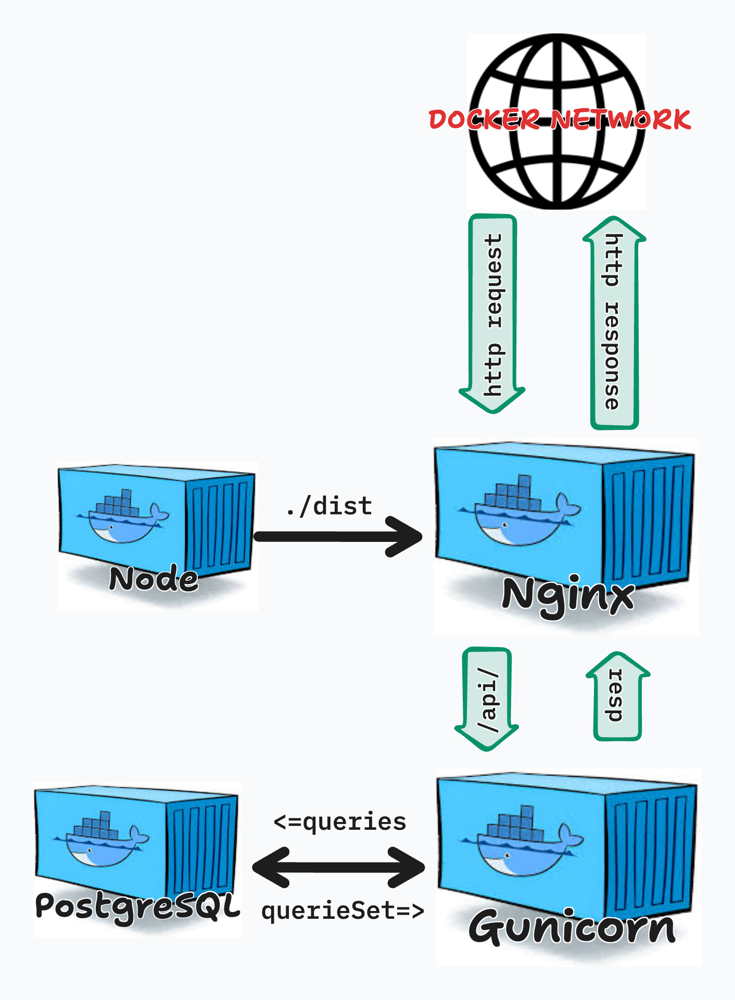

# Full Stack Applications

## What are we trying to accomplish?

In this module, we bring together everything you’ve learned so far—frontend development, backend APIs, databases, and containerization—to build **a complete, production-minded full-stack application**. The goal is not simply to make features work, but to understand how independent systems **coordinate, communicate, and scale together** as a single application.

You will learn how a React frontend, a Django REST API, and a PostgreSQL database operate within clearly defined boundaries while remaining tightly integrated through HTTP, authentication, and shared data models. Using Docker Compose, these services are orchestrated into a reproducible environment that mirrors real-world deployment patterns. On top of this infrastructure, you will implement **authentication workflows and full CRUD operations**, ensuring that users can securely interact with their own data end-to-end.

By the end of this module, you should be able to reason about a full-stack system holistically—how requests flow from the browser to the database and back, how state and authentication persist across refreshes, and how modern tooling supports reliable development and deployment.

---

## Pre-Requisites

* [Project Overview](./0-project-layout/README.md)

---

## Lessons

1. [Docker Composed](./1-docker-compose/README.md)  
2. [Full-Stack Workflow](./2-full-stack-workflow/README.md)  

---

## Module Topics

- Full-stack architecture and request flow
- Docker Compose and multi-service orchestration
- Service-to-service communication over Docker networks
- Token-based authentication with Django REST Framework
- Axios configuration and API integration
- Frontend routing and protected views
- Persistent authentication state using localStorage
- CRUD operations across the full stack
- User-scoped data access and authorization
- Production-minded development workflows
