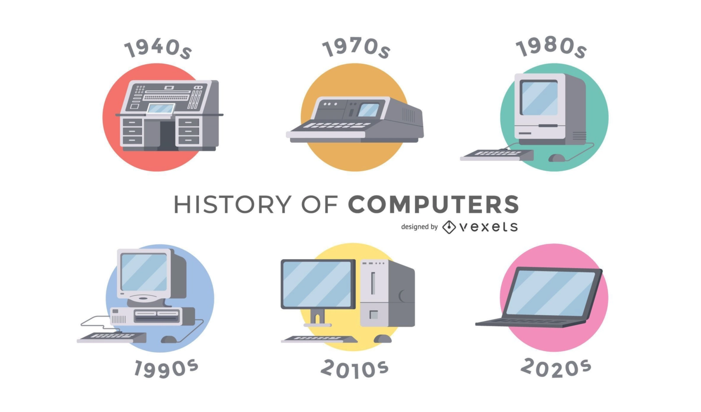
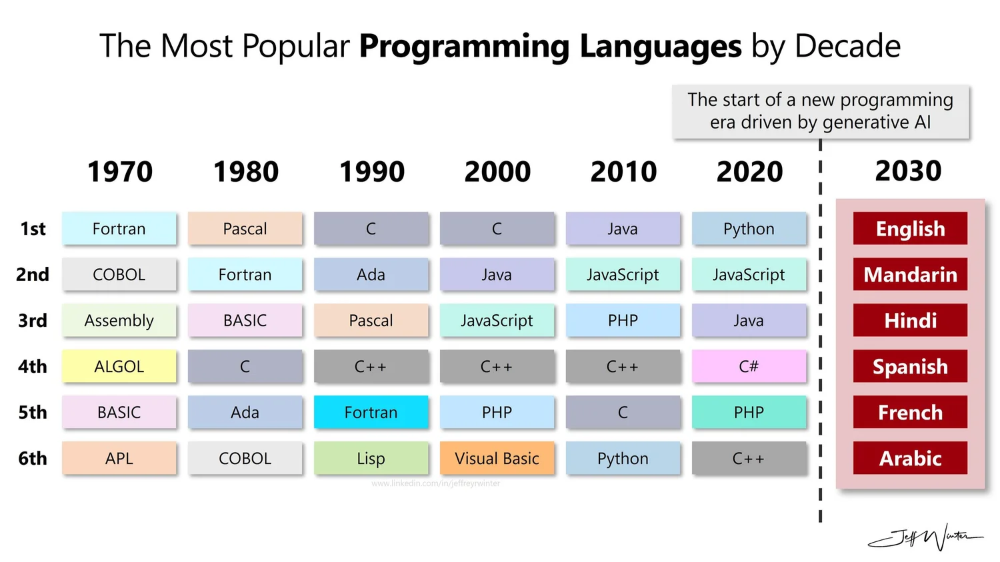
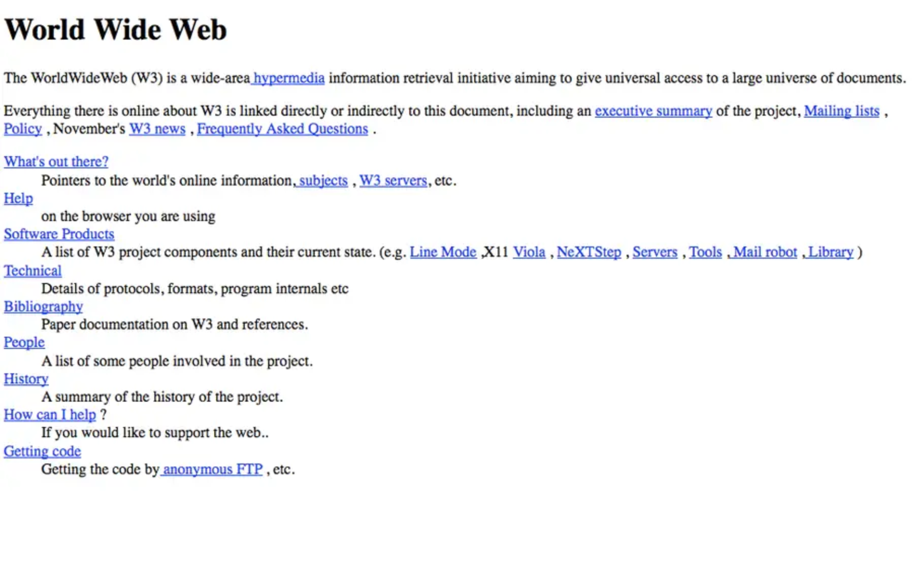
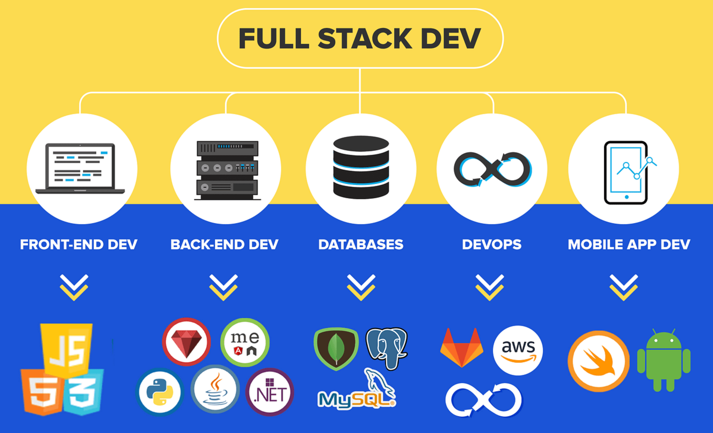
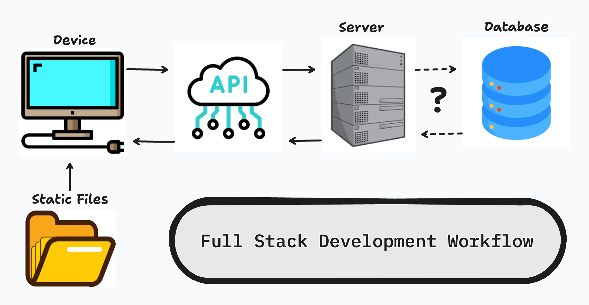
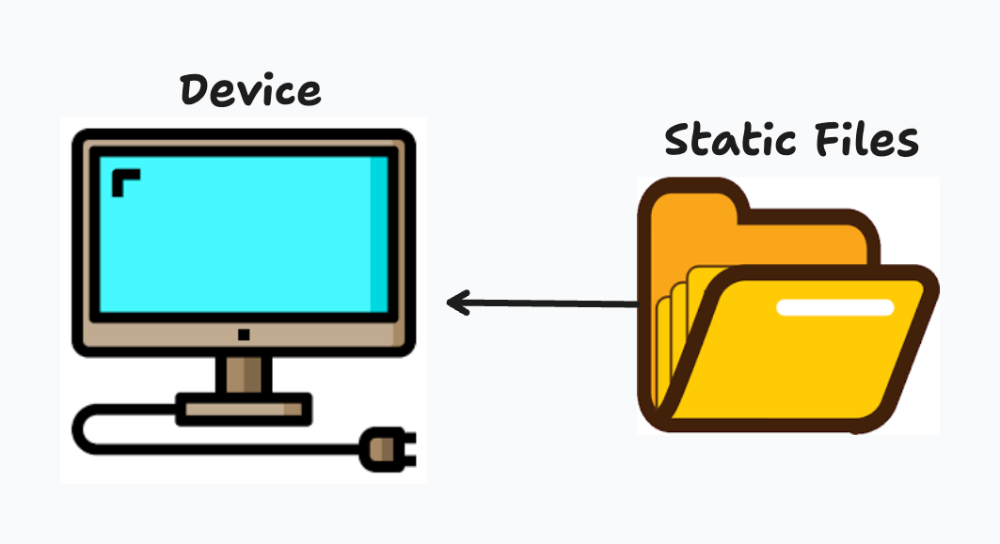
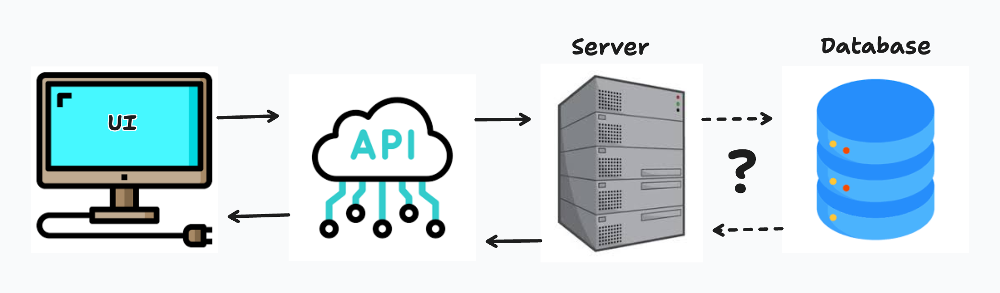

# Intro to Full Stack Development

## Intro

Modern applications rarely exist as a single piece of code. When you open a social media app, stream a video, or submit a form online, dozens of systems are working together behind the scenes to deliver that experience. **Full stack development** is the practice of understanding, building, and connecting those systems into a cohesive application.

In this lesson, we focus on *conceptual understanding* rather than implementation details. The goal is to help you mentally model how real-world applications function end to end—how user actions in a browser result in data being retrieved, processed, stored, and returned. This perspective is critical for writing effective code later, debugging complex issues, and communicating clearly as a software engineer.

---

## History of Web Development

Understanding full stack development is much easier when you understand **how we got here**. Modern tools like React, Django, and cloud infrastructure did not appear overnight—they evolved in response to real limitations, growing user needs, and advances in computing power. This brief historical overview provides context for why the web works the way it does today.

---

### The History of Computers

Early computers were not interactive, portable, or networked. The first computers in the mid-20th century were massive machines designed to perform **single-purpose calculations**, often for military, scientific, or academic use. Programs were written directly for specific hardware, and memory was extremely limited.

As computers evolved, key breakthroughs occurred: stored programs, faster processors, and more efficient memory management. Eventually, computers became general-purpose machines capable of running multiple programs. This shift laid the groundwork for modern operating systems, which abstract hardware complexity and allow developers to focus on software logic rather than physical machines.

---

### The History of Programming

Early programming was tightly coupled to hardware and written in low-level languages like **assembly** and **machine code**. These languages were powerful but difficult to write and maintain. As software complexity grew, higher-level languages such as **FORTRAN**, **C**, and later **Java** and **Python** emerged to improve readability, portability, and developer productivity.

Each generation of programming languages introduced abstractions that reduced cognitive load. Concepts like functions, objects, memory management, and libraries made it possible to build larger systems with fewer errors. Modern programming emphasizes maintainability, scalability, and collaboration—values that strongly influence today’s web development practices.

---

### Birth of the Web

The web began in the early 1990s as a way to **share documents** over the internet. Early websites were entirely static, consisting of HTML files served by a web server and rendered by a browser. There was no user interaction beyond clicking links, and no persistent data tied to users.

As demand grew, servers began generating dynamic content. Technologies like **CGI scripts**, **PHP**, and later **server-side frameworks** allowed web pages to change based on user input. Databases were introduced to store information persistently, marking the beginning of true web applications rather than simple web pages.

---

### The Current Web and Programming

Today’s web is **application-driven**, not document-driven. Modern web apps behave more like desktop software, with real-time updates, personalized experiences, and complex user interactions. Front-end frameworks like React manage application state and rendering, while back-end systems expose APIs that handle authentication, business logic, and data access.

The rise of cloud computing, containerization, and CI/CD pipelines has transformed how applications are built and deployed. Developers now think in terms of **distributed systems**, **scalability**, and **automation**. Full stack development exists because no single layer operates in isolation—the modern web is the result of decades of evolution across hardware, software, and networking.

---

> **Key takeaway:**  
> Full stack development is not just a skillset—it is the culmination of computer science history, programming evolution, and the continuous growth of the web itself.

## What is “Full-Stack” Development?

**Full stack development** refers to working across all major layers of an application. Typically layers of the application are divided by different Technologies, servers, Github Repositories, etc. as a way of ensuring the overall site rarely completely breaks down.

### The Layers

- The **Front-End**, this is typically the technology that is responsible for generating the applications User Interface.
- The **Back-End**, where business logic and validation occur along with the management of overall user data.
- The **Database**, where data is stored. We just mentioned the *Back-End* manages data so some view Database management as part of *Back-End* but you'll learn through your professional career that Databases are a lot more complicated than they may seem to be.
- The **Infrastructure**, which connects and deploys these components. We won't dive too far into this to avoid escalating the amount of information you are about to receive up to this point.

A full stack developer does not necessarily specialize in everything at once, but they understand how each layer interacts with the others. This understanding allows developers to reason about data flow, performance, security, and scalability. When something breaks, full stack awareness helps identify *where* the issue likely exists and *why* it occurs.

Rather than thinking in terms of isolated files or functions, full stack development encourages thinking in terms of **systems**.

> Jack of all traits, master of none, but often better than a master of one.

---

## Full Stack Development Flow

To make this concrete, let’s walk through a familiar experience: opening Instagram. While the real system is extremely complex, this simplified flow illustrates the core concepts that apply to most full stack applications.

---

### You Open Instagram

When you open Instagram in a browser or mobile app, the client begins by requesting the application interface from a server. This typically includes a folder of *static files* such as HTML, CSS, and JavaScript—or in modern frameworks, a bundled JavaScript application such as React.

Once the front-end code loads, it initializes the application and prepares to request additional data. At this point, the interface you see is often just a *shell*—the real content is still on its way.

---

### Request for User-Pertaining Data

With authentication complete, the application requests personalized data—such as posts, comments, followers, or messages. These requests are sent from the front-end to the back-end as HTTP requests, often using tools like `fetch` or `axios` which are common tools found within JavaScript.

The back-end processes these requests by applying business logic and querying the database. It determines *what* data the user is allowed to access and *how* it should be structured. The response is then sent back to the front-end in a standardized format, commonly JSON.

---

### App State Renders UI

When the front-end receives the data, it updates application state again. This triggers a re-render of the UI, displaying posts, images, usernames, and interactions specific to the user.

At this point, the application feels “alive.” What the user sees is no longer static—it is a reflection of real data retrieved from a server and stored in a database. The UI is simply a visual representation of the current application state.

---

### User Interacts with the Application

As the user likes a post, leaves a comment, or follows another account, the cycle repeats. Each interaction updates state locally, sends requests to the back-end, and potentially modifies data in the database.

The front-end handles user experience and responsiveness, while the back-end ensures correctness, security, and persistence. This continuous feedback loop between user actions and system responses is the essence of full stack development.

---

## Web Vocabulary

### IP - Internet Protocol

> The first protocol you should be aware of is IP, Internet Protocol. IP is concerned with WHERE a server is located on the internet. This location is described with a number called an IP address, which is similar to a physical address. Most of the world currently uses the fourth version of the IP protocol (IPv4), in which an IP address is a series of 4 numbers, separated by periods, like '192.0.2.1'. Whenever you type a domain name into your browser's url bar, your browser has to convert that into an IP address to know where to send the request. This is done using the Domain Name System (DNS)

---

### TCP - Transmission Control Protocol

> IP is only concerned with WHERE a server is, but not HOW to get there. TCP (transmission control protocol) provides reliable, ordered, and error-checked delivery of a stream of bytes between applications running on hosts communicating via an IP network. The reliability makes this protocol a little bit slower, since every single TCP connection actually requires multiple requests to initiate, known as a 3-way handshake. TCP was designed alongside IP, so they're often referred to together as TCP/IP.

---

### HTTP - Hypertext Transfer Protocol

> TCP is only concerned with HOW data is transferred, but not WHAT data is transferred, or how the data is formatted. The format of our application data is determined by the HTTP protocol.

### AJAX - Asynchronous Javascript and XML

> There are many ways to send an HTTP request, such as clicking a link, submitting a form, or just typing a url into your browser. However, most ways of sending HTTP requests from your browser will unload the page, and replace it entirely with the contents of the HTTP response. To build a more elegant, modern application, we need a way to send an HTTP request in the background without interrupting the user's experience. This technique is known as AJAX: 'asynchronous javascript and xml'. 'asynchronous javascript' just means that we're doing work with javascript in the background, while other processes continue. XML is a data type that can potentially be returned by an AJAX request. In modern applications, XML is not commonly used, but JSON (javascript object notation) is used instead. However, even though we typically get JSON, not XML, from AJAX requests, we still call this technique 'AJAX', because that sounds cool, and 'AJAJ' sounds weird.
> This technique was first made possible in 1999 in Internet explorer, through an object that is now known as `XMLHttpRequest`, or XHR. XHR enabled developers to build many kinds of applications that wouldn't have been possible otherwise, although it was pretty awkward to work with. More recently, modern browsers have started supporting `fetch()`, which provides more convenient access to the same functionality. However, neither of these options is as powerful and convenient as some 3rd party AJAX tools.

## Conclusion

Full stack development is about understanding **how everything connects**. It is not just writing front-end components or back-end APIs in isolation, but designing systems where data flows predictably and reliably between layers.

In this lesson, you learned how a real-world application operates from the moment it opens to the moment a user interacts with it. This mental model will serve as the foundation for every technical skill you build moving forward—from React components and API design to authentication, databases, and deployment.

As we progress, each new tool you learn will fit into this larger picture, helping you move from writing code to building complete, production-ready applications.
