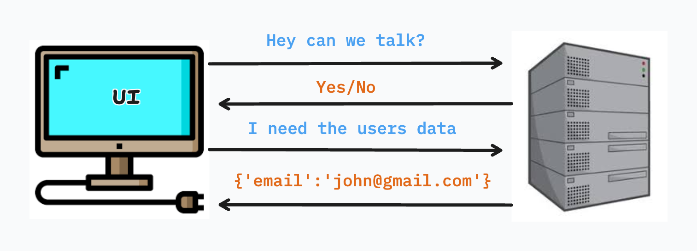
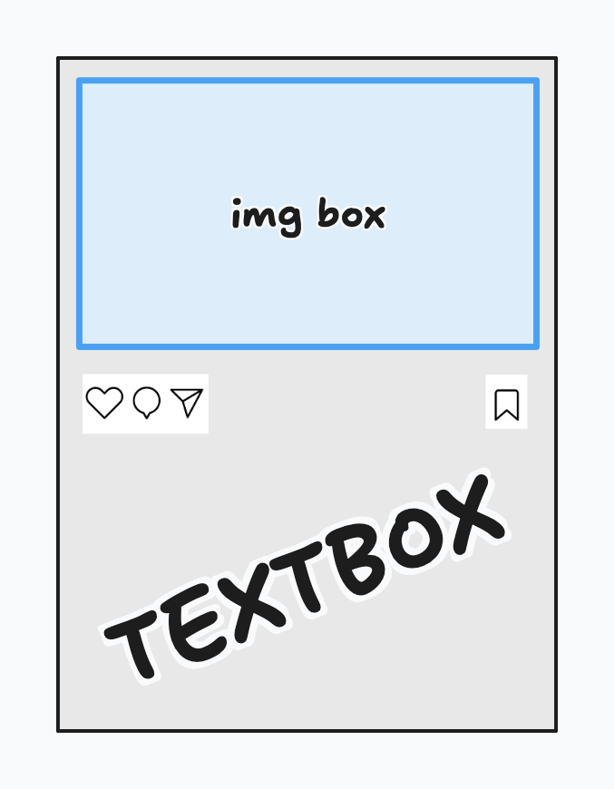
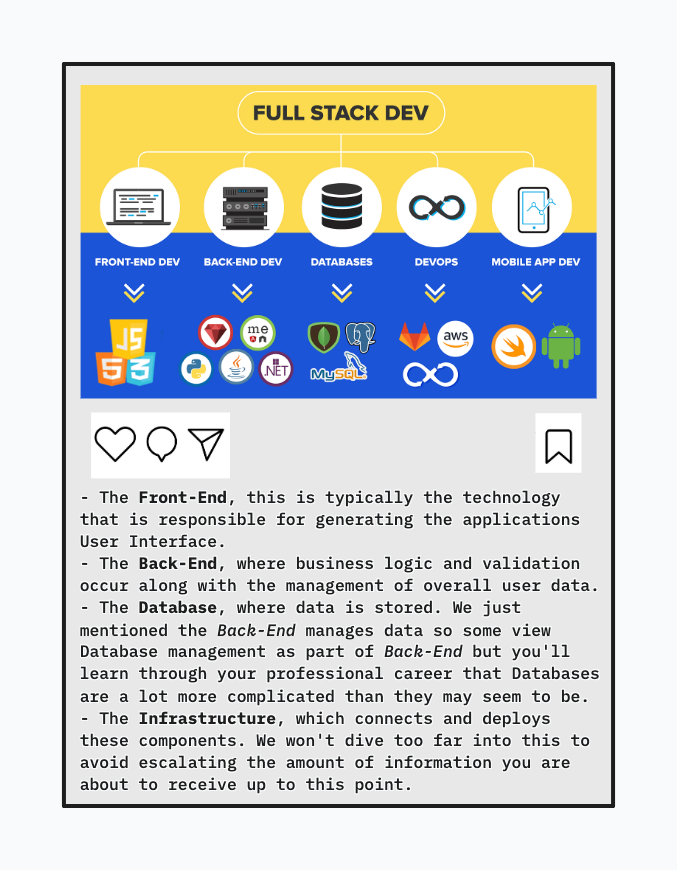

# Full Stack Development Breakdown

## Intro

Full stack development is about understanding **how every layer of an application works together**. While front-end and back-end technologies are often taught separately, real-world applications depend on constant communication between them. Every click, form submission, and page update is the result of a coordinated exchange between a user interface, a server, and a data source.

In this lecture, we will break down full stack development into its core components and walk through how data flows from the user to the server and back again. The goal is not to memorize tools or syntax, but to build a **mental model** of how modern web applications operate.

---

## What is HTTP?

At the center of full stack communication is **HTTP (HyperText Transfer Protocol)**. HTTP is the language that browsers and servers use to communicate over the internet. It defines how requests are sent, how responses are structured, and how clients and servers understand one another.

HTTP is **stateless**, meaning each request is independent. The server does not remember previous requests unless additional systems—like sessions, cookies, or tokens—are introduced. This design keeps communication simple and scalable, but requires developers to be explicit about state management.

---

### The HTTP Conversation

An HTTP interaction is best understood as a conversation. The browser starts the conversation by sending a request, and the server responds with a message containing data or an explanation of what happened. This exchange happens constantly, often without the user realizing it. At least at the surface level that's what it looks like but there is an awkward phase where the server may decline to accept requests from the browser.

The conversation looks something like this:



Each request includes information such as the destination URL, the type of action being requested, and any data needed to fulfill the request. The response includes a status code indicating success or failure, along with any data the client needs to update the interface.

---

## The Front-End Breakdown

The front-end is the **user-facing layer** of an application. Its primary responsibility is to display information and capture user interactions. Modern front-end development focuses on writing reusable, modular code that can respond dynamically to changes in data.

---

### Reusable and Conditional Blocks of Code

Front-end frameworks encourage developers to break interfaces into reusable pieces. These pieces can be shown, hidden, or updated based on application state. This allows developers to avoid duplicating logic and ensures consistency across the user experience.

Conditional rendering is especially important. Interfaces change based on whether a user is logged in, whether data has loaded, or whether an error occurred. Instead of navigating to entirely new pages, modern applications update only the parts of the UI that need to change.

---

### Components Dependent on Data

Front-end components often rely on data that does not exist at page load. This data may come from an API, user input, or external services. Because of this, components must be designed to handle loading states, empty states, and error states gracefully.

This dependency on data is what makes front-end development tightly coupled to back-end behavior. The shape, timing, and reliability of server responses directly influence how the UI behaves.



Think about an Instagram post, the skeleton code that generates the visual component is always living within the Front-End application but it's empty. It holds no actual dynamic data. So the Front-End makes a request to the server asking for posts to which the Back-End server returns an array of objects in a format that may look like:

```json
[
  {
    "img":"image_address.png",
    "likes":100,
    "text":"This is a text describing an img",
    "comments":[
      {
        "text":"This is an awesome post",
        "likes":5,
        "replies":[
          {
            "text":"it's not that awesome",
            "likes":1
          }
        ]
      }
    ]
  }
]
```

From there the Front-End skeleton starts to fill in the blanks and generates the post to the user with the appropriate data.



---

## The Back-End

The back-end is responsible for **business logic, data integrity, and security**. While the front-end focuses on presentation, the back-end ensures that operations are valid, authorized, and correctly stored.

---

### Validating and Serializing Data

Before data is stored or processed, the back-end must validate it. Validation ensures that incoming data meets expectations, such as correct types, required fields, and acceptable values. This protects the system from invalid input and malicious behavior.

Once validated, data is often serialized. Serialization converts complex objects into formats like JSON so they can be transmitted over HTTP and understood by the front-end. This step creates a clear contract between client and server.

---

### CRUD Methods

Most back-end systems revolve around CRUD operations: Create, Read, Update, and Delete. These actions define how data moves through an application. Whether a user is creating an account, viewing content, editing a profile, or deleting a post, the back-end enforces the rules governing these actions.

CRUD operations are mapped directly to HTTP methods, creating a predictable and standardized API structure.

---

## Front-End and Back-End Communication

The heart of full stack development is the communication loop between client and server. Every interaction follows a predictable sequence that repeats throughout the life of an application.

---

### Front-End Formulating a Request

When a user interacts with the application, the front-end constructs an HTTP request. This request includes the destination endpoint, the method being used, and any data required to perform the action.

---

#### HTTP Methods

HTTP methods describe the intent of a request. A GET request retrieves data, a POST request creates new data, PUT or PATCH modifies existing data, and DELETE removes data. Choosing the correct method ensures clarity, consistency, and alignment with RESTful design principles.

#### Real World Relevancy

Let's think about generating an Instagram post rather than retrieving an Instagram post. On the Front-End the user fills out a form with image or video file/s and a body of text. This data is then utilized to formulate a request in JavaScript to *create* an Instagram post.

```javascript
axios.post('http://back-end.server', data={
  "image":"12vsdui43.png",
  "text":"this is my lunch"
})
```

---

### Back-End Receiving the Request

The back-end receives the request and determines how to handle it. This includes routing the request to the correct handler, validating permissions, checking data integrity, and executing business logic. If anything goes wrong at this stage, the server responds with an appropriate error.

---

### Back-End Formulating a Response

Once processing is complete, the back-end sends a response back to the client. This response includes both data and a status code indicating the outcome of the request.

---

#### HTTP Response Status Codes

Status codes communicate meaning beyond the data itself. Codes in the 200 range indicate success, 400-level codes signal client-side issues, and 500-level codes represent server-side failures. These codes allow the front-end to react appropriately without guessing what went wrong.

#### Real World Relevancy

Going back to our Instagram request sent by the browser to the server. The server grabs the data from the body of the request and proceeds to validate data, store the data and then return a response with a status code that would tell the browser if the request was successfully fulfilled.

```python
class InstagramPosts(APIView):
  
  def post(self, request):
    try:
      data = request.data.copy() #GRABS DATA FROM THE REQUEST
      new_post = IgPostSerializer(data) #SERIALIZES DATA
      if new_post.is_valid(): 
        return Response(new_post.data, status=HTTP_201_CREATED) #IF VALID
      else:
        return Response(new_post.errors, status=HTTP_400_BAD_REQUEST) #IF INVALID
    except Exception as e:
      return Response(e.message_dict, status=HTTP_500_INTERNAL_SERVER_ERROR) #DEV ERROR
```

---

### Front-End Receiving a Response

The front-end receives the response and interprets it. Successful responses may trigger UI updates, while error responses may display messages or prompt corrective action. This step is critical for maintaining a responsive and user-friendly experience.

---

#### Front-End Updating the UI

Based on the response, the front-end updates application state and re-renders components. This could mean displaying new data, navigating to a different view, or informing the user of an issue. The user experiences this as a seamless interaction, even though multiple systems are involved.

#### Real World Relevancy

When the response comes back from the server, the browser uses JavaScript to conduct the appropriate action. For example:

```JavaScript
axios.post('http://back-end.server', data={
  "image":"12vsdui43.png",
  "text":"this is my lunch"
})
  .then((response)=>{
    if(response.status_code === 201){
      // redirect user to their post page
    }
    else{
      alert(response.data) // raises a pop up letting the user know the issue
    }
  })
  .catch((err)=>{
    console.log(err) // dev error
  })
```

---

### Rinse and Repeat

This request-response cycle repeats continuously as users interact with the application. Full stack developers must understand this loop deeply, because performance, reliability, and user experience all depend on how efficiently it operates.

---

## <a href="https://docs.google.com/presentation/d/15Mq7xn5nQVDjShPOZd4cwVi807oQvNfLE3irJDrlgwU/edit#slide=id.p" target="_blank" rel="noopener noreferrer">CHECK OUT THIS SLIDE DECK</a>

## Conclusion

Full stack development is not about mastering every tool—it’s about understanding **how the pieces fit together**. HTTP provides the communication layer, the front-end manages interaction and presentation, and the back-end enforces logic and data integrity.

By understanding this flow, developers gain the ability to reason about bugs, performance issues, and architectural decisions. This mental model is what transforms someone from a code writer into a full stack engineer.
