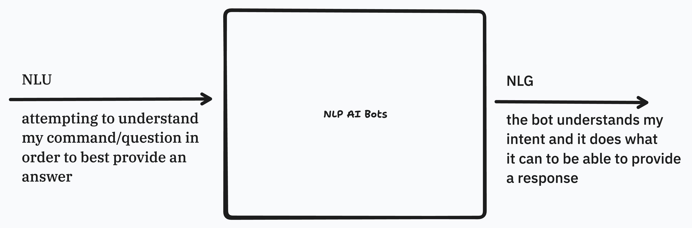
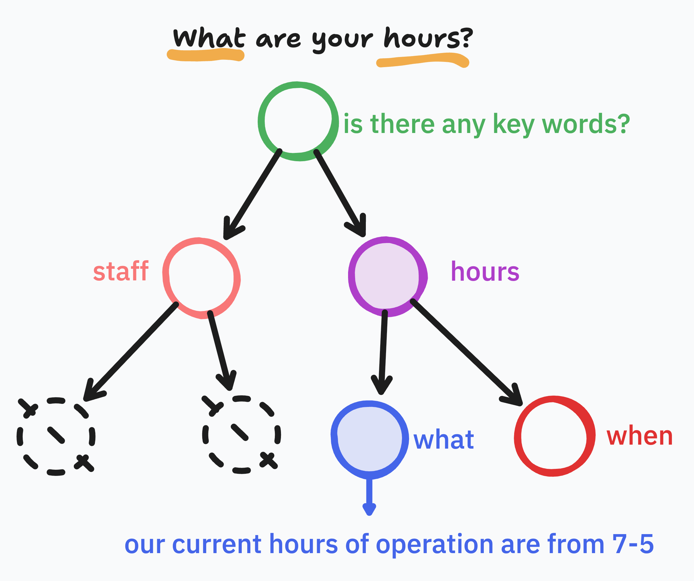
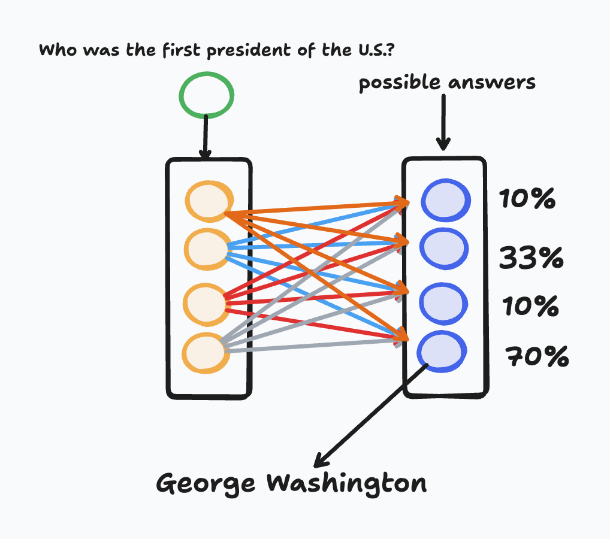
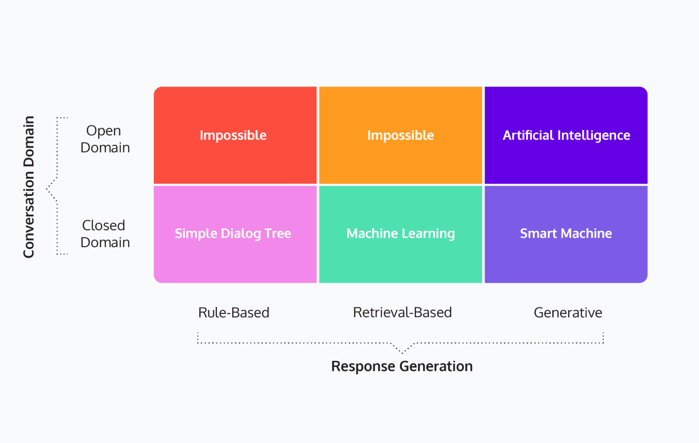

# What are Chat-Bots

## What are AI Chatbots?

AI chatbots are computer programs designed to simulate human conversation using artificial intelligence, natural language processing (NLP), and often machine learning. They began as rule-based systems in the 1960s, with early examples like **ELIZA** (1966), which mimicked a psychotherapist using simple pattern matching and scripted responses. In the 1990s, bots like **ALICE** advanced the concept with more sophisticated scripting but still lacked understanding of context. With the rise of machine learning and big data in the 2010s, chatbots evolved dramatically—**Siri**, **Alexa**, and **Google Assistant** introduced voice-enabled interfaces with NLP capabilities. The real leap came with deep learning and transformer-based models like OpenAI’s **GPT** series and Google’s **BERT**, which enabled generative AI chatbots to understand context, nuance, and user intent. Today’s AI chatbots, such as **ChatGPT**, can hold dynamic, human-like conversations, assist with customer support, education, and personal productivity, and are integrated into platforms from websites to mobile apps, representing a significant evolution from scripted responders to intelligent conversational agents.

## How do they work?

From a technical standpoint, chatbots function by processing user input—typically text or voice—through several layers, beginning with **natural language understanding (NLU)** to interpret the user's intent and extract relevant information. This is followed by a **dialogue management** system that determines how the bot should respond, using either predefined rules or machine learning models trained on large datasets. The response is then generated using **natural language generation (NLG)** and sent back to the user in human-readable form. More advanced AI chatbots, like those built on transformer models (e.g., GPT), use deep learning to predict and generate coherent, context-aware responses across a conversation. From the user's perspective, this process is seamless: they input a question or command and receive an intelligent, often conversational response almost instantly. The chatbot appears to "understand" and respond naturally, creating an interactive experience that feels human-like, even though it's powered by complex data pipelines, algorithms, and model inference under the hood.

- NLU (Natural Language Understanding):
    - Intent Detection: Is the user asking a question, giving a command?
    - Entity Recognition: Extracting items like dates, names, product IDs.
- Dialogue Management Layer:
    - tracks conversation state, 
    - decides next actions
    - applies business or model logic.
- NLG (Natural Language Generation):
    - Takes internal data or logic results and produces a human-like response.
    - Example: converting “{item} is out of stock” into “Sorry, we’re currently out of {item}.”

## Types of ChatBots

### Rule-Based ChatBots

**What is a rule-based chatbot?**  

A rule-based chatbot operates on a set of predefined rules and patterns, often using decision trees or keyword matching to guide the flow of conversation. These bots do not understand context or intent beyond their hardcoded logic and are typically designed for specific tasks like answering FAQs or guiding users through menus. Check out <a href="https://anthay.github.io/eliza.html" target="_">**E.L.I.Z.A.**</a> take some time to experiment and test out the bots capabilities and limitations.

#### Response Generation  

Rule-based chatbots generate responses by matching the user’s input to a fixed set of rules or triggers. For example, if a user types "What are your hours?", the bot searches for keywords like "hours" and replies with a preset message. There is no learning or adaptability; every valid input must have a predefined rule to match.

#### Conversation Domain

Rule-based chatbots are **closed-domain** systems. They can only handle questions and interactions within the specific scope they were designed for. If a user deviates from the expected inputs, the chatbot often fails or gives an irrelevant response.

### Retrieval-Based ChatBots

**What is a retrieval-based chatbot?**

Retrieval-based chatbots select the most appropriate response from a pool of predefined responses using machine learning and natural language processing. These bots rely on similarity measures and intent recognition to find the best match to a user's input. Checkout <a href="https://www.pandorabots.com/pandora/talk?botid=b8d616e35e36e881" target="_">**Alice**</a> take some time to experiment and test out the bots capabilities and limitations.

#### Response Generation (RB)

Retrieval-based chatbots use models to interpret user intent and then retrieve the best matching response from a database or response bank. They do not generate original responses; instead, they choose from existing ones, ensuring that answers are relevant and controlled.

#### Conversation Domain (RB)

These chatbots are usually **semi-closed domain** but can scale to larger applications with a wide set of intents. While they are more flexible than rule-based bots, they still struggle with true open-domain conversations because their responses are limited to what is pre-written.

> Unlike generative models, retrieval-based chatbots never invent new sentences. Every response the user sees already exists in the system’s response bank.

### Generative ChatBots

**What is a generative chatbot?**  

Generative chatbots use deep learning models—especially transformer architectures like GPT—to generate responses word-by-word. They don’t rely on pre-written answers but instead form new responses based on training data and contextual understanding.

#### Response Generation (GC)

These chatbots use neural networks trained on massive datasets to predict the next word in a sequence, allowing them to craft entirely new responses on the fly. This allows them to handle novel queries, express creativity, and adapt to various conversation tones and topics.

#### Conversation Domain (GC)

Generative chatbots are capable of **open-domain** conversations. They can discuss virtually any topic, shift context dynamically, and provide nuanced, detailed responses—though they may occasionally generate inaccurate or unexpected answers.

### Types of Chatbots Summary

Rule-based, retrieval-based, and generative chatbots differ fundamentally in how they produce responses and the range of conversations they can support. **Rule-based bots** follow strict if-then logic and can only handle predefined interactions, making them ideal for narrow, predictable tasks. **Retrieval-based bots** improve flexibility by using intent detection and selecting responses from a curated set, providing more dynamic conversations while maintaining control. **Generative bots**, powered by advanced AI models, are the most sophisticated—able to understand and generate context-aware, natural language across broad topics. However, this power comes with the trade-off of needing more data, compute, and careful monitoring for accuracy and safety.

### Use Cases for each Chatbot

| Use Case                     | Best Fit        | Reason                                       |
| ---------------------------- | --------------- | -------------------------------------------- |
| FAQ Bot                      | Rule-Based      | Predictable questions and answers            |
| E-commerce Product Assistant | Retrieval-Based | Requires context-aware, accurate responses   |
| Personal Assistant           | Generative      | Needs flexibility and conversational ability |
| Mental Health Companion      | Generative      | Requires empathy and open-domain capability  |
| IVR Phone Menu               | Rule-Based      | Fixed flow with clear user options           |

## Ethical Concerns

As chatbot technology advances, developers must navigate several ethical concerns to ensure responsible and transparent use. A key issue is **user transparency**, especially regarding how chatbots collect, store, and use personal data—users should always be informed if their conversations are recorded or used for training purposes. Another concern involves **chatbot personas**, such as the infamous case of Microsoft’s Tay, which quickly adopted offensive language after being exposed to toxic inputs on social media. This highlights the risk of unmoderated learning and the importance of setting clear behavioral boundaries. Additionally, chatbots can employ **manipulative communication techniques**, such as mimicking human empathy or persuasion, which may mislead users or exploit trust—particularly in customer service or mental health contexts. Developers must be cautious to design chatbots that are not only effective but also ethical, transparent, and aligned with user safety and societal values.

## Summary

AI chatbots have come a long way from simple rule-based systems to sophisticated generative models capable of human-like conversation. We've explored the evolution from ELIZA to ChatGPT, detailing how these bots use NLU, dialogue management, and NLG to understand and respond to user input. Understanding the distinctions between rule-based, retrieval-based, and generative chatbots is crucial: rule-based for structured tasks, retrieval-based for context-aware interactions, and generative for open-domain conversations requiring creativity and nuance. As we integrate chatbots into various aspects of our lives, from customer service to mental health support, it's essential to address the ethical concerns surrounding transparency, persona management, and the potential for manipulative communication. By understanding both the capabilities and limitations of each type, along with the ethical considerations, we can harness the power of AI chatbots responsibly and effectively.
