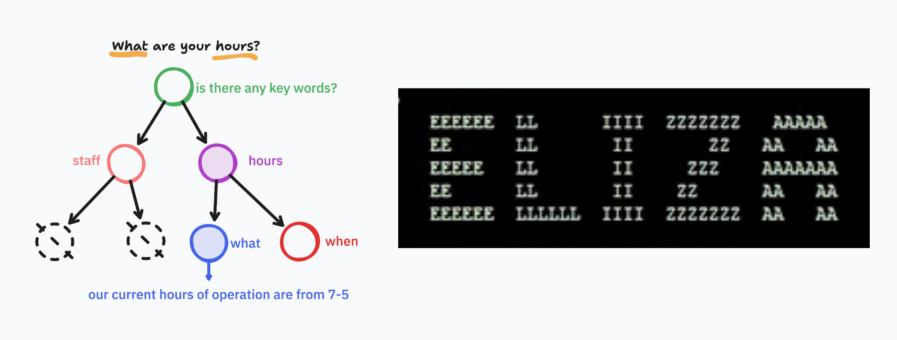

# Rule Based ChatBots



## Concepts of a Rule-Based ChatBot

A **rule-based ChatBot** is a conversational agent that relies on predefined rules, conditions, or patterns to determine how to respond to user inputs. Unlike machine learning ChatBots, it does not learn from data or adapt dynamically—instead, it uses _if-else logic_, _decision trees_, or _regular expressions (regex)_ to match user input to specific responses. In this lecture we will utilize Python Classes to create a Rule Based Chatbot that helps agents `learn` how to pay their bill and `paying` their bills.

---

### What common methods belong to a ChatBot?

A typical rule-based chatbot contains:

- **Entering**  
  A method that greets the user and introduces the chatbot’s purpose. It can also be utilized to capture the users name in hopes of generating a more user friendly interaction with the ChatBot.

- **Exiting**  
  A method that allows users to leave the conversation gracefully (e.g., recognizing exit commands or negative sentiments).

- **Handling a Conversation**  
  A method that controls the conversation flow—parsing input, matching patterns, and delivering appropriate responses.

---

### Limitations of Rule-Based Chatbots

- New phrasing requires new rules
- Complex conversations become hard to manage
- No learning or adaptation
- Difficult to scale beyond narrow domains

These limitations motivate the move toward retrieval-based and generative chatbots. Think about yourself being the single developer in charge of managing a rule based chatbot for a customer service line within your company. Any time something within your companies SOP changes or the methods for processing payments change, you would have to go back onto the chatbot code and manually find and refactor all logic to match the new requirements. This is inefficient and extremely difficult to maintain.

---

## BillPayChatBot

Let's go ahead and kick off interactions with ChatBots by creating a ChatBot meant to interact with everyday users and help them process payment related actions. This means our bot should do the following actions:

> GREET -> IDENTIFY INTENT | NEGATIVE RESPONSES | EXIT COMMANDS -> PROCESS LOGIC MATCHING THE INTENT

---

### Creating a Welcome Method

Let's start by creating a class that will hold multiple methods to handle this logic.

```python
import re

class BillPayChatBot:

  def __init__(self):
    self.greeting = "Hello my name is BillBot!, I am here to help manage your account! How may I be of service? You can say things like 'Pay my bill' or 'check account balance'.\n"""

  def conversation(self)-> None:
    reply = input(self.greeting).lower().strip()
    print(reply)

  def __call__(self):
    self.conversation()

bot = BillPayChatBot()
bot()
```

When you create and call an instance of `BillPayChatBot`, it will trigger the `conversation` method. This is due to the `__call__` method we've created within the class definition.

---

### Identifying Negative Responses

The bot should recognize when a user wants to leave the chat or refusing help from the bot itself. We can do this by adding a couple of instance variables detailing both predefined `Exit` and `Negative` responses. Now we could just write these negative responses as a list of strings, but instead of strings lets utilize regex strings that we can later utilize to quickly find matches of their presence. As you may have experiences when interacting with these bots, user input is never too straight forward so we have to find an efficient way to find *keywords/phrases* like these.

```python
    def __init__(self):
        ...
        self.negative_responses = [r'cancel', r'no', r'not now',r'never']
        self.exit_commands = [r'exit', r'quit', r'bye', r'get out', r'leave me alone']
```

We can determine if these `Negative` commands are present within our users initial response by creating a method `check_negative` that will take in the users input, iterate through the `negative_responses` and identify if any of them are present within the user input. Then we call this method within our initial conversation method:

```python
    def conversation(self):
        reply = input(self.greeting).lower().strip()
        if self.check_negative(reply):
          return

    def check_negative(self, user_input:str) -> bool:
        for negative in self.negative_responses:
            found = re.search(negative, user_input)
            if found:
                print("Alright, I understand you don't want this action. Lets try again later!")
                return True
        return False
```

> *NOTE*: We want to *normalize* user input by flattening the string and removing any unnecessary white spaces.

---

### Creating a Handling Conversation Method

The core of the chatbot is the ability to process user inputs, identify intent, and respond accordingly allowing users to feel like they can effectively communicate and find their desired information. We can accomplish this by creating a method which will handle the conversation between our user and our ChatBot and call the method within the `conversation` method.

```python
    def conversation(self):
        reply = input(self.greeting).lower().strip()
        if self.check_negative(reply):
          return
        self.handle_conversation(reply)

    def handle_conversation(self, user_input):
        while True:
            print(user_input)
            break
```

For now we are going to leave this with little to no logic but as we continue in this lecture we will see this block of code dramatically evolve in logic.

---

### Creating the Exit Command

Now that we are able to pass the user input into our `handle_conversation` method, we can ensure the users have a method for being able to exit the interaction with the ChatBot. This method should iterate through the different `exit` commands and check if they are present within the user input.

```python
    def handle_conversation(self, user_input):
        while not self.check_exit(user_input):
            print(user_input)
            break

    def check_exit(self, user_input:str) -> bool:
        for exit_cmd in self.exit_commands:
            found = re.search(exit_cmd, user_input)
            if found:
                print("Thank you for coming in, I hope you are satisfied with your service")
                return True
        return False
```

This method scans user input for exit commands by leveraging *regex* to ensure lookups are as efficient as possible. If found, it gracefully ends the interaction and releases the user from the conversation.

---

### Identifying Intent

Since this is a rule-based chatbot, we know exactly which intents we want to handle allowing us to utilize tools like regex to identify and designate intent to our users input. In this case the actions we want to handle are:

- ✅ **Pay bill**
- ✅ **Ask about balance**
- ✅ **General help**

We can use regex or simple keyword matching by defining an intents dictionary where for every intent we hold a list of possible keywords that match the intent:

```python
    def __init__(self):
        ...
        self.intents = {
            # key = intent : vals = list of regex that match the intent
            "pay_bill": [r'\bpay\b.*\bbill\b', r'\bbill\b.*\bpay\b'],
            "check_balance":[r'\bbalance\b'],
            "help":[r'\bhelp\b']
        }

```

Now we want to create a method that will iterate through the different keywords for each intent and if a match is found to return the intent that has been identified. This way we can map the appropriate logic and return the next steps to the user.

```python
    def handle_conversation(self, user_input):
        while not self.check_exit(user_input):
            match = self.identify_intent(user_input)
            if not match:
                user_input = input("I'm sorry, I couldn't understand you. Please rephrase your statement.\n").lower().strip()

    def identify_intent(self, user_input:str)->str:
        user_input = user_input.lower().strip()
        if self.check_negative(user_input):
            return "_"
        for intent, expressions in self.intents.items(): # [[key,val], [key,val], [key,val]]
            for reg in expressions:
                if re.search(reg, user_input):
                    return intent
        user_input = input("Sorry I couldn't understand you! Please clearly state 'Pay Bill', 'Check Balance', or 'Help'.\n").lower().strip()
        return self.identify_intent(user_input)
```

---

#### Why Regex Works Well for Rule-Based Chatbots

Regex allows us to match flexible patterns in user input without understanding the full meaning.
For example, the phrases:

- "I want to pay my bill"
- "Can I pay this bill now?"
- "Bill payment please"

All map to the same intent because they share predictable word patterns.

---

### Matching to a Response

Depending on the intent we identify, we will want to match an appropriate response and return that to the user. Let's make a method that takes in the identified intent and print a message to the user that matches the action they are trying to conduct:

```python
    def handle_conversation(self, user_input):
            while not self.check_exit(user_input):
                intent = self.identify_intent(user_input)
                if intent != "_":
                    self.match_response(intent)
                user_input = input("How else may I help you?\n").lower().strip()


    def match_response(self, intent:str) -> None:
        if intent == 'pay_bill':
            print("Great, lets pay your bill!\nPlease provide your 10 digit credit card number:\n")
        elif intent == 'check_balance':
            print("Your current balance is as follows:")
        else:
            print("I am capable of helping you make a payment and or hear your account balance.\nAny other actions would require you to visit us in person!")
     
```

We can take this method and replace each one of these print statements with independent functions or utilities that will help the user achieve their intent. Typically other classes that hold their own methods and logic for continuing the conversation process and executing the actions the user is attempting to complete.

---

### Conversation Loop Mental Model

A rule-based chatbot operates in a loop:

1. Prompt the user for input
2. Normalize the input
3. Check for exit conditions
4. Detect intent using rules or regex
5. Return a predefined response
6. Repeat until the user exits

This loop continues until an explicit exit condition is met.

---

### Testing Your Chatbot

Try the following inputs and observe how the chatbot responds:

- "Pay my bill"
- "What's my balance?"
- "Help"
- "No thanks"
- "Exit"

Understanding how rules fire helps you debug conversational logic.

---

## Conclusion

In this lesson, we designed a **rule-based chatbot** that assists customers in paying their bills. We explored how to:

- ✅ Greet and guide users at the start of a conversation.
- ✅ Recognize exit commands and negative responses to end conversations politely.
- ✅ Identify user intent using regex patterns.
- ✅ Return clear, predefined responses based on intent.

Rule-based bots like this are ideal for narrow, well-defined tasks (such as bill payment) because they provide **predictable**, **controlled**, and **reliable** interactions. While they may not handle unexpected queries as flexibly as AI-driven chatbots, they remain a valuable tool for customer service scenarios where accuracy and compliance are essential.
