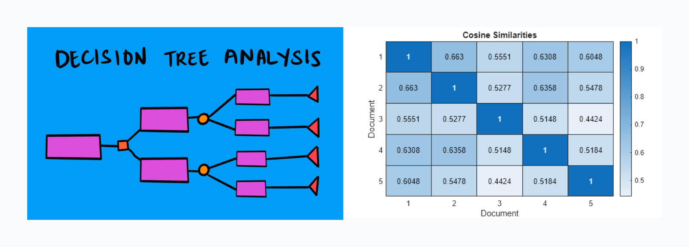
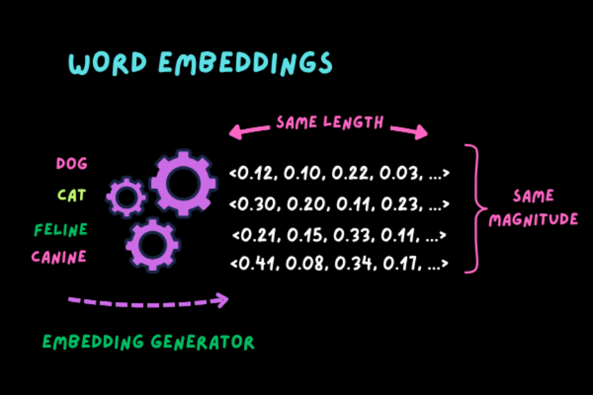
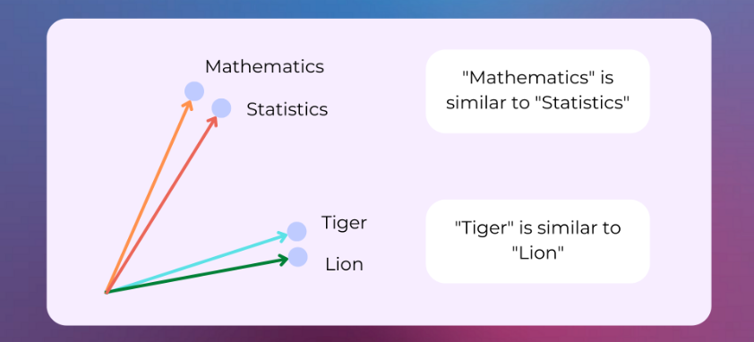

# Understanding Retrieval-Based Chatbots

---

## Introduction

In this lecture you'll learn what a **retrieval-based chatbot** is and how it differs from a **rule-based chatbot**. From there we will move on into breaking down the functionality of understanding intent and how limited this process is when working within a Rule Based Chatbot. We will learn how to empower our chatbot by converting text into numbers using **Bag-of-Words**, **TF-IDF**, and **embeddings** which will allow us to turn chatbots from rule base to retrieval base.

---

## What Is a Retrieval-Based Chatbot?

### The Evolution from Rule-Based to Retrieval-Based Systems

A **rule-based chatbot** relies on strict logic — it follows predefined rules written by a human developer.  
You might use **if/else statements**, **regex patterns**, or **decision trees** to decide which response to give.

For example:
```python
import re

def rule_based_chatbot(text):
    if re.search(r"\bhello\b", text, re.I):
        return "Hello there!"
    elif re.search(r"\bbye\b", text, re.I):
        return "Goodbye!"
    else:
        return "I'm not sure what you mean."
```

This approach works well for small, predictable interactions (like “hi”, “bye”, or “thank you”),
but it quickly becomes **rigid** and **unscalable**.
As soon as you want your chatbot to understand dozens of ways people might say the same thing, your rules explode.

---

### Retrieval-Based Chatbots: The Next Step

A **retrieval-based chatbot**, on the other hand, doesn’t rely on exact word matches or predefined branches.
Instead, it **retrieves** the most relevant response from a set of known examples based on **similarity**.

Here’s the big idea:

> Instead of saying *“if message == 'hello'”*,
> we say *“which of my known messages is this most similar to?”*

That small shift — from **rule checking** to **similarity checking** — makes all the difference.

You can think of a retrieval chatbot as a **smart librarian**:

* A user asks a question (“Hey, what’s a good sci-fi book?”)
* The librarian doesn’t memorize every question — instead, they find the **most similar** question in their library index.
* Then they return the **prewritten answer** that matches that intent.

---

### Visual Comparison



| Feature                  | Rule-Based Chatbot                 | Retrieval-Based Chatbot                |
| ------------------------ | ---------------------------------- | -------------------------------------- |
| **Logic Type**           | Pattern Matching (if/else, regex)  | Similarity Matching (vector space)     |
| **Scalability**          | Limited – rules grow exponentially | Scalable – add data, not rules         |
| **Response Flexibility** | Deterministic                      | Based on closest match                 |
| **Best Use Case**        | Small FAQs, command bots           | Conversational agents, larger datasets |

---

## Understanding Intent Matching

An **intent** is the *goal or meaning* behind a user’s message.
For example, “hello”, “hey there”, and “good morning” all express the same **intent**: greeting.

### Example Intents and Responses

```python
intents = {
    "greeting": ["hello", "hi there", "hey", "good morning", "good evening"],
    "goodbye": ["bye", "see you", "good night"],
    "thanks": ["thanks", "thank you", "much appreciated"],
    "age": ["how old are you", "what is your age"],
    "name": ["what is your name", "who are you"]
}

responses = {
    "greeting": "Hello! How can I help you today?",
    "goodbye": "Goodbye! Have a great day!",
    "thanks": "You're very welcome!",
    "age": "I don't have an age, but I'm constantly learning!",
    "name": "I'm your friendly retrieval-based chatbot."
}
```

---

### Student Exercise: Regex-Based Intent Matching

Before we move into similarity-based retrieval, let’s see how we can detect intents using regex loops.
This code loops through every pattern under each intent and returns the **matched intent tag**.

```python
import re

def match_intent(user_input, intents):
    for intent, patterns in intents.items():
        for pattern in patterns:
            if re.search(rf"\b{pattern}\b", user_input, re.I):
                return intent
    return None

# Test it out
user_input = "hey there"
intent = match_intent(user_input, intents)
print("Detected Intent:", intent)
```

This function can identify intents dynamically — but it still depends on **manual pattern coverage**.
As soon as users say something new (“yo!” or “good day!”), this approach breaks.

That’s where **vectorization** comes in.

---

## From Text to Numbers – Vectorization



Chatbots don’t understand text directly — they understand **numbers**.
Vectorization is the process of converting text into numerical form so we can compare meanings mathematically.

We’ll explore three common approaches:

---

### Bag of Words (BoW)

**Concept:**
Imagine each unique word in your dataset as a column in a big spreadsheet.
Each sentence marks a `1` for words it contains, and `0` for words it doesn’t.

| Sentence      | hello | how | are | you | bye |
| ------------- | ----- | --- | --- | --- | --- |
| "hello"       | 1     | 0   | 0   | 0   | 0   |
| "how are you" | 0     | 1   | 1   | 1   | 0   |
| "bye"         | 0     | 0   | 0   | 0   | 1   |

**Python Demo:**

```python
from sklearn.feature_extraction.text import CountVectorizer

corpus = ["hello", "how are you", "bye"]
vectorizer = CountVectorizer()
X = vectorizer.fit_transform(corpus)

print(vectorizer.get_feature_names_out())
print(X.toarray())
```

**Strengths:**

* Simple and fast
* Works well for short, structured text

**Weaknesses:**

* Doesn’t account for **word importance**
* Doesn’t understand **context or meaning**

---

### TF-IDF (Term Frequency – Inverse Document Frequency)

**Concept:**
TF-IDF improves upon Bag of Words by considering **how common** or **rare** a word is.
Common words like “the” or “is” get lower weight, while rare, meaningful words get higher weight.

**Analogy:**
Think of TF-IDF as a highlighter that fades common words and brightens the important ones.

**Python Demo:**

```python
from sklearn.feature_extraction.text import TfidfVectorizer

corpus = ["hello there", "how are you", "bye bye"]
vectorizer = TfidfVectorizer()
X = vectorizer.fit_transform(corpus)

print(vectorizer.get_feature_names_out())
print(X.toarray())
```

**Strengths:**

* Prioritizes informative words
* Good for medium-sized datasets

**Weaknesses:**

* Still based on individual words
* Doesn’t capture meaning or word relationships

---

### Word Embeddings

**Concept:**
Embeddings take words and represent them as **dense vectors** that capture meaning and relationships.
For example, in a well-trained embedding space:

> vector(“king”) – vector(“man”) + vector(“woman”) ≈ vector(“queen”)

This means embeddings **understand relationships and context** in a way BoW and TF-IDF can’t.


**In Practice:**
You can use pre-trained models like:

* [spaCy](https://spacy.io/usage/vectors-similarity)
* [Gensim Word2Vec](https://radimrehurek.com/gensim/models/word2vec.html)
* [Sentence Transformers](https://www.sbert.net/)

**Strengths:**

* Captures context and meaning
* Works great for semantic similarity

**Weaknesses:**

* Requires large data or pre-trained models
* Computationally heavier

---

### When to Use Each Method

| Method           | Best For                           | Weakness                           |
| ---------------- | ---------------------------------- | ---------------------------------- |
| **Bag of Words** | Simple prototypes, structured text | Ignores meaning                    |
| **TF-IDF**       | Balanced small-to-medium projects  | Limited semantic understanding     |
| **Embeddings**   | Conversational or semantic tasks   | Requires model training or loading |

---

## Measuring Similarity – Cosine Similarity


Now that we can represent text as vectors, we need a way to **measure how close** two pieces of text are.

That’s where **cosine similarity** comes in.

---

### Conceptual Understanding

Cosine similarity measures the **angle** between two vectors in space.
It doesn’t care about their length — just how much they point in the **same direction**.



**Analogy:**
Imagine two arrows on a dartboard:

* If they point in the same direction → angle = 0°, similarity = 1.0
* If they are at right angles → angle = 90°, similarity = 0
* If they point opposite → angle = 180°, similarity = -1.0


---

### Python Demo

```python
from sklearn.metrics.pairwise import cosine_similarity
from sklearn.feature_extraction.text import TfidfVectorizer

sentences = ["hello", "hi there", "goodbye"]
vectorizer = TfidfVectorizer()
X = vectorizer.fit_transform(sentences)

sim = cosine_similarity(X[0], X)
print(sim)
```

This will output a similarity score between `"hello"` and all other phrases.
The higher the score, the more similar the sentences.

---

### What Happens Under the Hood (Conceptually)

Cosine similarity uses this relationship:

> **cos(θ) = (A · B) / (‖A‖ × ‖B‖)**

Where:

* **A · B** is the *dot product* (how much two vectors overlap)
* **‖A‖ × ‖B‖** is the *product of their magnitudes*

**Intuitive Analogy:**
If two sentences share many similar words, their arrows (vectors) point in nearly the same direction → **high cosine similarity**.

---

### Why Cosine Similarity Works So Well

* It focuses on **direction**, not magnitude (so “hello” and “hello hello hello” look similar).
* It’s scale-independent and works perfectly with **TF-IDF** and **embedding** vectors.

---

## 🧾 Summary

In this part, we learned:

* The **difference** between rule-based and retrieval-based chatbots.
* How **intents** group similar user messages.
* How to convert text into numbers using **Bag of Words**, **TF-IDF**, and **embeddings**.
* How **cosine similarity** measures closeness between text inputs.

These tools form the foundation of a retrieval-based chatbot — which we’ll build in **Part II**, where you’ll combine these ideas into a functioning Python chatbot.
