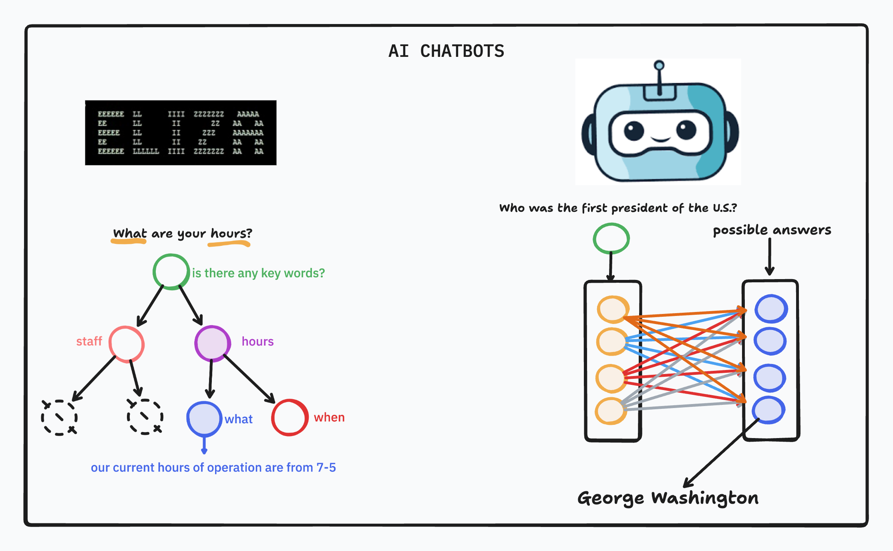

# Classic ChatBots

## What are we trying to accomplish?

The goal of this module is to equip students with a deep understanding of how conversational AI systems are designed, built, and progressively improved—without relying on large language models. Beginning with the history and taxonomy of chatbots, students move through a deliberate progression: from **rule-based systems** driven by pattern matching, to **data-driven systems** that treat language as a structured dataset, to **retrieval-based and classification-powered systems** that use machine learning to understand user intent. Each lesson builds directly on the last, exposing both the capabilities and limitations of classical approaches so that students understand *why* each technique exists and *when* it breaks down. By the end of this module, students will have built multiple functional chatbot systems in Python and will be prepared to transition into generative, LLM-powered architectures.

---

## Lessons

1. [Intro to ChatBots](./1-intro-to-chatbots/README.md)
2. [Regex & Rule-Based ChatBots](./2-regex-rule-based-chatbots/README.md)
3. [Language as Data](./3-language-as-data/README.md)
4. [Deep Learning](./4-deep-learning/README.md)
5. [Retrieval-Based ChatBots](./5-retrieval-based-chatbots/README.md)

---

## Module Topics

- Chatbot taxonomy: rule-based, retrieval-based, and generative systems
- NLU, dialogue management, and NLG components
- Python ML environment setup with Jupyter Notebook
- Regular expressions for pattern detection and intent inference
- Rule-based conversation loop design and input normalization
- Text preprocessing pipelines: tokenization, normalization, stopword removal, lemmatization
- Vocabulary construction and corpus-based feature extraction
- Bag of Words, N-grams, and TF-IDF vectorization
- Information retrieval concepts and cosine similarity
- Retrieval-based chatbot construction and response ranking
- Intent classification with scikit-learn and PyTorch
- Sentence embeddings and semantic retrieval
- Classical vs. generative chatbot system design
