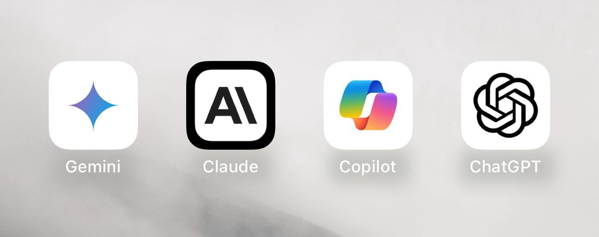
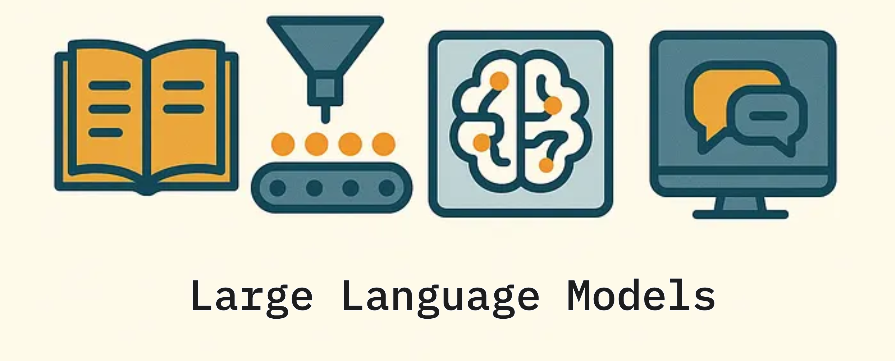
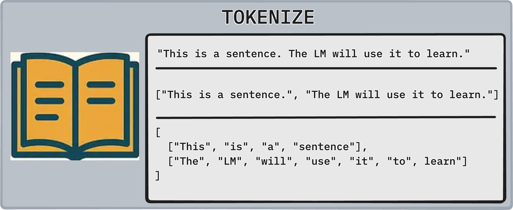
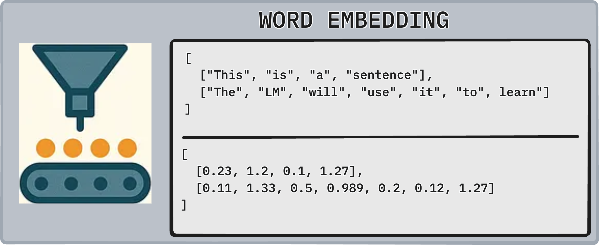
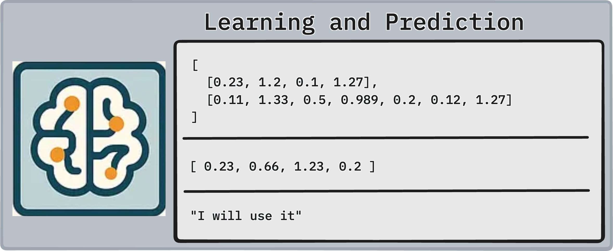
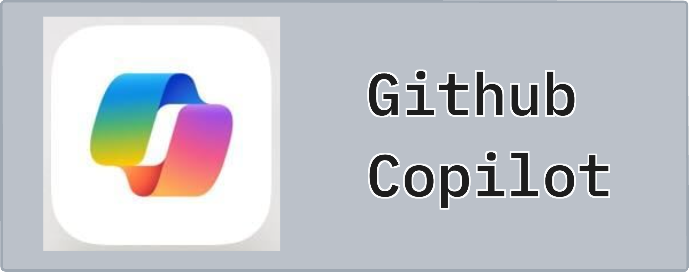
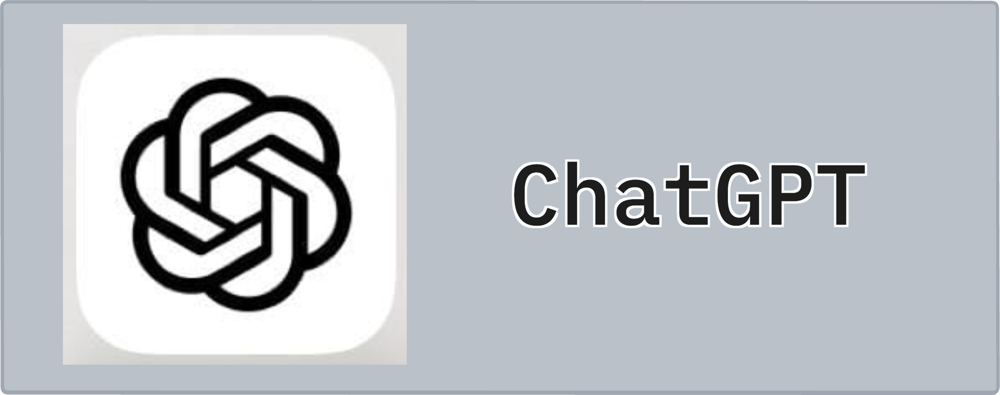
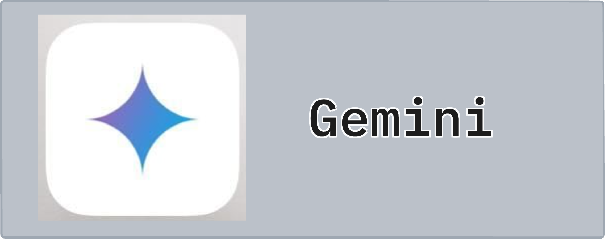

# What are Large Language Models

## Intro

You've come a long way. You started by hardcoding rules into a chatbot — *if the user says this, respond with that*. Then you trained a neural network to classify intent and select the best pre-written response from a bank of answers. Both approaches had one thing in common: the response always came from somewhere you defined.

Generative AI breaks that constraint entirely. These systems don't retrieve — they **compose**. Every response is generated from scratch, token by token, based on everything the model learned during training.

In this lesson we'll build a clear mental model of what a Large Language Model (LLM) actually is, how it relates to everything you've already built, and what the landscape of modern LLMs looks like today.

---

## Lesson

### What is a Large Language Model?

#### High Level Overview

Let's start with an analogy.

Imagine a jazz musician who has spent their entire life — not memorizing songs to play back on request — but *absorbing* millions of recordings, compositions, and live sessions. They've listened to so much music that they've internalized the deep patterns of how music works: what chord follows naturally after another, what rhythm fits a given tempo, how tension builds and resolves. They don't store the songs — they've internalized the *language* of music.

Now ask them to improvise. They don't search a catalog. They don't retrieve a stored piece. They **compose** something new, in real-time, that sounds coherent and contextually appropriate — because they've absorbed enough patterns to know what fits.

**LLMs are that musician, but for language.**

During training, an LLM is exposed to an enormous volume of text — books, articles, code repositories, websites, conversations. It doesn't memorize any of it. Instead, it learns the statistical patterns of language: what words tend to follow what other words, how topics connect, what tone matches what context. When you send it a message, it generates a response token by token — each token chosen based on everything that came before it in the conversation.

At the highest level, an LLM is a system that answers one question repeatedly:

> *"Given everything I've seen so far in this conversation, what token should come next?"*

That's it. Everything — code generation, summarization, question answering, creative writing — emerges from that single learned behavior, applied at massive scale.

#### Infrastructure Overview

To understand *how* LLMs generate text, you need to know the architecture that makes it possible: the **Transformer**.

Before transformers (pre-2017), sequence models had to process text word by word, left to right. By the time the model got to word 50, it had largely "forgotten" word 1. Transformers solved this with a mechanism called **Attention**.

**Attention** lets the model look at every token in the input simultaneously and decide which tokens are most relevant to the current token being processed. Sound familiar? It's the same idea behind cosine similarity in your retrieval-based chatbot — *how related is this thing to that thing?* — but applied dynamically across the entire sequence, all at once.

The Transformer architecture has two primary components:

- **Encoder** — reads the input and builds a deep contextual representation of it. Each token's representation is influenced by every other token in the sequence.
- **Decoder** — generates the output sequence one token at a time, attending to both the encoded input and the tokens it has already generated.

Different LLMs use different configurations:
- **Encoder-only** (e.g., BERT) — built for understanding tasks like classification or semantic similarity
- **Decoder-only** (e.g., GPT, Claude, Gemini) — built for generation tasks
- **Encoder-Decoder** (e.g., T5) — built for transformation tasks like translation or summarization

The models you'll be working with — Gemini, Claude — are **decoder-only** architectures. They generate text autoregressively: one token at a time, each token conditioned on all previous tokens.

#### Deep Level Overview

Now let's connect this to the work you've already done.

In module 07 you built every piece of this pipeline — just at a smaller scale.

**Tokenization** — You broke text into tokens (words, subwords) before feeding them into your models. LLMs do the same thing, just with more sophisticated tokenizers (like Byte Pair Encoding) that handle rare words and multiple languages gracefully.

**Embeddings** — You converted tokens to dense vectors so the model could work with them mathematically. LLMs do this too. Every token maps to a high-dimensional embedding vector. Similar tokens cluster together in that space — just like your word2vec embeddings from the vectorization lesson.

**Neural Network Training Loop** — You trained a PyTorch model by making a prediction, comparing it to the target with `CrossEntropyLoss`, computing gradients, and updating weights with Adam. LLMs train the same way:

1. Take a sequence of real text from the training corpus
2. Hide the last token
3. Ask the model: "what token comes next?"
4. Compare the model's prediction to the actual next token using cross-entropy loss
5. Backpropagate and update billions of weights

This is called **next-token prediction**, and it's the training objective behind most modern LLMs. The model sees trillions of examples of this task — and in learning to predict the next token well across all of them, it develops deep representations of grammar, facts, reasoning, and style.

The difference between what you built and what an LLM is isn't conceptual — it's **scale**. Your chatbot had a few thousand parameters. GPT-4 has an estimated 1.8 trillion. Your training data was a few hundred labeled examples. LLMs train on hundreds of billions of tokens scraped from the internet, books, and code.

Same ideas. Incomprehensibly larger execution.

---

### Rule and Retrieval Chatbots to Generative Chatbots — How & Why?

You've already built two generations of chatbots. Here's how they stack up against generative models:

| Approach | How it responds | Domain | Limitation |
|---|---|---|---|
| **Rule-Based** | Matches pattern → returns hardcoded response | Closed | Breaks on anything outside defined rules |
| **Retrieval-Based** | Encodes input → finds closest response in a bank | Semi-closed | Can only return what was pre-written |
| **Generative** | Predicts next token from learned patterns | Open | May hallucinate; harder to control |

The fundamental shift from retrieval to generative is this: **retrieval-based systems can only be as good as what you put in them.** If a user asks something you didn't anticipate, the best they get is the closest thing you did write. Generative models compose new responses — they're not limited by the size or coverage of your response bank.

This is why the industry moved toward generative AI. Not because retrieval-based approaches are bad — they're still used heavily in production for their reliability and control — but because generative models unlocked **open-domain conversation** for the first time. A generative chatbot can handle questions its creators never thought of, in contexts they never prepared for.

The trade-off is **hallucination**: because the model is always composing new text rather than selecting from curated responses, it can confidently generate incorrect information. This is one of the central challenges in working with LLMs, and you'll encounter strategies for managing it throughout this module.

---

### Common Types of LLMs

The LLM landscape has exploded in the last few years. Here are the four you're most likely to encounter as a developer:

#### GitHub Copilot

**Purpose**

GitHub Copilot is a code completion and generation tool built on top of OpenAI's Codex model (a GPT variant fine-tuned on public code repositories). It's deeply integrated into IDEs — most commonly VS Code — and designed to assist during active development.

**Limitations**

- Works best within the context of an open file or project — it lacks awareness of your full codebase unless context is explicitly provided
- Can suggest plausible-looking code that doesn't work, uses deprecated APIs, or introduces subtle bugs
- Not built for general conversation or explanation — it's a code-first tool

#### ChatGPT

**Purpose**

ChatGPT, built by OpenAI on the GPT series of models, is a general-purpose conversational AI. It excels at explanation, brainstorming, drafting content, reasoning through problems, and code assistance.

**Tasks it excels at**

- Long-form writing, editing, and summarization
- Step-by-step reasoning and math problem walkthroughs
- Code explanation and debugging assistance
- Broad Q&A across a wide range of domains

**Tasks where it needs improvement**

- Real-time or recent information (knowledge cutoffs apply unless browsing tools are enabled)
- Precise factual recall — it can confidently state incorrect details
- Complex multi-step agentic tasks that require sustained, reliable tool use

#### Gemini

**Purpose**

Gemini, built by Google DeepMind, is a multimodal LLM designed to work across text, images, audio, and code. It has strong integration with Google's ecosystem (Drive, Docs, Search) and competes directly with GPT-4 class models.

**Tasks it excels at**

- Multimodal reasoning (analyzing images alongside text)
- Tasks that benefit from Google Search integration (more up-to-date information)
- Coding tasks, especially with Gemini's longer *context* windows
- Cost-effectiveness — Gemini has a generous free API tier, which is why we'll be using it in this module

**Tasks where it needs improvement**

- Can be more verbose than necessary, requiring more explicit prompt guidance
- Instruction-following in complex multi-step prompts can be inconsistent compared to leading alternatives
- Creative writing and nuanced tone control lag behind some competitors

#### Claude

**Purpose**

Claude, built by Anthropic, is an AI assistant with a strong emphasis on safety, instruction-following, and long-context reasoning. It's the model powering — **Claude Code** — which you'll explore in detail in module 3 of this phase.

**Tasks it excels at**

- Long document analysis — Claude supports context windows up to 200K tokens
- Faithful instruction-following and nuanced task handling
- Code review, refactoring, and technical explanation
- Safety-conscious outputs — less likely to produce harmful or misleading content

**Tasks where it needs improvement**

- Can be overly cautious or add unnecessary caveats in certain domains
- Knowledge cutoff applies like all other LLMs — not connected to the web by default
- Performs best with clear, structured prompts; vague inputs can produce vague outputs

---

### Choosing the Right AI

With so many options available, how do you decide which model to use for a given task?

Think of it like choosing a tool from a toolbox. A hammer and a screwdriver can sometimes do similar jobs — but the right tool makes the work easier and the result more reliable.

A few questions to ask when evaluating an LLM for a use case:

**What modalities does the task require?**
Text only? Code? Images? Not every model handles all of these well. Gemini's multimodal capabilities make it a strong choice for vision + language tasks; Copilot is purpose-built for code in an IDE context.

**How much control do I need over outputs?**
Rule-based and retrieval-based approaches offer predictable, auditable responses. If your application requires strict control — customer service, compliance, healthcare — the composability of generative models becomes a liability unless carefully managed with system prompts, output validation, and human review.

**What is the cost and rate limit?**
For prototyping and learning, Gemini's free API tier is a practical starting point. Production applications need to account for token costs, rate limits, and latency.

**Does the task require up-to-date information?**
All LLMs have knowledge cutoffs. If your use case needs current information, look for models with integrated search (Gemini with Google Search, ChatGPT with browsing enabled) or plan to implement Retrieval-Augmented Generation (RAG) — a pattern you'll learn later in this phase.

**Is there a fine-tuned or specialized model?**
For narrow, high-stakes domains (medical, legal, financial), a smaller model fine-tuned on domain-specific data can outperform a general-purpose LLM at a fraction of the cost.

> There is no universally best LLM. The right choice depends on the task, the constraints, and the context. A strong engineer knows the landscape well enough to pick deliberately — and to revisit that decision as the landscape evolves.

Use the table below as a quick reference when deciding which model fits your task:

| Task | Claude | Gemini | ChatGPT |
|---|---|---|---|
| Long document analysis / large context | ✅ Best (200K tokens) | ✅ Strong | ✅ Good (128K tokens) |
| Code generation and review | ✅ Strong | ✅ Strong | ✅ Strong |
| Real-time / up-to-date information | ❌ No web by default | ✅ Google Search integration | ⚠️ Browsing available (paid tier) |
| Multimodal reasoning (image + text) | ⚠️ Limited | ✅ Best | ✅ Strong |
| Creative writing and tone control | ✅ Strong | ⚠️ Tends to be verbose | ✅ Strong |
| Strict instruction-following | ✅ Best | ⚠️ Inconsistent on complex prompts | ✅ Good |
| Free API access for prototyping | ❌ Paid | ✅ Free tier available | ❌ Paid |
| Safety-conscious / low-risk outputs | ✅ Best | ✅ Good | ✅ Good |
| Step-by-step reasoning and math | ✅ Strong | ✅ Strong | ✅ Best (o-series models) |

---

## Conclusion

You now have a grounded mental model of what Large Language Models are and where they come from.

LLMs are not magic — they are next-token predictors trained at extraordinary scale. The building blocks you worked with in module 07 — tokenization, embeddings, neural networks, backpropagation — are all present under the hood. What changed is the scale of the training data, the size of the model, and the sophistication of the architecture (the Transformer) that makes training at that scale computationally feasible.

Key takeaways from this lesson:

- LLMs **generate** text rather than retrieve it — each response is composed token by token from learned patterns
- The **Transformer architecture** and its **attention mechanism** enable models to consider the full context of a conversation simultaneously
- Generative models unlock **open-domain** conversation but introduce the risk of **hallucination**
- The current LLM landscape includes purpose-built tools (Copilot), general-purpose assistants (ChatGPT, Gemini, Claude), and everything in between
- **Choosing the right model** means evaluating modality, control requirements, cost, recency needs, and domain fit

In the next lesson, you'll learn how to communicate with these models effectively through **prompt engineering** — how to structure your inputs to get reliable, useful outputs.
