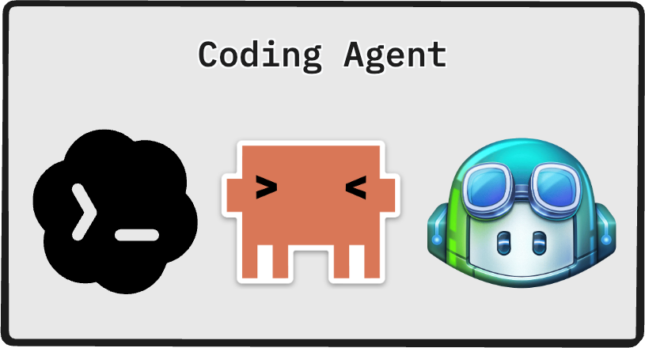
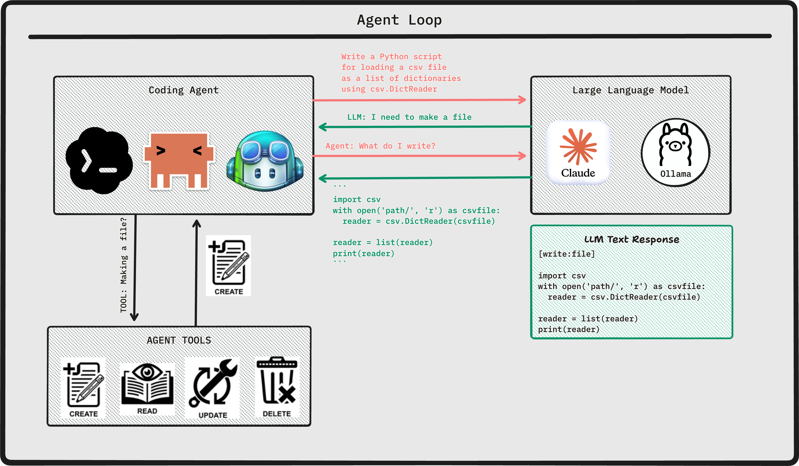
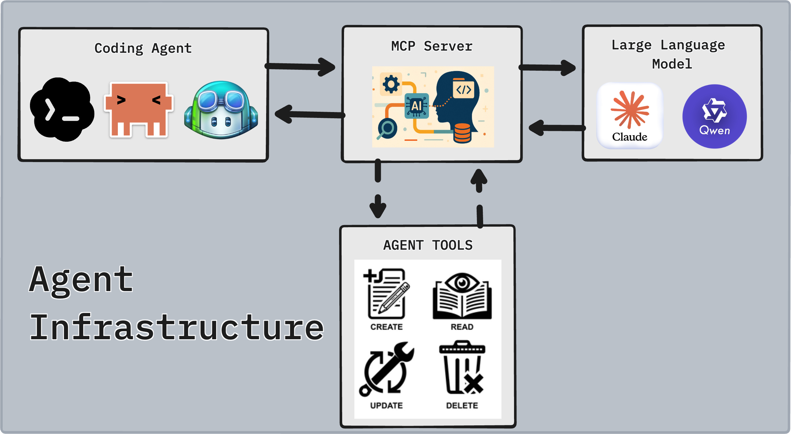
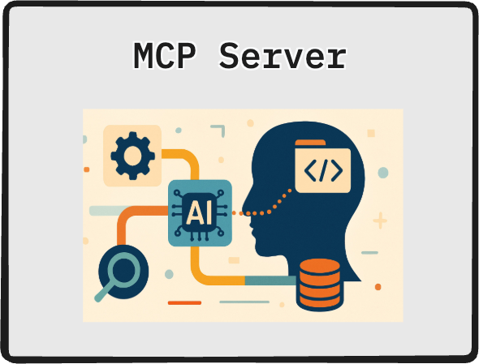
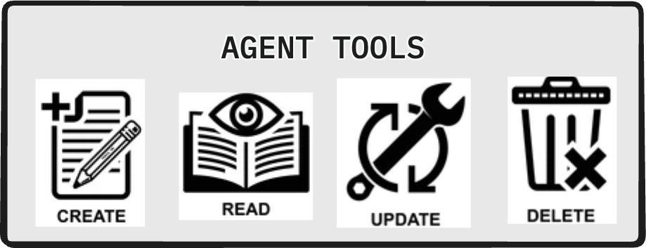
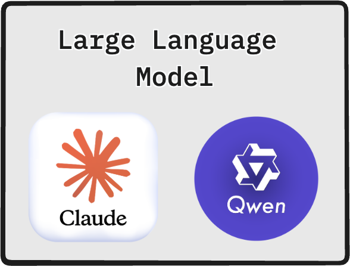

# Intro to Coding Assistants



## Introduction

In the last lesson you integrated an LLM through an API — you sent a message, received a response, and built multi-turn conversations. The LLM was a reasoning engine you queried.

Coding assistants take the next step: they give the LLM **hands**. Instead of just responding to questions, the model can read your files, run code in your terminal, search documentation, and write changes directly into your codebase. The LLM's reasoning is the same — what changes is that its outputs can be *actions*, not just text.

This lesson explains the architecture that makes that possible.

## Lesson

### What is a Coding Agent?

A **coding agent** is software that wraps an LLM in an autonomous loop, giving it access to tools so it can take actions in your development environment. Where a chatbot responds and waits, a coding agent responds, acts, observes the result, and continues until the task is complete.

The key shift:

| Chatbot | Coding Agent |
|---------|--------------|
| Receives message | Receives task |
| Generates text response | Generates text **and** tool calls |
| Waits for next input | Loops until task is done |
| No environment access | Reads files, runs code, edits codebase |

You still talk to it in natural language. But under the hood, "fix the bug in `auth.py`" triggers a sequence: read the file, analyze the code, write a fix, run the tests, check output, iterate if tests fail.

#### Popular Coding Agents

| Agent | Made By | Primary Use | Notable Strength |
|-------|---------|-------------|------------------|
| **GitHub Copilot** | Microsoft / OpenAI | IDE autocomplete + chat | Deep GitHub integration, PR reviews |
| **Gemini Code Assist** | Google | IDE integration, cloud apps | Google Cloud and Workspace integration |
| **Cursor** | Cursor AI | Full IDE replacement | Codebase-wide context, fast edits |
| **Claude Code** | Anthropic | Terminal-based agent | Long context (200K), agentic autonomy, MCP ecosystem |

#### Choosing Your Coding Agent

No single agent wins on every dimension. Use this decision tree:

```
Do you work primarily inside VS Code or JetBrains?
├─ Yes → GitHub Copilot or Gemini Code Assist
└─ No
   ├─ Do you want a full IDE built around AI?
   │  └─ Yes → Cursor
   └─ Do you want a terminal-first, agentic workflow with deep tool integration?
      └─ Yes → Claude Code
```

For this course we use **Claude Code** — it exposes the agent architecture most transparently, has the deepest MCP ecosystem, and works with local models (Ollama) so you can operate without API costs.

---

### Coding Agent ≠ LLM

This distinction matters: a coding agent is **not** an LLM. It is a system that *uses* an LLM.



The LLM is the **reasoning core** — it decides what to do next given the current context. The agent is the **orchestration layer** — it manages the loop, invokes tools, feeds results back to the LLM, and determines when the task is complete.

You could swap the LLM (Claude → Gemini → local Qwen model) and the agent would still work. The orchestration logic doesn't change; only the reasoning quality does.

---

### Agent Infrastructure



Every coding agent is built from the same four components. Let's walk through each.

#### The Coding Agent

The coding agent is the orchestrator. It:

1. Receives the user's task
2. Builds context (relevant files, conversation history, available tools)
3. Sends that context to the LLM
4. Receives back either text or a **tool call** (an instruction to use a specific tool)
5. If a tool call: executes it, appends the result to context, sends back to LLM
6. If text with no tool call: task is complete, return response to user

Claude Code, Cursor, and Copilot all implement this loop — they just differ in what tools they expose and how much of the loop they surface to you.

#### The Model Context Protocol (MCP)



The **Model Context Protocol (MCP)** is an open standard, created by Anthropic, that defines how LLMs communicate with external tools and data sources.

Before MCP, every AI tool built its own custom integration: one format for reading files, a different format for querying databases, another for web search. Each agent was a walled garden.

MCP standardizes the interface:

```
Any MCP-compatible LLM  ◄──►  Any MCP-compatible Tool
```

An MCP **server** is a process that wraps a capability (filesystem access, a database, a web browser) and exposes it through the standard protocol. The LLM doesn't need to know anything specific about the tool — it just calls it by name with parameters, and the MCP server handles the implementation.

This is the same problem that USB solved for hardware: before USB, every peripheral needed a different port and driver. MCP is USB for AI tools.

**Why this matters for you:** When you configure Claude Code, you're connecting it to MCP servers. The tools Claude has access to — and therefore what it can do autonomously — are determined entirely by which MCP servers are active.

#### The Agent Tools



Tools are the actions the agent can take. They are always implemented as MCP servers. Common tool categories:

| Category | Examples |
|----------|---------|
| **Filesystem** | Read file, write file, list directory, search content |
| **Terminal** | Run bash command, start/stop processes |
| **Code** | Parse AST, run tests, lint, format |
| **Web** | Search documentation, fetch URLs |
| **Version Control** | Git status, diff, commit, branch |
| **IDE** | Get diagnostics, navigate to definition |

When the LLM generates a tool call like `read_file("src/auth.py")`, the MCP server intercepts it, reads the actual file, and returns the content as text. The LLM never directly touches your filesystem — it only sees text representations of results.

#### The Large Language Model



Inside the agent loop, the LLM's job is slightly different from what you used it for in lesson 2. Instead of just generating a helpful response, it's generating one of two things:

1. **A tool call** — "I need to read this file before I can answer"
2. **A final response** — "I've gathered enough context; here's the solution"

Modern LLMs (Claude, GPT-4o, Gemini) are fine-tuned specifically for this **tool use** pattern. They understand that they're operating inside a loop, and they've learned when to gather more information vs. when to act.

---

### The Agent Loop

Everything above comes together in one algorithm that runs continuously until the task is done.

● **Learn by Doing**

**Context:** The agent infrastructure diagram and the four component descriptions above give you the full picture of what happens when you type a request into Claude Code. Now you need to internalize it by implementing the logic yourself.

**Your Task:** In [TLDRAW](https://www.tldraw.com/), implement a visual representation of the Agent loop that goes through the following steps:
1. Calls the LLM with the current context
2. Checks whether the response is a tool call or a final answer
3. If tool call: executes the tool, appends result to context, and loops
4. If final answer: returns it to the user

**Guidance:** Think carefully about the loop condition — this is the core decision of the agent. The LLM signals "I'm done" by generating a response with no tool call. Also consider: what happens if the LLM calls a tool that doesn't exist, or returns an error? You don't have to handle every edge case, but think about whether your loop would terminate correctly if a tool failed.

## Conclusion

A coding agent is not magic — it is an LLM inside a loop with access to tools. The Model Context Protocol standardizes how those tools connect, which means the ecosystem of things an agent can do grows independently of the LLM powering it.

In the next lesson you'll install Claude Code, connect it to MCP servers, and configure it for your development workflow.
