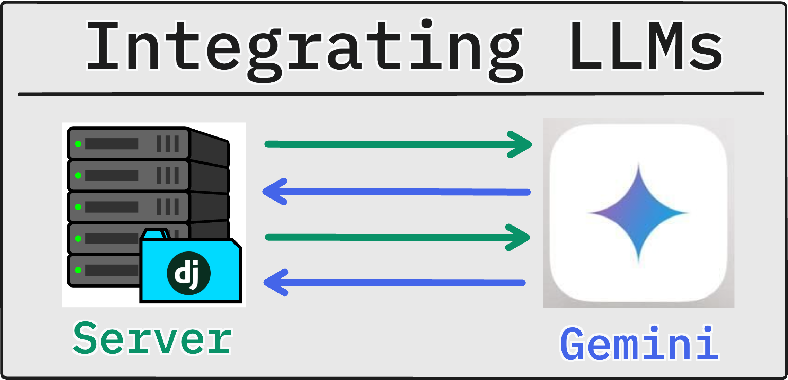
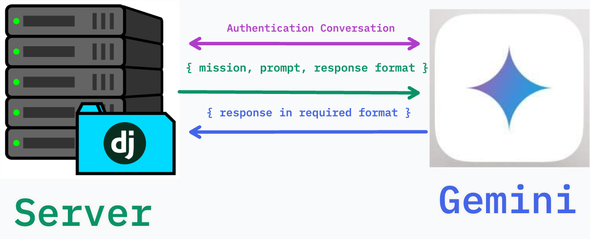
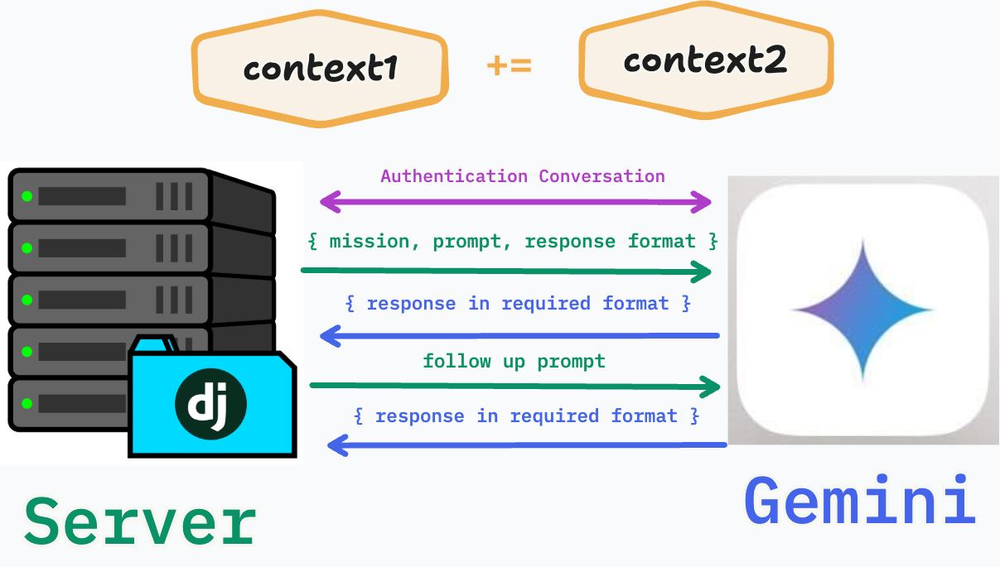
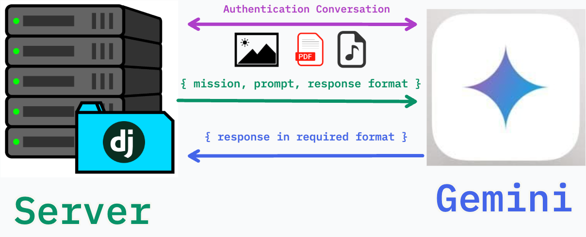
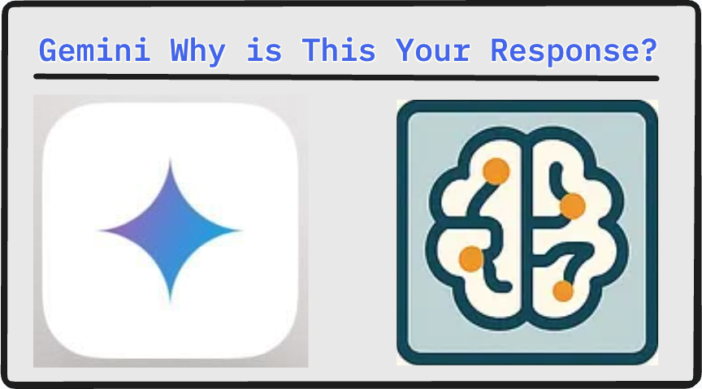

# Adjusting your Agent



## Introduction

In the last lesson you built the simplest possible version of an LLM integration: one question, one response, done. That's enough to prove the API works — but it's not how useful applications are built.

Real AI-powered tools do more than answer a single question. They hold conversations across multiple turns, return data in predictable formats that other code can consume, reason through hard problems before answering, and interpret inputs beyond plain text.

In this lesson you'll extend the script from the previous lesson with four capabilities: structured outputs, multi-turn conversations, multimodal inputs, and thinking mode. Each one is a separate tool in your toolkit — you'll learn what it does, when to reach for it, and exactly how to wire it up.

---

## Lesson

### Structured Outputs



By default, the Gemini API returns plain text. That's fine when the output is meant to be read by a human. It's a problem when another part of your program needs to consume it.

Consider asking the model to extract information from a paragraph. If it responds in plain prose, you'd have to parse natural language to get the values you need — fragile and error-prone. **Structured output** solves this by forcing the model to respond in valid JSON that matches a schema you define.

#### Defining a Schema with Pydantic

The `google-genai` SDK accepts a <a href="https://docs.pydantic.dev/" target="_">Pydantic</a> model as a `response_schema`. Pydantic is a Python library for data validation — you define a class where each field has a name and type, and the model guarantees its response matches that shape.

```python
from pydantic import BaseModel, Field

class MovieReview(BaseModel):
    title: str = Field(description="The title of the movie.")
    sentiment: str = Field(description="The overall *sentiment* of the movie. Must be on of the following options `positive`, `negative`, or `neutral`")
    summary: str = Field(description="The summary of the movie")
    score: int = Field(description="The score must be an integer value ranging from 0 to 10 where max is 10 and 0 is min.")
```

#### Requesting Structured Output

Pass the schema into a `GenerateContentConfig` object alongside `response_mime_type='application/json'`. Note that `GenerateContentConfig` is also the correct place to pass your system instruction — more precise than concatenating it with the user message as we did in the last lesson.

```python
import json
from google import genai
from google.genai import types
from pydantic import BaseModel
import os
from dotenv import load_dotenv

load_dotenv()

client = genai.Client(api_key=os.getenv("GEMINI_API_KEY"))
MODEL_NAME = "gemini-2.5-flash"

class MovieReview(BaseModel):
    title: str = Field(description="The title of the movie.")
    sentiment: str = Field(description="The overall *sentiment* of the movie. Must be on of the following options `positive`, `negative`, or `neutral`")
    summary: str = Field(description="The summary of the movie")
    score: int = Field(description="The score must be an integer value ranging from 0 to 10 where max is 10 and 0 is min.")

SYSTEM_PROMPT = "You are a film critic. When given a movie description, return a structured review."

user_input = input("Describe a movie for me to review:\n")

response = client.models.generate_content(
    model=MODEL_NAME,
    contents=user_input,
    config=types.GenerateContentConfig(
        system_instruction=SYSTEM_PROMPT,
        response_mime_type="application/json",
        response_schema=MovieReview
    )
)

review = json.loads(response.text)
print(f"\nTitle: {review['title']}")
print(f"Sentiment: {review['sentiment']}")
print(f"Score: {review['score']}/10")
print(f"Summary: {review['summary']}")
```

#### When to Use Structured Output

| Use It When... | Skip It When... |
|---|---|
| Another function will consume the response | The output is displayed directly to a user |
| You need consistent field names across responses | The response is inherently open-ended prose |
| You're building a pipeline (extract → transform → store) | You're prototyping and schema isn't defined yet |

> Structured output is not just a formatting convenience — it's what makes LLMs composable with the rest of your codebase. A function that returns a `MovieReview` object is far more useful than one that returns an unpredictable string.

---

### Beyond Single Requests (Conversations)

The script from the last lesson sends one message and exits. Every time you run it, the model starts fresh with no memory of previous exchanges. This is fine for one-off tasks, but it breaks down for anything conversational — the model can't help you debug code across multiple messages if it forgets what the code was after the first reply.

The `google-genai` SDK solves this with **chat sessions**. A chat session automatically tracks the full conversation history and resends it with every new message, so the model always has context.

#### Creating a Chat Session



```python
chat = client.chats.create(model=MODEL_NAME)
```

That's it. The session handles history automatically. Use `chat.send_message()` instead of `client.models.generate_content()` for every turn.

#### Building a Conversation Loop

Here's a complete multi-turn chatbot that runs until the user types `exit`:

```python
from google import genai
from google.genai import types
import os
from dotenv import load_dotenv

load_dotenv()

client = genai.Client(api_key=os.getenv("GEMINI_API_KEY"))
MODEL_NAME = "gemini-2.5-flash"

SYSTEM_PROMPT = """
You are a Python programming assistant for junior software developers.
Keep responses concise and always include a code example when explaining a concept.
"""

chat = client.chats.create(
    model=MODEL_NAME,
    config=types.GenerateContentConfig(system_instruction=SYSTEM_PROMPT)
)

print("Python Assistant ready. Type 'exit' to quit.\n")

while True:
    user_input = input("You: ").strip()
    if not user_input:
        continue
    if user_input.lower() in ["exit", "quit"]:
        print("Goodbye.")
        break

    response = chat.send_message(user_input)
    print(f"\nAssistant: {response.text}\n")
```

#### Inspecting the Conversation History

At any point you can inspect what the model sees by reading `chat.get_history()`. Each entry is a `Content` object with a `role` (`"user"` or `"model"`) and the message text.

```python
for turn in chat.get_history():
    role = turn.role
    text = turn.parts[0].text
    print(f"[{role}]: {text[:80]}...")  # print first 80 chars of each turn
```

This is useful for debugging — if the model gives a strange response, check whether its history matches what you expected.

> Every message you send in a chat session includes the full conversation history. This means long conversations consume more tokens. For production applications, you'll eventually need a strategy for summarizing or pruning old turns — but for learning purposes, the default behavior is exactly what you want.

---

### Multi-Modal Capabilities



So far every prompt has been plain text. Gemini is a **multimodal** model — it can reason about images, audio, and documents alongside text. This opens up a different category of applications: tools that can read a screenshot, describe a photo, or extract data from a scanned document.

#### Sending an Image with Your Prompt

The `google-genai` SDK lets you pass image data directly as part of the `contents` list using <a href="https://pillow.readthedocs.io/en/stable/installation/basic-installation.html" target="_">Pillow</a>. Once you open the image you can send it within the request.

Here's a script that loads a local image and asks the model to describe it:

```python
from google import genai
from PIL import Image
from dotenv import load_dotenv
import os

load_dotenv()

client = genai.Client(api_key=os.getenv("GEMINI_API_KEY"))
MODEL_NAME = "gemini-2.5-flash"

image_path = "photo.jpg"  # path to a local image file

img = Image.open(image_path)

response = client.models.generate_content(
    model=MODEL_NAME,
    contents=[
        img,
        "Describe what you see in this image in two sentences."
    ]
)

print(response.text)
```

The `contents` list accepts a mix of `Part` objects and plain strings — you can combine an image, a text description, and a question in a single request.

#### Uploading Larger Files

For larger files or files you plan to reference across multiple requests, use `client.files.upload()`. This stores the file on Google's servers and returns a handle you can pass into any subsequent call:

```python
file = client.files.upload(file="document.pdf")

response = client.models.generate_content(
    model=MODEL_NAME,
    contents=["Summarize the key points from this document:", file]
)

print(response.text)
```

#### Supported Input Types

| Type | MIME Types | Notes |
|---|---|---|
| Images | `image/jpeg`, `image/png`, `image/webp` | Inline bytes or uploaded file |
| PDF | `application/pdf` | Up to 1,000 pages |
| Audio | `audio/mp3`, `audio/wav` | Transcription and analysis |
| Video | `video/mp4` | Frame-level understanding |

> Multimodal inputs follow the same pattern as text: you're still constructing a `contents` list and calling `generate_content`. The model handles interpreting the modalities — your job is just to pass the right data in the right format.

---

### Thinking



Gemini 2.5 models have a **thinking mode** — before generating a response, the model performs an internal reasoning pass that is not shown in the output. The result is more accurate answers on tasks that require multi-step logic: math problems, code debugging, planning, and complex analysis.

Thinking is controlled by `ThinkingConfig`, which you pass inside `GenerateContentConfig`. The `thinking_level` parameter sets how much reasoning effort the model applies.

```python
from google import genai
from google.genai import types
import os
from dotenv import load_dotenv

load_dotenv()

client = genai.Client(api_key=os.getenv("GEMINI_API_KEY"))
MODEL_NAME = "gemini-2.5-flash"

problem = """
A store sells apples for $0.75 each and oranges for $1.25 each.
A customer buys some combination of apples and oranges and pays exactly $10.00.
What are all the possible combinations?
"""

response = client.models.generate_content(
    model=MODEL_NAME,
    contents=problem,
    config=types.GenerateContentConfig(
        thinking_config=types.ThinkingConfig(
            thinking_level="high" #only supported by Gemini >= 3.0 
            include_thoughts=True,
        )
    )
)

for part in response.candidates[0].content.parts:
    if not part.text:
        continue
    if part.thought:
        print("Thought summary:")
        print(part.text)
        print()
    else:
        print("Answer:")
        print(part.text)
        print()

print(response.text)
```

#### Thinking Level Options

| Level | Use When... |
|---|---|
| `"minimal"` | Simple tasks — thinking adds unnecessary latency |
| `"low"` | Light reasoning; faster and cheaper than medium |
| `"medium"` | General-purpose reasoning tasks |
| `"high"` | Complex multi-step problems where accuracy is critical |

#### When to Enable Thinking

Turn thinking **on** for: math and logic problems, code debugging, multi-step planning, tasks where wrong answers are costly.

Turn thinking **off** (or use `"minimal"`) for: simple Q&A, creative writing, tasks where speed and cost matter more than precision.

> Thinking increases latency and token consumption. Don't apply `"high"` thinking level universally — reserve it for tasks where the extra reasoning actually changes the answer quality.

#### Why include Thoughts

The easiest way we can identify there's something wrong with out prompt is by viewing the thought process of our LLM. We can identify assumptions it may have made and/or steering that should not have happened.

---

## Conclusion

You've moved well beyond the single-request script. The four capabilities covered here — structured outputs, multi-turn conversations, multimodal inputs, and thinking mode — represent the core toolkit for building practical AI-powered applications.

Notice how they compose: a coding assistant could hold a multi-turn conversation, accept screenshots of error messages as multimodal input, enable thinking for complex debugging, and return structured output when the user asks it to generate a JSON config. Each capability is independent, but they work together.

In the next module you'll take a step back from the API and look at the tools AI can offer you directly as a developer — specifically, how to integrate AI assistants into your development workflow to write, review, and understand code faster.
