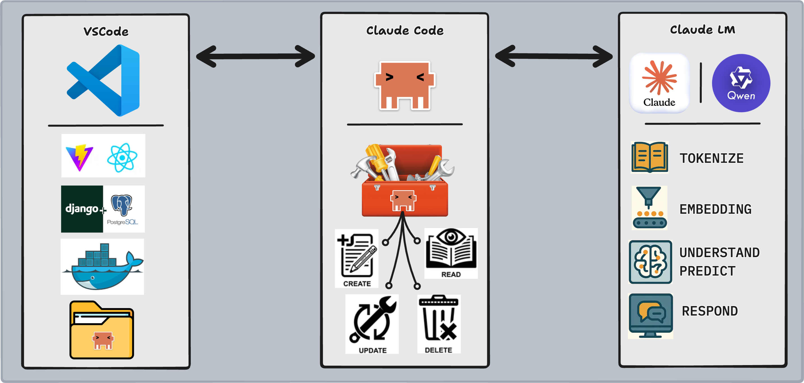

# Context and MCP



## <a href="https://drive.google.com/file/d/161vs_Ryy4y3RTXvS2dDGJrs7xgJYXg2J/view?usp=drive_link" target="_" download="task_manager.zip"> Download Project </a>

Before you start this lecture, please ensure to download the project so you may follow along with the techniques we will be demonstrating.

## Introduction

You have Claude Code installed and know how to launch it. Now you're going to use it on a real codebase — the `task_manager` project you downloaded above. It is a full-stack application: a React frontend, a Django REST API, a PostgreSQL database, and an Nginx reverse proxy, all wired together with Docker Compose.

Working effectively with a coding agent on a project this size requires two things:

1. **Context management** — controlling what Claude knows so it can reason accurately without burning tokens on irrelevant files
2. **Tool extension via MCP** — connecting Claude to capabilities it doesn't have by default, like a live browser

This lesson covers both. Start your project first:

```bash
cd task_manager
docker compose up --build
```

The app will be available at `http://localhost:80` once all containers are healthy.

---

## Lesson

### Claude.md

Once you start Claude in a new project, run `/init` immediately. This command tells Claude to read the project structure and write down everything it needs to work effectively. The output is a `CLAUDE.md` file at the root of your project.

> This file will be included in every request you make to Claude moving forward and does two things:
>
> - Gives Claude a snapshot of your project architecture at every request
> - Gives you a place to add standing instructions Claude must follow

After running `/init` on the `task_manager`, your `CLAUDE.md` will contain entries like:

```markdown
# Task Manager

## Architecture
- Frontend: React 19 + Vite, served by Nginx on port 80
- Backend: Django 6 + DRF, Gunicorn on port 8000
- Database: PostgreSQL 15 on port 5433
- Orchestration: Docker Compose

## Key Files
- API endpoints: server/task_app/views.py, server/user_app/views.py
- Custom user model: server/user_app/models.py (email-based auth)
- Frontend API layer: client/src/utilities.jsx
```

#### Separate CLAUDE.md files for different purposes

- `CLAUDE.md` — Created by `/init`, committed to the repo, shared with all contributors (public/unique to project)
- `CLAUDE.local.md` — Not committed, lives in the project, for your personal preferences (private/unique to project)
- `~/.claude/CLAUDE.md` — Not committed, applies to every project on your machine (private/shared with all projects)

#### Updating CLAUDE.md

Two options:

1. **Manual** — Open the file and edit it directly
2. **Memory mode** — Prefix any Claude message with `#`. Claude enters memory mode and writes the instruction directly into the CLAUDE.md file you select

Example memory mode prompt for the task manager:

```text
# When asked about the data model, always reference server/user_app/models.py
  and server/task_app/models.py as the source of truth — not the migrations
```

---

● **Learn by Doing**

**Context:** Running `/init` gives Claude a generic project summary. But the task_manager has specific architectural facts that would trip Claude up without explicit guidance: the user model uses email instead of username, tasks are always user-scoped (never global), and the Docker service name `backend` is different from the localhost hostname you use in a browser. These aren't obvious from a directory scan.

**Your Task:** In this file, fill in the memory block below after the `TODO(human)` comment. Write 3–5 memory-mode instructions (`#`-prefixed) you would type into Claude to make it perform better on the task_manager specifically.

```text
# TODO(human): Write 3-5 memory-mode instructions for the task_manager.
# Think about: what would Claude get wrong without explicit guidance?
# What is the source of truth for the data model?
# Are there naming conventions or architectural rules Claude should always respect?
```

**Guidance:** Focus on things Claude cannot reliably infer from reading the files once — things that require judgment about *intent*, not just structure. The custom user model is one example: Claude might default to Django's built-in `User` and miss that `AppUser` uses `email` as the login field. What else fits that pattern?

---

### Context

#### What is Context?

In Claude Code, **context** is everything in the active session that Claude can "see": your messages, its responses, the contents of every file it has read, every tool result it has received, and the full conversation history.

Claude processes all of this as a single block of text — its **context window**. For Claude Sonnet and Opus, this window holds up to 200,000 tokens (roughly 150,000 words). When the window fills up, older content falls off and Claude loses access to it.

For the `task_manager`, a single `/init` scan might read 15–20 files and consume 10,000–20,000 tokens before you type your first real prompt.

#### Why Do We Have to Worry About Context?

Two problems emerge as context grows:

1. **Accuracy degrades** — when Claude has too much irrelevant information in context, it starts making associations between unrelated things. Asking "how does auth work?" with 30 unrelated files in context produces worse answers than asking with just the two auth files loaded.

2. **Cost compounds** — every message you send resends the full conversation history as input tokens. A 50,000-token context costs 50,000 input tokens *per message*, even if you only typed 10 words.

The eight techniques below give you control over both problems.

---

#### 1. Defining Paths

Use the `@` symbol to point Claude at the exact file it needs. This collapses a multi-file search into a single read.

```text
# Vague — Claude must scan the codebase to find the answer
What attributes does a user have?

# Targeted — Claude reads one file and answers immediately
Using @server/user_app/models.py, what attributes does the AppUser model have?
```

For the task manager, this matters in particular because there are two separate apps — `user_app` and `task_app` — each with their own models, views, and URLs. Vague questions about "the model" or "the endpoint" will make Claude guess which app you mean.

If a file should always be in context for a category of questions, add it to `CLAUDE.md`:

```text
# When answering questions about the data model, reference
  @server/user_app/models.py and @server/task_app/models.py
```

---

#### 2. Providing Proof

Images give Claude spatial information that text descriptions cannot. If you are modifying UI code, take a screenshot and attach it to your prompt.

For the `task_manager`, the task list renders as a column of bordered cards with Edit and Delete buttons on each row. If you want Claude to restyle the layout, a screenshot of the current state communicates the existing structure far more efficiently than describing it:

```text
[screenshot of task list attached]
Redesign the task cards in @client/src/components/TaskDisplay.jsx
so they use a two-column grid instead of a single column stack.
```

Claude will read the current component code and the visual state together, giving it far more accurate context for what needs to change.

---

#### 3. Planning Mode

Press `shift + tab` to put Claude into **planning mode**. Claude will research the relevant files and produce a written plan before making any changes.

Use planning mode for tasks that span multiple files. Adding a `due_date` field to tasks is a good example — it touches at minimum:

- `server/task_app/models.py` — add the field
- `server/task_app/migrations/` — generate the migration
- `server/task_app/serializers.py` — expose the field in the API
- `server/task_app/views.py` — handle optional field on create/update
- `client/src/components/TaskForm.jsx` — add date input
- `client/src/components/TaskDisplay.jsx` — display the date

Without planning mode, Claude might start writing code before it has scanned all six files. The plan surfaces the full scope before any edit is made — and lets you catch misunderstandings before they become broken code.

---

#### 4. Thinking Modes

Keywords in your prompt increase how much reasoning effort Claude applies to a single response. These are ordered from lowest to highest:

```text
(lowest) ──────────────────────────────────────────── (highest)
Think → Think more → Think a lot → Think longer → Ultrathink
```

Use thinking modes for isolated, deep reasoning on a single component. For example:

```text
Think longer: the task_manager stores the auth token in localStorage.
What are the security trade-offs of this approach compared to
HttpOnly cookies? Reference @client/src/utilities.jsx.
```

This instructs Claude to reason carefully about a narrow question rather than scan the codebase broadly.

---

#### Planning vs. Thinking

| | Planning Mode | Thinking Mode |
|---|---|---|
| **Triggered by** | `shift + tab` | Keywords in prompt |
| **Best for** | Multi-file changes, broad refactors | Deep reasoning on one component |
| **What it does** | Researches files, writes a plan | Extends internal reasoning before answering |
| **Token cost** | High (reads many files) | Medium (longer generation, fewer reads) |

You can use both on the same task — planning mode to map the scope, then a thinking-mode prompt to reason carefully about the trickiest part of the implementation.

---

#### 5. Interruption and Adjustment

Watch Claude's tool calls as it works. If it reads the wrong file, writes to the wrong component, or misidentifies which app a model lives in, press `esc` to stop it before the mistake compounds.

After interrupting, make the error explicit in your next message and add it to memory:

```text
# The task_manager has two separate Django apps: user_app and task_app.
  Auth-related code lives in user_app/. Task CRUD lives in task_app/.
  Do not mix them.
```

This prevents the same confusion from surfacing on the next request.

---

#### 6. Rewinding the Conversation

Every message adds to the context. If a sequence of exchanges went in the wrong direction — Claude explored the wrong file, wrote an approach you rejected, or accumulated stale assumptions — press `esc` twice to open the conversation log. Select the message you want to roll back to, and all context built after that point is discarded.

For the `task_manager`, this is useful if Claude reads both apps' views trying to understand auth and builds up a mental model you then correct. Rather than argue with accumulated context, rewind to before the bad read and give it a more targeted starting point.

---

#### 7. Compacting

`/compact` asks Claude to summarize the current conversation into a compressed representation. The end-state — what was built, what decisions were made — is preserved, but the step-by-step tool calls and intermediate reasoning are collapsed.

Use it after a long exploration session to reclaim context space before starting implementation:

```bash
/compact
```

Example: you spent 20 messages exploring the task_manager's auth flow, reading five files and asking clarifying questions. Before asking Claude to write any new code, `/compact` converts that exploration into a dense summary. The 20,000 tokens of back-and-forth shrink to 2,000 tokens of structured notes.

---

#### 8. Clearing

`/clear` discards the entire conversation context and starts fresh. Use it when switching between completely unrelated tasks — for example, moving from debugging the Django auth views to working on the React task form. The two tasks share no relevant context, and carrying the Django exploration into the React session only adds noise.

```bash
/clear
```

After clearing, re-establish the new task's context from scratch with a targeted `@`-path prompt rather than letting Claude re-scan everything.

---

### Adding an MCP Server

#### Why Add a New MCP Server?

Claude Code ships with a default set of tools: read files, write files, run bash commands, search content, manage git. These tools cover the vast majority of backend and refactoring work — anything that lives in your filesystem or terminal.

But some workflows require capabilities that don't exist in the filesystem. Testing a web UI, for example, requires a browser: loading pages, clicking buttons, filling forms, and asserting visual state. None of Claude's default tools can do that.

MCP servers extend Claude's toolkit without modifying the agent or the model. You connect a new server, and Claude gains access to a new category of tools — the same way adding a USB device gives your computer a new capability without replacing the operating system.

The distinction from the architecture lesson matters here: you are not changing the LLM. You are giving the **agent loop** access to a new set of tool calls it can invoke.

---

#### Installing Playwright MCP

```bash
claude mcp add playwright @playwright/mcp@latest
```

After installation, Claude can open a Chromium browser, navigate to URLs, click elements, fill inputs, take screenshots, and assert page state — all as tool calls within the same agent loop you already understand.

---

#### Testing the Task Manager with Playwright

With the `task_manager` running at `http://localhost:80`, you can ask Claude to verify end-to-end user flows that would otherwise require you to manually click through the app.

**Example prompt — verify the full auth and task creation flow:**

```text
Using Playwright, navigate to http://localhost:80.

1. Register a new user with email agent@test.com and password testpass123
2. After registration, confirm you are on the /home route
3. Create three tasks: "Write unit tests", "Review PR", "Deploy to staging"
4. Verify all three tasks appear in the task list
5. Edit the first task to read "Write unit tests (done)"
6. Delete the third task
7. Take a screenshot of the final task list state
```

Claude will execute each step as a browser tool call, surface any failures (a redirect that didn't happen, a task that didn't appear), and return a screenshot of the final state. This is the same workflow a QA engineer would run manually — now it runs as a single Claude prompt.

**Example prompt — check for a security issue:**

```text
Using Playwright, navigate to http://localhost:80/home without logging in first.
What happens? Does the application redirect you or expose any task data?
```

This tests whether the React Router route protection is actually working — the loader on `/home` should redirect unauthenticated users back to `/`. If it doesn't, Claude will report exactly what it saw.

---

## Conclusion

Effective use of Claude Code is not just about knowing the right prompt — it is about managing what Claude knows at every point in a session. A well-scoped context with the right files in view produces answers that are faster, cheaper, and more accurate than asking Claude to search blindly.

The techniques in this lesson — defining paths, planning mode, thinking modes, interruption, rewind, compact, and clear — are all tools for the same goal: keeping Claude's attention on what matters for the task at hand.

MCP servers extend that toolkit outward. When a task lives outside the filesystem — in a browser, a database client, a Slack workspace — an MCP server bridges the gap without changing anything about the agent or the model.

In the next lesson you'll use all of this together: reading an unfamiliar codebase, identifying real bugs, and directing Claude Code to fix them with precision.
