# Internet and AWS

## Intro

Before we can deploy an application to the world, we need to understand the world it's being deployed into. The internet is not magic — it is a massive, interconnected system of physical machines, and every request you make from your browser travels through that system to reach one of them.

In this lesson, we'll pull back the curtain on how the internet works, look at the major hosting providers that rent space on that system, and then create our very first cloud server using AWS EC2.

---

## Lesson

### What is the Internet

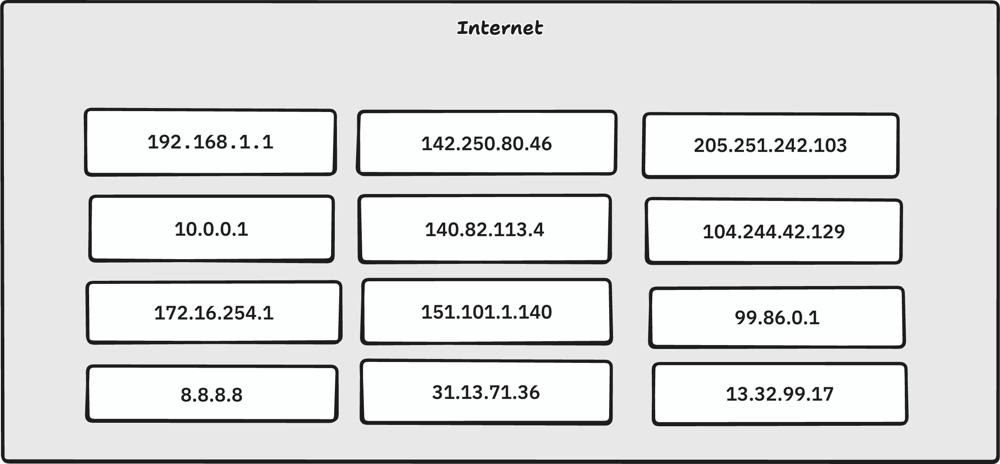

Think of the internet as a very large city block. Each house on that block is a **server** — a physical computer running somewhere in the world. Just like a house has a street address that tells the postal service exactly where to deliver a package, every server has a unique numerical address that tells the internet exactly where to send data.

When you buy a house, you own that physical space at that address. When a company like Google or Netflix wants to make their service available to the world, they do something similar — they either own or rent space on one of these "houses" (servers), and the internet knows how to find them.

The key insight is this: **the internet is not a cloud floating somewhere in the sky**. It is a global network of real, physical machines — many of which you could walk up to and touch if you had access to the data center they live in. When you visit a website, your computer is quite literally sending a message to another computer, somewhere in the world, and waiting for a response.

---

### What is DNS?

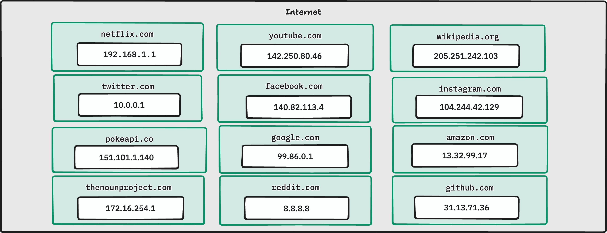

Every server connected to the internet has a numerical address called an **IPv4 address**. An IPv4 address looks like this:

```
142.250.80.46
```

Four numbers, each between 0 and 255, separated by dots. That address uniquely identifies a single machine on the internet. In theory, you could type that address directly into your browser and reach the server — but nobody wants to memorize `142.250.80.46` when they just want to check their email.

This is where **DNS (Domain Name System)** comes in. DNS is essentially a giant phone book for the internet. It maps human-readable domain names (like `google.com`) to their underlying IPv4 addresses (like `142.250.80.46`). When you type `google.com` into your browser:

1. Your computer asks a DNS resolver: "What is the IP address for `google.com`?"
2. The resolver looks it up and returns the IP address.
3. Your browser connects directly to that IP address.

You never see any of this — it happens in milliseconds in the background.

#### Seeing it in action

You can observe DNS resolution yourself using the `nslookup` command, which is available on macOS, Linux (including WSL), and Windows.

```bash
nslookup google.com
```

Output:
```
Server:         192.168.1.1
Address:        192.168.1.1#53

Non-authoritative answer:
Name:   google.com
Address: 142.250.80.46
```

Try a few more:

```bash
nslookup github.com
```

```
Non-authoritative answer:
Name:   github.com
Address: 140.82.113.4
```

```bash
nslookup amazon.com
```

```
Non-authoritative answer:
Name:   amazon.com
Address: 205.251.242.103
```

Notice that each domain resolves to a specific IP address. That address is the actual location of the server you are communicating with whenever you visit that site. DNS simply makes it so you don't have to remember the number.

---

### Hosting Providers

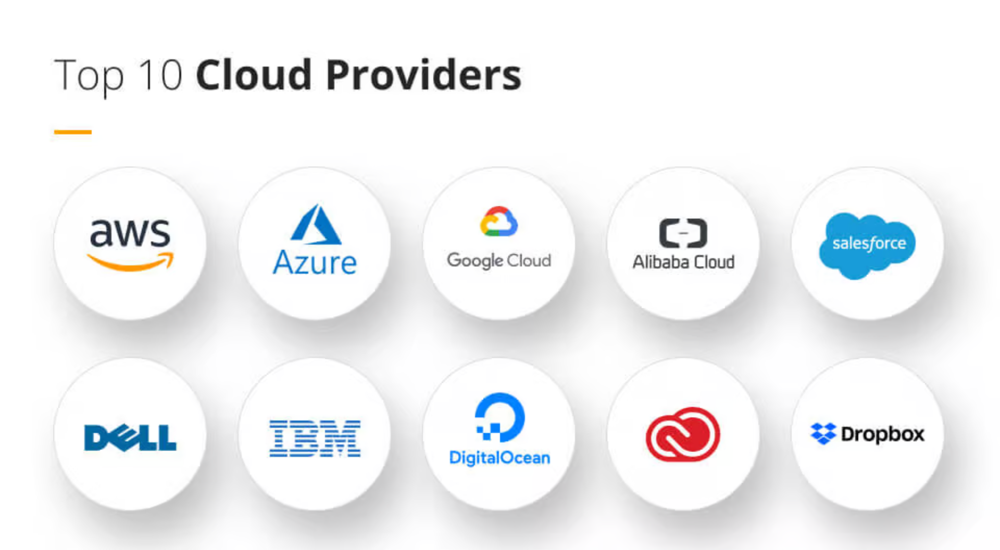

Now that we know servers are physical machines, the next question is: where do we get one?

You have two options:

1. **Buy and manage your own physical hardware** — expensive, requires a data center, power, cooling, and a dedicated ops team.
2. **Rent server capacity from a hosting provider** — pay for only what you use, let someone else manage the hardware.

For virtually all modern software development, option 2 is the right choice. Hosting providers own massive data centers filled with thousands of servers, and they rent access to those servers — or slices of them — to developers and companies around the world.

The major players are:

#### Azure

Microsoft's cloud platform. Deeply integrated with the Microsoft ecosystem (Active Directory, .NET, Windows Server). Commonly chosen by enterprises already invested in Microsoft products.

#### AWS

Amazon Web Services. The largest and most widely used cloud provider in the world. Offers the broadest range of services and has the largest community and documentation base. We will be using AWS in this curriculum.

#### Google Cloud

Google's cloud platform. Strong in data analytics, machine learning (TensorFlow, Vertex AI), and Kubernetes (Google invented it). Preferred by teams working heavily in the ML/AI space.

#### Netlify

A specialized platform focused on static site and front-end deployment. Dramatically simpler than AWS/Azure/GCP but far more limited in what it can host. Excellent for React apps, static sites, and JAMstack architectures.

#### Others

- **DigitalOcean** — developer-friendly, simpler pricing, great for small-to-medium projects
- **Heroku** — very beginner-friendly PaaS (Platform as a Service), abstracts away most infrastructure concerns
- **Render** — modern alternative to Heroku, generous free tier
- **Linode (Akamai)** — similar to DigitalOcean, competitive pricing

#### Choosing your provider

| Provider | Best For | Ease of Use | Free Tier | Relative Cost |
|---|---|---|---|---|
| **AWS** | Full-stack apps, enterprise, broad services | Moderate | Yes (limited) | Medium–High |
| **Azure** | Microsoft/enterprise environments | Moderate | Yes (limited) | Medium–High |
| **Google Cloud** | ML/AI workloads, data pipelines | Moderate | Yes (limited) | Medium–High |
| **Netlify** | Static sites, front-end only | Very Easy | Yes (generous) | Low |
| **DigitalOcean** | Small–medium full-stack apps | Easy | No | Low–Medium |
| **Heroku** | Quick prototypes, beginners | Very Easy | No (removed) | Medium |
| **Render** | Modern Heroku alternative | Easy | Yes (limited) | Low–Medium |

For this curriculum, we will use **AWS** — it is the industry standard and understanding it will transfer to virtually any professional environment you enter.

---
## AWS Account Setup Before EC2

Before we launch our first EC2 instance, we need to properly configure our AWS account. By default, AWS gives you a **root user**, which has unrestricted access to the entire account. This is powerful, but it is not the account we should use for normal day-to-day work.

In this section, we will secure the root account, create a safer admin user, and set up basic billing protections.

---

### Root User vs IAM Users

AWS accounts start with a **root user**.

The root user is the original account owner. It has access to everything in the AWS account and can perform certain account-level actions that normal users cannot.

An **IAM user** is a separate login identity inside the AWS account. IAM users are given permissions through AWS Identity and Access Management.

For normal work, we should use an IAM user instead of root.

| User Type | Purpose |
| --- | --- |
| Root user | Account ownership, billing/account recovery, rare account-level actions |
| IAM admin user | Normal AWS management work |
| IAM limited user | Specific tasks with limited permissions |
| IAM role | Temporary permissions for AWS services, applications, or automation |

Best practice:

- Secure the root user.
- Create an IAM admin user.
- Use the IAM admin user for normal work.
- Avoid using root unless absolutely necessary.

---

### Step 1: Log In as the Root User

Log in to AWS using the root account email and password.

This should be the original email address used to create the AWS account.

---

### Step 2: Enable MFA on the Root User

Multi-Factor Authentication, or MFA, adds a second layer of protection to the account.

From the AWS Console:

1. Go to **IAM**.
2. Open the **IAM Dashboard**.
3. Find the root user security recommendations.
4. Choose **Add MFA**.
5. Use an authenticator app or hardware MFA device.
6. Complete the setup.

This is one of the most important security steps. If someone gets the root password but does not have the MFA device, they still cannot log in.

---

### Step 3: Create an AWS Account Alias

By default, IAM users log in using the AWS account ID, which is a long number.

An **account alias** lets users log in with a readable name instead.

From the AWS Console:

1. Go to **IAM**.
2. Open the **IAM Dashboard**.
3. On the right side, find **AWS Account**.
4. Choose **Account Alias**.
5. Create a unique alias.

The alias must be unique across AWS.

After creating the alias, save the IAM sign-in URL.

It will look similar to this:

```text
https://your-account-alias.signin.aws.amazon.com/console
```

This is the URL IAM users can use to log in.

---

### Step 4: Enable Billing Access for IAM Users

Even if an IAM user has admin permissions, AWS billing access is not always enabled by default.

To allow IAM users to access billing information:

1. Click the profile menu in the top-right corner.
2. Go to **Account**.
3. Find **IAM user and role access to Billing Information**.
4. Click **Edit**.
5. Activate IAM access to billing.

This allows admin IAM users to view billing information, budgets, and cost tools.

---

### Step 5: Update Billing Preferences

Billing alerts help prevent surprise charges.

From the AWS Console:

1. Go to **Billing and Cost Management**.
2. Open **Preferences** or **Billing Preferences**.
3. Enable **Free Tier usage alerts**.
4. Enable **CloudWatch billing alerts** if available.
5. Add an email address for alerts.
6. Optionally enable PDF invoices by email.

These settings do not stop AWS from charging you, but they help you notice usage before it becomes a problem.

---

### Step 6: Create a Budget

AWS Budgets can send alerts when your account spending reaches a certain amount.

From the AWS Console:

1. Go to **Billing and Cost Management**.
2. Open **Budgets**.
3. Choose **Create budget**.
4. Select a template such as **Monthly cost budget**.
5. Enter a small amount, such as `$5`, `$10`, or `$20`.
6. Add your email address.
7. Create the budget.

!!! warning
    AWS budgets do **not** automatically stop resources.

    A budget sends alerts when spending reaches your chosen amount, but EC2 instances, databases, load balancers, and other services will continue running unless you manually stop them or create automation to stop them.

---

### Step 7: Create an IAM Admin User

Now that the root account is secured, create a normal user for daily AWS work.

From the AWS Console:

1. Go to **IAM**.
2. Go to **Users**.
3. Choose **Create user**.
4. Enter a username.
5. Check **Provide user access to the AWS Management Console**.
6. Choose **I want to create an IAM user**.
7. Set a custom password or allow AWS to generate one.
8. For a personal learning account, you may uncheck **Users must create a new password at next sign-in**.

Console access is important here because this user needs to log in through the AWS web interface.

---

### Step 8: Create an Admin User Group

Instead of attaching permissions directly to the user, create a group and attach permissions to the group.

From the AWS Console:

1. Go to **IAM**.
2. Go to **User groups**.
3. Choose **Create group**.
4. Name the group something like `Admins`.
5. Search for the policy named `AdministratorAccess`.
6. Select `AdministratorAccess`.
7. Create the group.

Then add the IAM user you created to the `Admins` group.

This gives the IAM user full administrative permissions inside the AWS account.

---

### Step 9: Log Out of Root and Log In as the IAM User

Once the IAM admin user exists:

1. Log out of the root account.
2. Go to the IAM sign-in URL saved earlier.
3. Enter the account alias.
4. Log in with the IAM username and password.

From this point forward, use the IAM admin account for normal AWS work.

---

### Step 10: Enable MFA on the IAM Admin User

The root user is now protected, but the admin IAM user also needs MFA.

From the IAM admin account:

1. Go to **IAM**.
2. Go to **Users**.
3. Select your IAM user.
4. Open **Security credentials**.
5. Add an MFA device.

This protects the account you will actually use day to day.

---

### Final Check

Before moving on to EC2, confirm that:

- The root user has MFA enabled.
- The IAM admin user exists.
- The IAM admin user is in an admin group.
- The admin group has the `AdministratorAccess` policy.
- Billing access is enabled for IAM users.
- Billing alerts are enabled.
- A monthly budget exists.
- The IAM admin user has MFA enabled.
- You are no longer using root for normal work.

Once this setup is complete, the account is ready for creating AWS resources like EC2 instances.

---

### Important Reminder

The AWS root user should only be used for rare account-level tasks, such as billing/account recovery, changing certain account settings, or closing the AWS account.

For normal AWS work, including creating EC2 instances, use the IAM admin user.
---

### AWS EC2 Instance

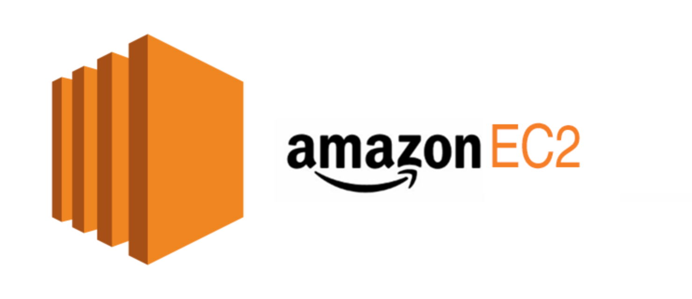

#### What is AWS EC2

**EC2** stands for **Elastic Compute Cloud**. It is AWS's service for renting virtual machines — computers you can access over the internet, configure however you like, and run your applications on.

The word "elastic" is important: you can scale your compute resources up or down based on demand. Spin up one server today, spin up fifty tomorrow if you need them, and shut them all down when you don't.

An EC2 **instance** is a single virtual machine running in one of AWS's data centers. From your perspective, it behaves exactly like a computer — because it is one.

#### My Machine VS EC2

Your local machine and an EC2 instance have more in common than you might expect. Here is how they compare:

| | Your Local Machine | EC2 Instance |
|---|---|---|
| **Operating System** | macOS / Windows / Linux (WSL) | Linux (typically Ubuntu) |
| **File System** | Local SSD/HDD | EBS (Elastic Block Store) volume |
| **Terminal Access** | Direct (open Terminal/WSL) | SSH over the internet |
| **Network Interface** | Router / WiFi | Virtual network interface (VPC) |
| **IP Address** | Private, assigned by your router | Public IPv4 assigned by AWS |
| **Running Processes** | Same concept (ps, top, kill) | Same concept |
| **Package Manager** | brew / apt / winget | apt (on Ubuntu) |
| **Users & Permissions** | Same Unix model | Same Unix model |
| **Shutting Down** | Press power button | Stop/terminate instance in AWS |

**What's the same:** The underlying operating system works identically. Shell commands, file permissions, running services, installing packages — all of it works just as it does on your Linux/WSL/macOS environment.

**What's different:** You don't have a monitor or keyboard attached to it. You interact with it entirely through SSH (Secure Shell) over the internet. AWS also manages the physical hardware, networking, and storage underneath — you never touch any of that.

---

#### Creating an EC2 Instance

Log in to the [AWS Management Console](https://aws.amazon.com/console/), navigate to **EC2**, and click **Launch Instance**. We will walk through each configuration step below.

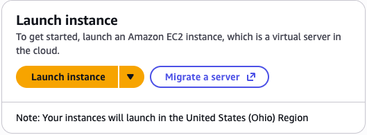

---

##### Amazon Machine Image (AMI)

An **AMI** is a pre-built operating system image that your EC2 instance will boot from. Think of it like choosing which OS to install when setting up a new computer — except AWS has already done the installation for you.

Available options include:

- **Amazon Linux** — AWS's own Linux distribution, optimized for EC2
- **macOS** — available on dedicated Mac hardware instances (not free tier)
- **Ubuntu** — one of the most popular Linux distributions, widely used in production
- **Windows Server** — for Windows-based workloads
- **Debian** — minimal, stable Linux distribution

We will use **Ubuntu Server 24.04 LTS (HVM), SSD Volume Type**.

Let's break down what that name means:

| Term | Meaning |
|---|---|
| **Ubuntu Server** | The server edition of Ubuntu — no graphical desktop, minimal footprint |
| **24.04** | Released April 2024 |
| **LTS** | Long-Term Support — security updates guaranteed until April 2029 |
| **HVM** | Hardware Virtual Machine — full virtualization, best performance and compatibility |
| **SSD Volume Type** | The root disk is backed by an SSD (faster than magnetic HDD) |

**Capabilities:**
- Full Ubuntu Linux environment — any package in the `apt` ecosystem is available
- Runs web servers (Nginx, Apache), application servers (Gunicorn), databases (PostgreSQL), containers (Docker)
- Compatible with the vast majority of open-source software

**Limitations:**
- No graphical desktop — terminal-only access
- On a `t3.micro`, RAM is limited (1 GB) — not suitable for memory-intensive workloads
- Root volume is not automatically backed up — you must configure snapshots separately

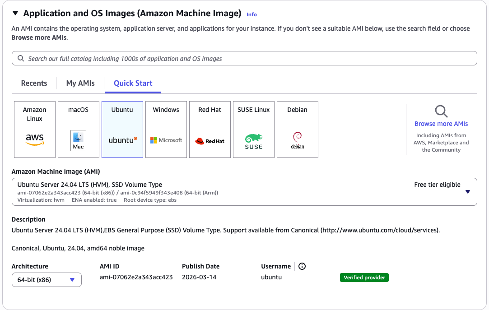

> The AMI selection screen shows a search bar and a list of available images. You should see "Ubuntu Server 24.04 LTS (HVM), SSD Volume Type" near the top of the Quick Start list. Confirm the architecture is **64-bit (x86)** and click **Select**.

---

##### Instance Type

The **instance type** determines how much CPU and RAM your virtual machine has. AWS organizes instance types into families:

- `t` — general purpose, burstable (good for variable workloads)
- `c` — compute-optimized (good for CPU-intensive tasks)
- `m` — memory-optimized
- `r` — storage-optimized

The number and suffix after the family letter indicate the generation and size. Here are the three types relevant to us:

| Instance Type | vCPUs | RAM | Free Tier Eligible | Strengths | Weaknesses | Estimated Cost |
|---|---|---|---|---|---|---|
| **t3.micro** | 2 | 1 GB | Yes | Free for 750 hrs/month (first year), good for learning and low-traffic apps | Limited RAM, burstable CPU (throttled under sustained load) | ~$0.0104/hr after free tier |
| **t3.small** | 2 | 2 GB | No | Better RAM headroom, still affordable | Not free tier, costs add up for hobby projects | ~$0.0208/hr |
| **c7i.flex.large** | 2 | 4 GB | No | Compute-optimized, great for CPU-bound workloads, flexible baseline | More expensive, overkill for simple web apps | ~$0.09/hr |

We will use **t3.micro** — it falls within the AWS Free Tier (750 hours per month for the first 12 months), which means you can run it for free while learning.

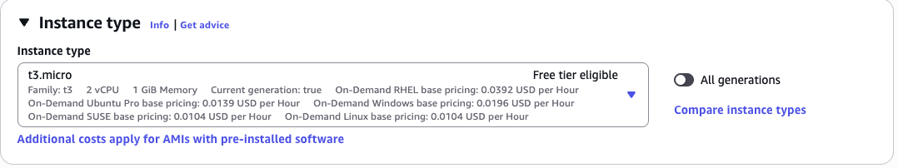

> The Instance Type screen displays a searchable table of all available types. Filter by "t3.micro" and select it. You should see the "Free tier eligible" label appear next to it. The summary panel on the right will update to show 2 vCPUs and 1 GiB Memory.

---

##### Create & Download PEM Key

To connect to your EC2 instance via SSH, you need a **key pair** — a set of cryptographic keys that prove your identity without requiring a password.

AWS holds the **public key** and places it on your instance when it launches. You download the **private key** (`.pem` file) and store it on your local machine. When you SSH in, your machine presents the private key, AWS verifies it against the public key, and access is granted.

**`Important`: You cannot download this key again after this step. If you lose it, you lose SSH access to the instance. Treat it like a password.**

Steps:

1. Under **Key pair (login)**, click **Create new key pair**.
   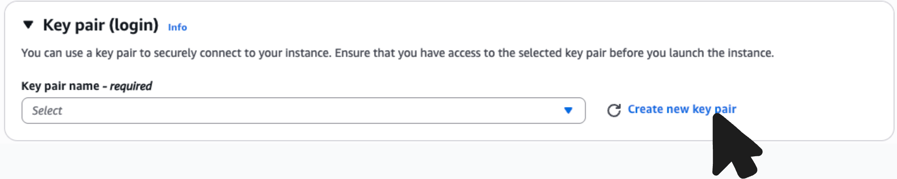
2. Give it a descriptive name (e.g., `my-ec2-key`).
3. Choose **RSA** as the key pair type and **.pem** as the file format (for use with OpenSSH on macOS/Linux/WSL).
4. Click **Create key pair** — the `.pem` file will download automatically.
   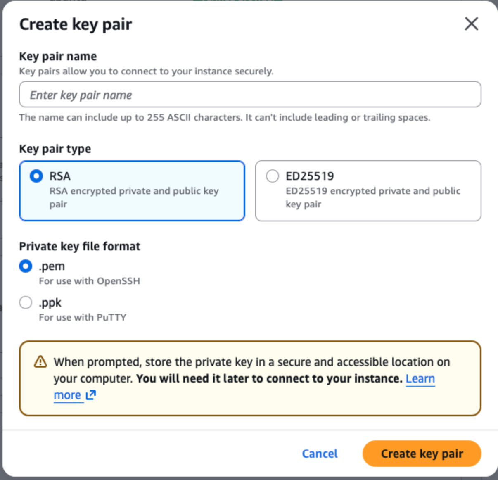
5. Move it somewhere safe 

```bash
mv ~/Downloads/my-ec2-key.pem ~/.ssh/
```

> The key pair creation modal shows fields for name, key pair type (RSA / ED25519), and file format (.pem / .ppk). After clicking "Create key pair," your browser will immediately begin downloading the `.pem` file.

---

##### Network Settings

The **network settings** section controls who is allowed to connect to your instance and on which ports. This is enforced by a **Security Group** — essentially a firewall that AWS manages for you.

There are three types of traffic to configure:

**SSH Traffic (Port 22)**

SSH is the protocol you will use to log in to your instance from the terminal. You have three options for who can initiate an SSH connection:

| Option | Who Can Connect | When to Use |
|---|---|---|
| **Anywhere (0.0.0.0/0)** | Any IP address on the internet | Convenient for learning, but less secure |
| **My IP** | Only your current public IP address | Better security; use this when possible |
| **Custom** | A specific IP range you define | For team environments or VPN-based access |

For this course, **My IP** is recommended — it restricts SSH access to your machine only, while still being easy to set up. Be aware that if your IP address changes (e.g., you switch networks), you will need to update this rule.

**HTTP Traffic (Port 80)**

HTTP is the protocol browsers use for unencrypted web traffic. Allowing HTTP from **Anywhere** means anyone on the internet can reach your application on port 80. You will typically want this enabled once your app is running.

**HTTPS Traffic (Port 443)**

HTTPS is the encrypted version of HTTP. Modern browsers expect HTTPS for any production site. Allowing HTTPS from **Anywhere** enables secure browser connections to your app. We will configure SSL certificates in a later lesson.

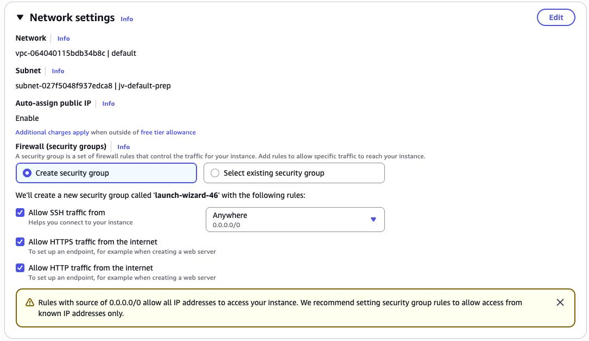

> The Network Settings section shows three checkboxes — "Allow SSH traffic from," "Allow HTTP traffic from the internet," and "Allow HTTPS traffic from the internet." Each has a dropdown. Set SSH to "My IP," and check both HTTP and HTTPS boxes.

Once you have configured all settings, click **Launch Instance**. AWS will take a moment to provision your machine. You will see a success banner with a link to your new instance ID.

---

#### Entering EC2 within AWS Portal

Once your instance is launched you'll be directed to the `info` page of you ec2 instance and/or provided a link to reach it. Once you open this page you'll find at the top of the instance a header that looks like the following image with a button that states `connect` click on said button and click `connect` on the follow on page.

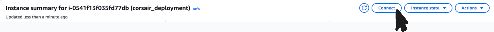

That will take you over to your ec2 instance portal where you can interact with your virtual machine.

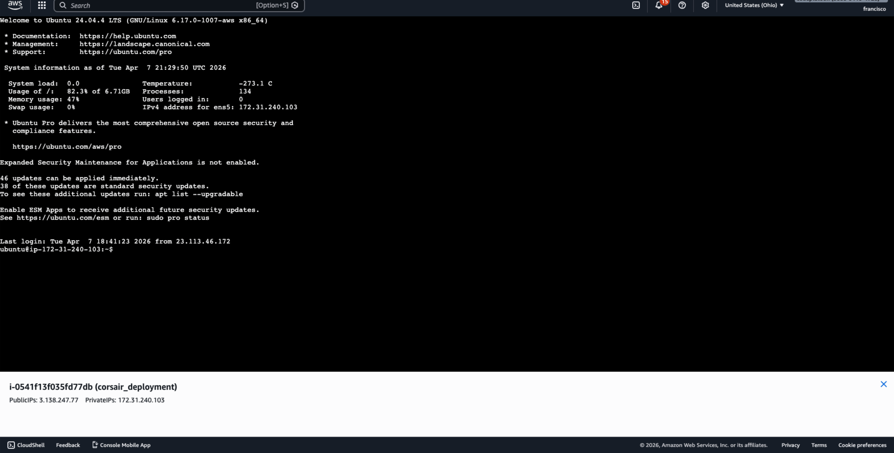

---

## Conclusion

The internet is a global network of physical servers, each identified by an IPv4 address and made human-accessible through DNS. Hosting providers like AWS abstract away the hardware so developers can rent compute capacity on demand.

In this lesson you:

- Learned how the internet routes requests using IP addresses and DNS
- Compared the major hosting providers and when to choose each
- Understood what an EC2 instance is and how it relates to your local machine
- Launched your first EC2 instance on AWS with a configured AMI, instance type, key pair, and security group
- Navigated the EC2 console to locate your running instance and find your connection details

In the next lesson, we will connect to this instance over SSH and begin setting up our server environment.
