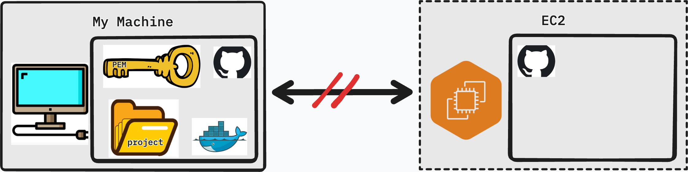
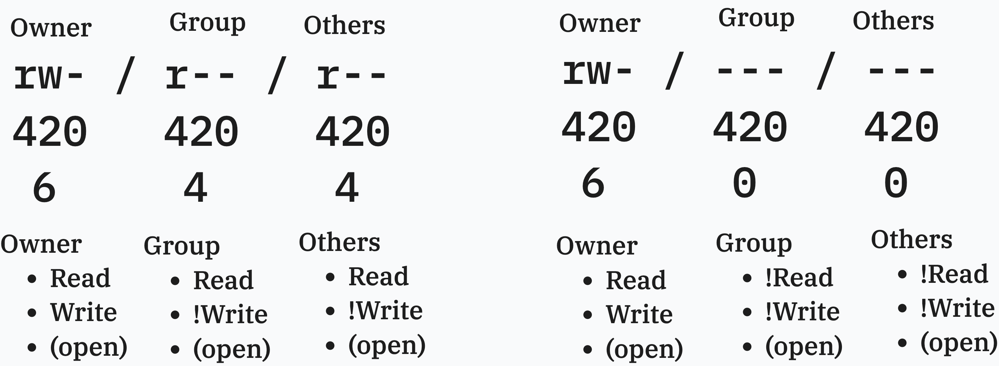
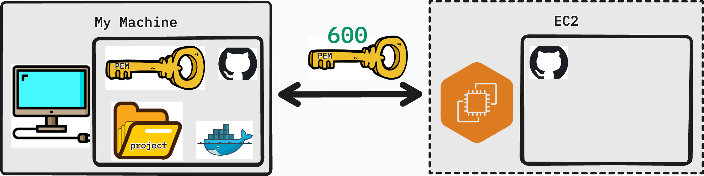
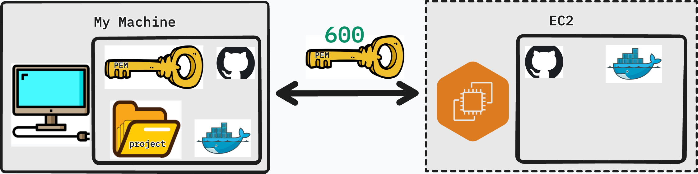
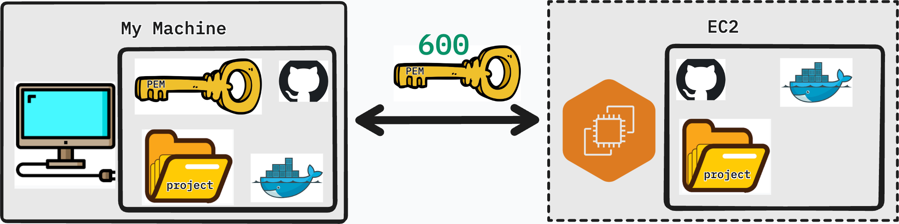

# Deploying your Application

## Intro

In the previous lesson we created an EC2 instance and familiarized ourselves with the AWS console. Now it's time to put it to use. In this lesson we will prepare our application for a cloud environment, connect to our EC2 instance over SSH, install Docker, and get our application running on a live server accessible from anywhere in the world.

---

## Lesson

### Current State



Our application is built with Docker Compose, which works in our favor — Docker abstracts away the underlying operating system differences, so we don't need to manually configure a Python environment, a Node environment, or a database on the EC2 instance. As long as Docker is running, our containers will behave the same way they do locally.

That said, there are a few gaps between what our personal machine has and what the EC2 instance currently has:

| Need | Personal Machine | Virtual Machine (EC2) |
|---|---|---|
| **Project** | Yes | No |
| **Git** | Yes | Yes |
| **Docker** | Yes | No |

Our plan is straightforward:

1. Prepare the project for a cloud environment and push to GitHub
2. SSH into the EC2 instance
3. Install Docker on the EC2 instance
4. Clone the project and run it

---

### Preparing Our Project

Before we push our code to GitHub and pull it onto the server, we need to make a few changes. A cloud environment is not the same as `localhost` — our app needs to know where to send requests, who is allowed to talk to the back end, and that no sensitive credentials are being committed.

#### Back-End

**Add CORS to Django**

When the browser makes requests from one origin (your EC2's public IP) to your Django API, the browser enforces [CORS (Cross-Origin Resource Sharing)](https://www.stackhawk.com/blog/django-cors-guide/) rules. Without CORS configured, the browser will block those requests entirely.

Install the `django-cors-headers` package:

```bash
pip install django-cors-headers
```

Add it to `INSTALLED_APPS` and `MIDDLEWARE` in `settings.py`:

```python
INSTALLED_APPS = [
    ...
    "corsheaders",
]

MIDDLEWARE = [
    "corsheaders.CorsMiddleware",  # must be as high as possible
    "django.middleware.common.CommonMiddleware",
    ...
]
```

For now, allow all origins (we will tighten this in a later lesson):

```python
CORS_ALLOW_ALL_ORIGINS = True
```

**Update `requirements.txt`**

Make sure `django-cors-headers` is captured in your requirements file:

```bash
pip freeze > requirements.txt
```

**Ensure no secrets are exposed**

Check that your `.env` file is listed in `.gitignore` and is not being committed. Any database passwords, secret keys, or API tokens should live in environment variables — never hardcoded in source code.

**Add `'*'` to `ALLOWED_HOSTS`**

Django's `ALLOWED_HOSTS` setting controls which host headers it will accept. On EC2, requests will arrive at your public IPv4 address. Add a wildcard for now:

```python
ALLOWED_HOSTS = ['*']
```

> This is acceptable for a development deployment. In production, you would replace `'*'` with your actual domain name or IP address.

---

#### Front-End

**Update API requests to use the EC2 IPv4 address**

Your front end currently points requests at `localhost`. On the server, `localhost` refers to the EC2 instance itself — not your Django container in the way you expect. Replace the `baseURL` in your Axios instance with your EC2's public IPv4 address:

```js
export const api = axios.create({
    baseURL: 'http://<ipv4>/api/v1/'
})
```

Replace `<ipv4>` with the **Public IPv4 address** from your EC2 Instance Summary page in the AWS console.

---

**Push to GitHub**

Once all changes are in place, commit and push to your repository:

```bash
git add .
git commit -m "prepare app for EC2 deployment"
git push origin main
```

---

### Entering EC2 Instance through SSH

#### What is `ssh`?

**SSH (Secure Shell)** is a protocol that lets you log in to a remote machine and run commands on it as if you were sitting in front of it. Instead of a username and password, we authenticate using the PEM key we downloaded when creating the EC2 instance.

The basic SSH command looks like this:

```bash
ssh -i <name_of_key>.pem ubuntu@<ipv4_address>
```

- `-i <name_of_key>.pem` — specifies the private key to use for authentication
- `ubuntu` — the default user on Ubuntu AMIs
- `<ipv4_address>` — the public IPv4 address of your EC2 instance

#### Permissions Issue?

If you attempt to SSH in immediately after downloading your key, you will likely see an error like this:

```
@@@@@@@@@@@@@@@@@@@@@@@@@@@@@@@@@@@@@@@@@@@@@@@@@@@@@@@@@@@
@         WARNING: UNPROTECTED PRIVATE KEY FILE!          @
@@@@@@@@@@@@@@@@@@@@@@@@@@@@@@@@@@@@@@@@@@@@@@@@@@@@@@@@@@@
Permissions 0644 for 'my-key.pem' are too open.
It is required that your private key files are NOT accessible by others.
This private key will be ignored.
```

SSH is refusing to use the key because its file permissions are too permissive. Let's understand what `0644` means.

##### Reading Permissions



On Unix systems, every file has a set of permissions that control who can read, write, or execute it. Permissions are split into three groups:

| Group | Who it applies to |
|---|---|
| **Owner** | The user who owns the file |
| **Group** | Users in the same group as the file |
| **Others** | Everyone else |

Each group gets three permission bits: **read (r)**, **write (w)**, and **execute (x)**. These can be represented as a number by adding their values:

| Permission | Symbol | Value |
|---|---|---|
| Read | `r` | 4 |
| Write | `w` | 2 |
| Execute | `x` | 1 |
| No permission | `-` | 0 |

So `rw-` = 4 + 2 + 0 = **6**, and `r--` = 4 + 0 + 0 = **4**.

A permission of `644` breaks down as:

| Group | Bits | Value | Meaning |
|---|---|---|---|
| Owner | `rw-` | 6 | Can read and write |
| Group | `r--` | 4 | Can read |
| Others | `r--` | 4 | Can read |

The problem: **group and others can read your private key**. SSH treats this as a security risk and refuses to proceed.

##### Fixing the Permissions Issue



We need to restrict the key so that only the owner can read it — no group, no others:

```bash
chmod 600 my-key.pem
```

`600` breaks down as:

| Group | Bits | Value | Meaning |
|---|---|---|---|
| Owner | `rw-` | 6 | Can read and write |
| Group | `---` | 0 | No access |
| Others | `---` | 0 | No access |

Now attempt to connect again:

```bash
ssh -i <name_of_key>.pem ubuntu@<ipv4_address>
```

You will be prompted to confirm the host fingerprint the first time — type `yes` and press Enter. If everything is correct, you will be greeted with the Ubuntu welcome banner and a new shell prompt indicating you are now inside your EC2 instance.

---

### Preparing EC2

#### Docker



The EC2 instance is a fresh Ubuntu Server — nothing beyond the base OS is installed. We need to install Docker before we can run our application.

**Step 1 — Set up Docker's `apt` repository**

Ubuntu's default package list doesn't include the latest Docker packages. We need to add Docker's official repository first:

```bash
sudo apt update
sudo apt install ca-certificates curl
sudo install -m 0755 -d /etc/apt/keyrings
sudo curl -fsSL https://download.docker.com/linux/ubuntu/gpg -o /etc/apt/keyrings/docker.asc
sudo chmod a+r /etc/apt/keyrings/docker.asc

sudo tee /etc/apt/sources.list.d/docker.sources <<EOF
Types: deb
URIs: https://download.docker.com/linux/ubuntu
Suites: $(. /etc/os-release && echo "${UBUNTU_CODENAME:-$VERSION_CODENAME}")
Components: stable
Architectures: $(dpkg --print-architecture)
Signed-By: /etc/apt/keyrings/docker.asc
EOF

sudo apt update
```

**Step 2 — Install Docker packages**

```bash
sudo apt install docker-ce docker-ce-cli containerd.io docker-buildx-plugin docker-compose-plugin
```

**Step 3 — Ensure Docker is running**

```bash
sudo systemctl status docker
```

---

#### Project



With Docker installed, clone your project from GitHub:

```bash
git clone <your-repository-url>
```

Navigate into the project directory:

```bash
cd <your-project-folder>
```

---

#### Running the Project

Start your application in detached mode so it continues running after you close the SSH session:

```bash
sudo docker compose up -d
```

The `-d` flag runs all containers in the background (detached). You will see Docker pull any missing images and start each service.

Once the containers are up, run your Django migrations:

```bash
sudo docker exec -it django-container bash
python manage.py migrate
```

Exit the container when done:

```bash
exit
```

---

#### Ensuring Your App is Running

Before visiting your app in the browser, open the Nginx container logs to watch for any incoming requests or errors in real time:

```bash
sudo docker logs -f <nginx-container>
```

The `-f` flag streams the log output live (similar to `tail -f`). Press `Ctrl + C` to stop following the logs.

Now open a browser and navigate to:

```
http://<your-ec2-ipv4-address>
```

Run through your application's core features — create records, log in, test any API endpoints. Watch the log output in your terminal as you interact with the app. If something is not working, the logs will tell you exactly where the request is failing.


---

## Conclusion

Your application is now live on a real server, accessible to anyone with the IP address.

In this lesson you:

- Updated Django to support CORS and accept requests from any host
- Pointed the front-end Axios instance at the EC2 public IPv4 address
- Connected to your EC2 instance over SSH and resolved the file permissions issue
- Installed Docker on a fresh Ubuntu Server
- Cloned your project, ran migrations, and started the application in detached mode
- Verified the deployment by monitoring logs and visiting the app in a browser

In the next lesson, we will look at how to secure and professionalize this deployment with a domain name, HTTPS, and NGINX configuration.
