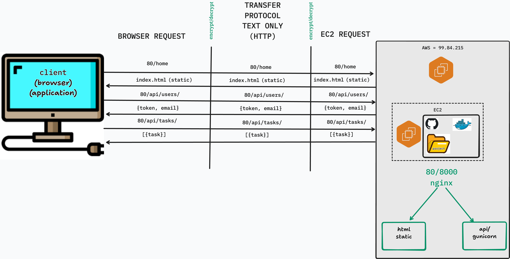
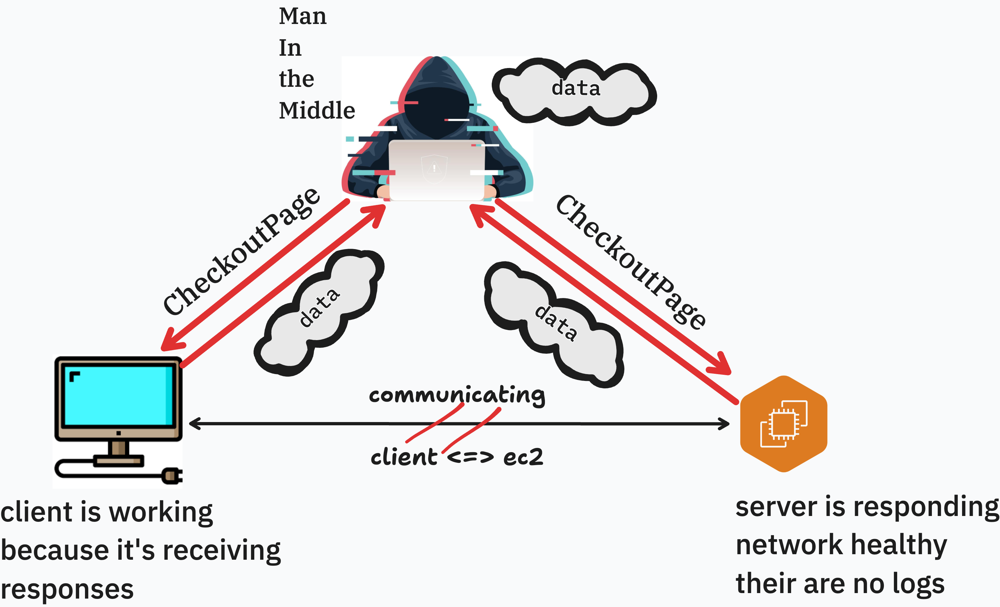

# Why Secure Socket Layer

## Intro

Your application is deployed. It is live on the internet, running on an EC2 instance, accessible from any browser in the world. That is a real accomplishment.

But open it in Chrome and look at the address bar. You will see a warning: **Not Secure**.

That warning is not cosmetic. It is telling you — and every user who visits your app — that every piece of data traveling between their browser and your server is being sent as plaintext. Credentials, tokens, form data — all of it readable to anyone positioned between the client and the server.

In this lesson, we will understand exactly why that matters, how SSL/TLS solves it, what your options are for obtaining a certificate, and how to acquire the domain name that every certificate approach requires.

---

## Lesson

### Current State

Right now, your application communicates over **HTTP** (HyperText Transfer Protocol). When a user logs in to your task manager, here is what happens at the network level:



That POST request — containing the username and password — travels across every router, switch, and network segment between the user's machine and your server. It is not encrypted. It is a plain text string moving through the internet.

HTTP has no concept of privacy. It is simply a protocol for sending text back and forth. Anyone who can intercept the connection can read everything.

---

### What Happens Without SSL

**Browser Warnings**

Modern browsers actively flag HTTP sites. Chrome shows a "Not Secure" label in the address bar for any page served over HTTP. For login forms specifically, Chrome shows a more prominent warning: *"Your connection to this site is not secure. You should not enter any sensitive information on this site."*

Users who see these warnings lose trust in the application — and rightfully so.

**Man-in-the-Middle Attacks**



A **man-in-the-middle (MITM) attack** occurs when an attacker positions themselves between the client and server and intercepts or modifies traffic.

Consider a user on a coffee shop WiFi network. The network's router sees all traffic passing through it. If your app runs over HTTP, the router — or an attacker on the same network — can:

- **Read** login credentials, auth tokens, and private data
- **Modify** responses before they reach the user (inject malicious scripts or content)
- **Replay** captured tokens to impersonate authenticated users

MITM attacks on HTTP are not theoretical. They are trivially easy on shared networks using widely available tools.

**SEO and Browser Feature Restrictions**

Beyond security, running over HTTP has practical consequences:

| Consequence | Details |
|---|---|
| **Google search ranking** | Google actively deprioritizes HTTP sites in search results |
| **Geolocation API** | Browsers refuse to expose location data on insecure origins |
| **Service Workers** | Only available over HTTPS |
| **Push Notifications** | HTTPS required |
| **Browser autofill** | Browsers warn users before autofilling passwords on HTTP pages |

For any application users are expected to trust with their data, HTTPS is not optional.

---

### How SSL/TLS Works

"SSL" and "TLS" are often used interchangeably. SSL (Secure Sockets Layer) was the original protocol; TLS (Transport Layer Security) is its modern replacement. When people say "SSL certificate," they almost always mean a TLS certificate.

**The Certificate Authority Model**

The goal of TLS is to answer a simple question: *How does the browser know it is talking to the real server and not an impersonator?*

The answer is **Certificate Authorities (CAs)** — independent organizations that browsers and operating systems trust by default. A CA will only issue a certificate for a domain after verifying that the requester controls that domain. When your server presents a certificate signed by a trusted CA, the browser can verify the chain of trust:

```
Browser's built-in trust store
         │
         ▼
    Root CA (e.g., ISRG Root X1)
         │  signs
         ▼
  Intermediate CA
         │  signs
         ▼
  Your certificate  ◄── issued for yourdomain.com
```

If the certificate is valid, matches the domain, and was signed by a trusted CA — the browser proceeds. If any of those conditions fail, the browser shows a security warning and blocks the connection.

**The TLS Handshake**

When a browser connects to an HTTPS server, it performs a **TLS handshake** before any application data is exchanged. In simplified terms:

1. **Client Hello** — browser says "I want a secure connection" and lists its supported encryption methods
2. **Server Hello** — server picks an encryption method and sends its certificate
3. **Certificate verification** — browser checks the certificate against its trusted CA list
4. **Key exchange** — both sides derive a shared secret key using asymmetric cryptography
5. **Encrypted channel established** — all subsequent communication uses symmetric encryption with the shared key

After the handshake, HTTP traffic flows normally — but it is encrypted. Your POST request to `/api/v1/users/login/` still looks exactly the same on the application layer. It just travels inside an encrypted envelope that only your server can open.

---

### SSL Providers

You have several options for obtaining a TLS certificate. They differ in cost, how they are issued, and where they can be deployed.

| Provider | Cost | Deployment | Notes |
|---|---|---|---|
| **Let's Encrypt / Certbot** | Free | Installed directly on server | 90-day certs, auto-renew, widely used in production. Requires a domain name. |
| **AWS Certificate Manager (ACM)** | Free (for AWS services) | Used with ALB, CloudFront, API Gateway only | Cannot download or install on EC2 directly. Requires a load balancer to use. |
| **ZeroSSL** | Free (basic) | Installed on server | Alternative to Let's Encrypt. Less tooling support. |
| **DigiCert / Comodo** | $50–$500+/year | Installed on server | OV and EV certificates with extended identity verification. Used in enterprise and financial services. |

For this module, we will use **Certbot** — it installs directly on your server, it's free, and it makes the certificate files visible and tangible. You will understand exactly what changed on your machine and why your application is now secure.

---

### Acquiring a Domain

Every SSL certificate approach covered in this module requires a **domain name**. Certificates cannot be issued against a raw IPv4 address like `3.138.247.77` for two reasons:

1. **Verification** — the certificate issuer needs to confirm you control the domain. They do this by having you add a specific DNS record or serve a specific file at a known URL. An IP address has no corresponding DNS record you can manage.
2. **Stability** — EC2 public IPv4 addresses change when an instance is stopped and restarted. A domain name is a stable identifier that you control regardless of what happens to the underlying IP.

**Route 53 vs External Registrars**

| Option | Pros | Cons |
|---|---|---|
| **AWS Route 53** | Seamless integration with AWS services, hosted zone created automatically | Slightly higher registration cost (~$13–15/year for .com) |
| **External registrar** (Namecheap, GoDaddy, Google Domains) | Often cheaper domain prices | Additional step to configure nameservers or add DNS records manually |

For this curriculum we will use **Route 53** — it keeps everything within the AWS ecosystem and requires the least manual DNS configuration.

**Registering a Domain in Route 53**

1. In the AWS Console, navigate to **Route 53** → **Registered domains** → **Register domain**
2. Search for the domain name you want
3. Select a domain and proceed through the registration steps (contact information, auto-renew preference)
4. Complete the purchase — Route 53 will automatically create a **Hosted Zone** for the domain

> Registration can take a few minutes to up to an hour to complete. You will receive a confirmation email.

**Creating an A Record**

Once your domain is registered and the Hosted Zone exists, point it at your EC2 instance.

1. In Route 53, navigate to **Hosted zones** and click your domain
2. Click **Create record**
3. Configure:
   - **Record name**: leave blank (for the root domain) or enter `www`
   - **Record type**: `A`
   - **Value**: your EC2 instance's **Public IPv4 address** (found in the EC2 Instance Summary)
   - **TTL**: 300 (5 minutes is fine for now)
4. Click **Create records**

This A record must be in place before running Certbot in the next lesson. Let's Encrypt verifies domain ownership by making an HTTP request to your domain — if DNS hasn't propagated yet, the verification will fail.

You can confirm propagation with:

```bash
nslookup yourdomain.com
```

When the returned IP address matches your EC2's public IPv4, you are ready to proceed.

**Importing an Existing Domain from an External Registrar**

If you already own a domain through GoDaddy, Namecheap, Google Domains, or any other registrar, you do not need to buy a new one. You can keep the domain where it is registered and delegate its DNS management to Route 53 by updating the domain's **nameservers**.

Here is how DNS authority works: when a browser looks up `yourdomain.com`, it first asks the global DNS system which nameservers are authoritative for that domain. Those nameservers are set at your registrar. By pointing them at Route 53, you are telling the internet "Route 53 is now in charge of all DNS records for this domain" — even though you are still paying your original registrar for the domain itself.

The steps are:

**Step 1 — Create a Hosted Zone in Route 53**

1. In the AWS Console, navigate to **Route 53** → **Hosted zones** → **Create hosted zone**
2. Enter your domain name exactly as registered (e.g. `yourdomain.com`)
3. Leave the type as **Public hosted zone**
4. Click **Create hosted zone**

Route 53 will immediately create the zone and populate it with two default records: an **NS record** (nameservers) and an **SOA record** (start of authority). The NS record is what you need next.

**Step 2 — Copy the Route 53 Nameservers**

Click into your new Hosted Zone and find the **NS record**. It will contain four nameserver addresses that look like:

```
ns-123.awsdns-45.com
ns-678.awsdns-90.net
ns-111.awsdns-22.co.uk
ns-999.awsdns-55.org
```

Copy all four — you will paste these into your registrar's dashboard.

**Step 3 — Update Nameservers at Your Registrar (GoDaddy example)**

1. Log in to your GoDaddy account and navigate to **My Products** → **Domains**
2. Click **Manage** next to your domain
3. Scroll to the **Nameservers** section and click **Change**
4. Select **Enter my own nameservers (advanced)**
5. Delete the existing GoDaddy nameservers and paste in the four Route 53 nameservers from Step 2
6. Save your changes

The process is nearly identical for other registrars — look for a "Custom nameservers" or "DNS management" section in your domain settings.

**Step 4 — Wait for Propagation**

Nameserver changes can take anywhere from a few minutes to 48 hours to propagate across the global DNS network, though in practice it is usually under an hour. You can check whether propagation has completed with:

```bash
nslookup -type=NS yourdomain.com
```

When the output shows the Route 53 nameservers instead of your registrar's original ones, DNS authority has transferred. From this point forward, all DNS records for your domain — including the A record pointing to your EC2 instance — are managed entirely within Route 53.

---

## Conclusion

HTTP sends all data as plaintext — credentials, tokens, everything. SSL/TLS wraps that traffic in an encrypted channel and proves to the browser that it is talking to the right server. Without it, your users are exposed to browser warnings, search ranking penalties, and active attacks on shared networks.

In this lesson you:

- Traced the current HTTP request flow and saw why plaintext is a problem
- Understood the attack surface created by running without SSL
- Learned how Certificate Authorities and the TLS handshake establish trust
- Compared the major SSL providers and their deployment models
- Registered a domain name (or imported an existing one), created a Hosted Zone, and pointed it at your EC2 instance

In the next lesson, we will use Certbot to obtain a free SSL certificate, wire it into our Nginx configuration, and serve our application exclusively over HTTPS.
