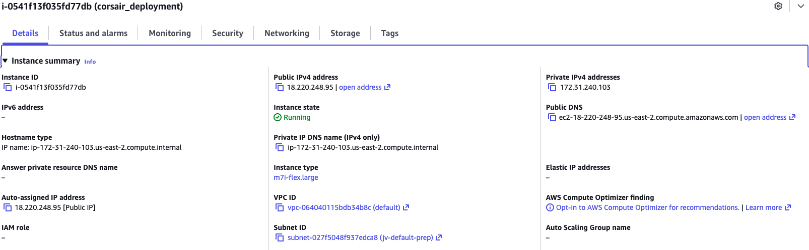
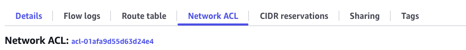
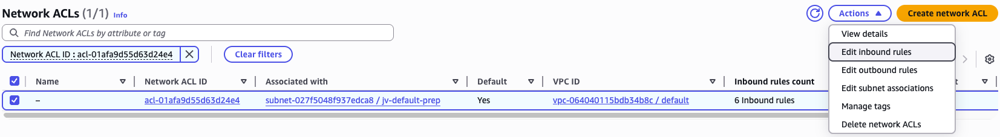
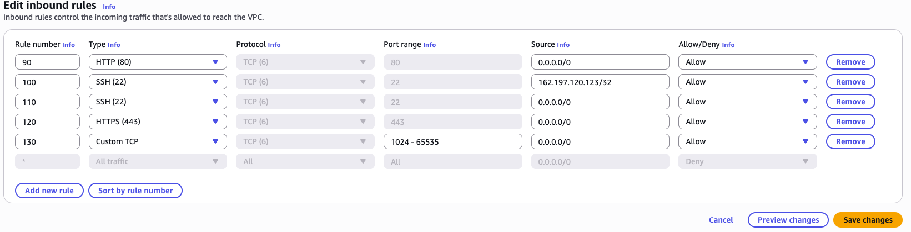

# Acquiring SSL

## Intro

In the previous lesson we established why HTTP is insufficient for a production application and how SSL/TLS works. We also acquired a domain name pointing to our EC2 instance. Now we will use that domain to obtain a certificate using **Certbot** — a free, open-source tool that installs a certificate directly on your server.

By the end, your application will be served exclusively over HTTPS.

---

## Lesson

### Certbot / Let's Encrypt

#### What is Certbot?

Certbot is a free, open-source tool built by the Electronic Frontier Foundation (EFF). Its entire job is to automate the process of obtaining, installing, and renewing SSL/TLS certificates issued by **Let's Encrypt** — a free, non-profit Certificate Authority (CA) trusted by every major browser.

Before Certbot existed, setting up SSL meant paying for a certificate, downloading files manually, configuring your server by hand, and repeating the whole process every time the certificate expired. Certbot eliminated all of that.

**How does Certbot prove you own your domain?**

Let's Encrypt uses a protocol called **ACME** (Automatic Certificate Management Environment) to verify domain ownership before issuing a certificate. The process works like this:

1. You run Certbot on your server and tell it which domain you want a certificate for.
2. Certbot contacts Let's Encrypt and says "I'd like a certificate for `yourdomain.com`."
3. Let's Encrypt responds with a challenge — it places a unique token at a known path and says "If you really own this domain, make this token accessible at `http://yourdomain.com/.well-known/acme-challenge/<token>`."
4. Certbot temporarily spins up a lightweight HTTP server on port 80 to serve that token file.
5. Let's Encrypt fetches the URL from the public internet and confirms the token matches.
6. Ownership verified — Let's Encrypt issues the certificate.

This entire handshake happens in seconds and Certbot handles every step automatically.

**What does Certbot produce?**

Once verification passes, Certbot places a set of files on your server under `/etc/letsencrypt/live/yourdomain.com/`:

| File | Purpose |
|---|---|
| `fullchain.pem` | Your certificate **plus** the CA's intermediate certificates — this is what Nginx serves to browsers |
| `privkey.pem` | Your private key — used by Nginx to decrypt incoming traffic |
| `cert.pem` | Your certificate alone (without the chain) |
| `chain.pem` | The CA's intermediate certificates alone |

Nginx needs `fullchain.pem` and `privkey.pem`. When a browser connects over HTTPS, Nginx presents `fullchain.pem` to prove its identity, and uses `privkey.pem` to complete the TLS handshake. Everything after that point is encrypted.

**Why does this integrate so naturally with Nginx and Linux?**

Nginx is simply told where to find those `.pem` files via its configuration. The certificate files live on the host Linux filesystem at `/etc/letsencrypt/`, and Nginx reads them at startup. No special plugin or middleware is required — it's just file paths in a config. This also means that if we mount `/etc/letsencrypt/` into a Docker container as a read-only volume, the Nginx container inside Docker gets access to the exact same certificates. We will do precisely that later in this lesson.

---

### Optimizing Space

Before installing Certbot and adding another layer to our application, let's take a look at the current occupied space within our Virtual Machine.

```bash
df -h
```

This will provide us a report of how much of our machine's disk is occupied. On a small EC2 instance you'll likely see the root partition close to full — which would cause `certbot` and future `docker build` commands to fail silently or with cryptic errors. Let's track down what's eating the space.

```bash
sudo du -xh / --max-depth=1 2>/dev/null | sort -h
```

This tells us which top-level directories are consuming the most space. You'll notice that `var` sits at the top of the list.

```bash
sudo du -xh /var --max-depth=1 2>/dev/null | sort -h
```

That points us to the `lib` directory inside `/var`.

```bash
sudo du -xh /var/lib --max-depth=1 2>/dev/null | sort -h
```

And that points us directly to Docker. Docker is the culprit — but before we start deleting things, let's understand *why* Docker accumulates so much data and handle it properly.

#### Decreasing Image Sizes

Every time Docker builds an image it pulls a **base image** from Docker Hub. The base image is the foundation your `Dockerfile` builds on top of — it ships with an operating system, a runtime (Node, Python, etc.), and a collection of pre-installed system packages. The heavier the base image, the more disk space every build consumes.

The two base images currently used in our project are larger than they need to be. Let's swap them for leaner alternatives:

```text
node:25             ==  node:22-alpine
python:3.13-trixie  ==  python:3.13-slim
```

Here's what changes — and what tradeoffs come with each swap:

| | `node:25` | `node:22-alpine` |
|---|---|---|
| **Approx. image size** | ~1.1 GB | ~180 MB |
| **Base OS** | Debian (full) | Alpine Linux (musl libc) |
| **Build tools included** | Yes (`gcc`, `make`, etc.) | No — must install manually if needed |
| **npm / yarn** | Included | Included |
| **Native module compilation** | Works out of the box | May require `apk add python3 make g++` |
| **Best for** | Complex apps with native dependencies | Lightweight APIs and front-end build steps |

| | `python:3.13-trixie` | `python:3.13-slim` |
|---|---|---|
| **Approx. image size** | ~1.3 GB | ~130 MB |
| **Base OS** | Debian Trixie (bleeding-edge) | Debian (minimal install) |
| **Build tools included** | Yes | No — must `apt-get install` if needed |
| **pip** | Included | Included |
| **psycopg / C-extension packages** | Compiles cleanly | May need `apt-get install libpq-dev gcc` |
| **Best for** | Dev environments needing bleeding-edge libs | Production Django/DRF containers |

In our case both swaps are safe. Our React frontend is a static Vite build — no native Node modules involved. Our Django backend uses `psycopg[binary]` which ships its own pre-compiled binary and does not require a C compiler at container build time.

#### Removing Docker Cache

Docker caches aggressively — and for good reason. Every line in a `Dockerfile` creates an immutable **layer**. When you rebuild an image after changing only your application code, Docker skips re-downloading the base image and re-running `pip install` by replaying cached layers up to the first changed line. This makes iterative development fast.

However, these cached layers accumulate silently on disk:

- **Build cache** — intermediate layers from every `docker build` you've ever run, including builds from images you no longer use.
- **Dangling images** — old image versions that lost their tag when you rebuilt with the same tag. They're no longer reachable by name but still occupy disk.
- **Unused images** — images that were pulled or built but are no longer referenced by any container.

On an EC2 instance that's been running for a few weeks with regular rebuilds, this cache can easily grow to 3–6 GB. We don't need any of it on a production machine where we build once and run. Clear it with:

```bash
docker builder prune -a
docker image prune -a
docker system prune -a
```

Run `df -h` again after this — you should see significant space recovered before continuing.

---

### Installing Certbot

**Within your EC2 Virtual Machine** we will install Certbot to work alongside Nginx.

```bash
sudo snap install --classic certbot
sudo ln -s /snap/bin/certbot /usr/bin/certbot
```

The second command creates a symbolic link so that `certbot` is available as a command anywhere in your terminal, regardless of where snap installed it.

```bash
sudo certbot certonly --standalone -d yourdomain.com
```

The `--standalone` flag tells Certbot to spin up its own temporary HTTP server to complete the ACME challenge — no Nginx configuration changes required at this stage. Certbot will bind to port 80 briefly, verify domain ownership with Let's Encrypt, and then release the port. Your certificates will be placed at `/etc/letsencrypt/live/yourdomain.com/`.

You can verify the certificate was issued successfully at any time with:

```bash
sudo certbot certificates
```

**Certificate Renewal**

Let's Encrypt certificates are valid for **90 days**. Certbot automatically schedules a renewal job via a systemd timer that runs twice a day. When the certificate is within 30 days of expiring, Certbot renews it.

Here's where our Docker setup introduces a complication: Certbot's `--standalone` mode needs to bind to **port 80** during renewal to complete the ACME challenge. But our Nginx container is already occupying port 80. If the two processes fight over that port, renewal fails silently — and 90 days later your site shows a certificate error to every visitor.

Certbot solves this with **renewal hooks** — shell scripts that run automatically before and after the renewal process. We register a `pre` hook that shuts Docker Compose down before Certbot touches port 80, and a `post` hook that brings it back up once the new certificate is in place.

```bash
sudo sh -c 'printf "#!/bin/sh\ndocker compose -f /home/ubuntu/<your-project-folder>/docker-compose.yml down\n" /etc/letsencrypt/renewal-hooks/pre/stop-containers.sh && chmod +x /etc/letsencrypt/renewal-hooks/pre/stop-containers.sh'

sudo sh -c 'printf "#!/bin/sh\ndocker compose -f /home/ubuntu/<your-project-folder>/docker-compose.yml up -d\n" /etc/letsencrypt/renewal-hooks/post/start-containers.sh && chmod +x /etc/letsencrypt/renewal-hooks/post/start-containers.sh'
```

Replace `<your-project-folder>` with the actual directory name of your project. With these hooks in place, every future renewal is fully automatic — Certbot stops your containers, renews the cert, starts your containers back up, and your users experience only a few seconds of downtime at most (and only once every 60–90 days).

---

### Docker, Nginx, and Certbot

Now that Certbot is installed within our machine, we need to ensure:

1. Certbot can communicate with the Docker Network
2. HTTP traffic can be properly directed to Nginx
3. Nginx can properly handle HTTPS traffic through ports 80 and 443
4. Certbot certifications are shared with the nginx-container

The key insight here is that the certificate files live on the **host machine** at `/etc/letsencrypt/`. Our Nginx container doesn't know about the host filesystem by default — but we can bridge that gap with a Docker **read-only volume mount**. We mount `/etc/letsencrypt` from the host directly into the Nginx container so it can read the `.pem` files as if they were local.

We also need to update our Nginx configuration to handle two scenarios:
- Incoming traffic on port 80 (plain HTTP) — redirect it permanently to HTTPS
- Incoming traffic on port 443 (HTTPS) — terminate SSL and forward to the appropriate container

`default.conf` for Nginx:

```txt
server {
    listen 80;
    listen [::]:80;
    server_name deployment-demo.com www.deployment-demo.com;

    return 301 https://deployment-demo.com$request_uri;
}

server {
    listen 443 ssl;
    listen [::]:443 ssl;
    server_name deployment-demo.com www.deployment-demo.com;

    ssl_certificate /etc/letsencrypt/live/deployment-demo.com/fullchain.pem;
    ssl_certificate_key /etc/letsencrypt/live/deployment-demo.com/privkey.pem;

    ssl_session_timeout 1d;
    ssl_session_cache shared:SSL:10m;
    ssl_session_tickets off;

    location /api/ {
        proxy_pass http://backend:8000;
        proxy_http_version 1.1;
        proxy_set_header Host $host;
        proxy_set_header X-Real-IP $remote_addr;
        proxy_set_header X-Forwarded-For $proxy_add_x_forwarded_for;
        proxy_set_header X-Forwarded-Proto $scheme;
    }

    location / {
        root /usr/share/nginx/html;
        index index.html;
        try_files $uri $uri/ /index.html;
    }
}
```

The first `server` block catches every HTTP request and issues a **301 permanent redirect** to the HTTPS version of the same URL. Browsers and search engines will remember this redirect and go straight to HTTPS on future visits.

The second `server` block handles all HTTPS traffic. It points Nginx to the certificate files Certbot placed on the host — the same files that will now be accessible inside the container via our volume mount. The `ssl_session_cache` directive keeps TLS session state in memory so repeat visitors don't have to do a full handshake on every request, improving performance.

Docker Compose port mapping and volume configuration:

```yaml
  frontend:
    build: ./client
    container_name: nginx-container
    ports:
      - "80:80"
      - "443:443"
    volumes:
      - ./client/dist:/usr/share/nginx/html
      - ./default.conf:/etc/nginx/conf.d/default.conf
      - /etc/letsencrypt:/etc/letsencrypt:ro
    depends_on:
      - backend
```

The `:ro` flag on the letsencrypt volume mount means **read-only**. The Nginx container can read the certificate files but cannot modify or delete them — a sensible security boundary since Certbot manages those files and we don't want a compromised container to tamper with them.

Run your application with `docker compose up -d`, then test that Nginx can parse the updated configuration without errors:

```bash
sudo docker exec -it nginx-container nginx -t
```

If you see `syntax is ok` and `test is successful`, Nginx has loaded the SSL configuration correctly and your certificates are reachable inside the container.

---

### AWS Blocking 443

When we created our EC2 instance we accepted the default networking settings without much thought. Those defaults were fine for HTTP development but they do not allow HTTPS traffic. We need to open port 443 at the AWS network level before any browser can reach our application over HTTPS.



Visit the AWS EC2 Console, select your running instance, and look under the **Details** tab for the **Subnet ID** — it will appear as a link. Click it.

**What is a Subnet?**

A subnet (short for *subnetwork*) is a logically defined range of IP addresses carved out of a larger network. Think of a large office building: the building itself is the network, and each floor is a subnet. Devices on the same floor can communicate freely, but traffic between floors passes through a router that enforces rules.

In AWS, every EC2 instance lives inside a **VPC** (Virtual Private Cloud) — your private, isolated section of the AWS network. Within that VPC, resources are further organized into subnets. A **public subnet** has a route to an Internet Gateway, which is what allows your EC2 instance to be reachable from the outside world. A **private subnet** has no direct internet route and is used for resources like databases that should never be publicly accessible.

Your EC2 instance lives in a public subnet — that's how it has been serving HTTP traffic so far.



Clicking the Subnet ID link takes you to the **VPC portal**. Select your subnet and click the **Network ACL** tab. You'll see an ID link for the Network ACL — click it.

**What is a Network ACL?**

A Network ACL (Access Control List) is a stateless firewall that operates at the **subnet boundary**. Every packet entering or leaving the subnet is evaluated against a numbered list of allow/deny rules in order from lowest to highest rule number. The first rule that matches wins.

It's important to understand the distinction between a Network ACL and a **Security Group**:

| | Network ACL | Security Group |
|---|---|---|
| **Operates at** | Subnet level | Instance (ENI) level |
| **Statefulness** | Stateless — must explicitly allow both inbound AND outbound traffic | Stateful — allowing inbound traffic automatically allows the response outbound |
| **Rule evaluation** | Processes rules in numbered order; first match wins | Evaluates all rules before deciding |
| **Default behavior** | Default ACL allows all traffic; custom ACLs deny all by default | Default group denies all inbound, allows all outbound |
| **Use case** | Broad subnet-level filtering (e.g., block entire IP ranges) | Fine-grained per-instance access control |

In short: the Security Group is the lock on the door of each individual instance, while the Network ACL is the gate at the entrance to the entire neighborhood. Both must permit traffic for a connection to succeed.

Our Security Group already allows port 443 from when we set up the instance (or we would need to add it there too), but the Network ACL is the blocker here. Because ACLs are stateless, we need to add port 443 to the **inbound rules** explicitly.



Click **Actions** → **Edit inbound rules** and add an HTTPS rule for port 443.



---

## Visit Your Website

Your application should now be rendering at `https://yourdomainname.com`. Notice the padlock icon in the browser's address bar — that is the browser confirming that your certificate is valid, the connection is encrypted, and the server is who it claims to be.

---

## Conclusion

In this lesson we moved our production application from plain HTTP to fully encrypted HTTPS. Let's recap what each piece contributed:

- **Certbot** handled the hard part of acquiring an SSL certificate for free, automating the ACME domain ownership challenge with Let's Encrypt and placing the resulting `.pem` files on our server.
- **Renewal hooks** ensured that automatic certificate renewal — which happens silently every 60–90 days — doesn't break because our Docker containers are occupying port 80.
- **Nginx** was updated to redirect all HTTP traffic to HTTPS and to terminate TLS on port 443 using the certificate files Certbot provided.
- **Docker volumes** bridged the gap between Certbot (which runs on the host) and Nginx (which runs inside a container) by mounting `/etc/letsencrypt` as a read-only volume into the Nginx container.
- **AWS Network ACLs** were the final unlock — without opening port 443 at the subnet boundary, all HTTPS traffic was silently dropped before it could reach our server.

Every production web application should reach this state before going live. Browsers actively warn users about HTTP sites, search engines rank HTTPS sites higher, and any data transmitted without encryption — login credentials, API tokens, user information — is readable by anyone on the same network. What we built today is not optional polish; it is the baseline expectation for a live application.
