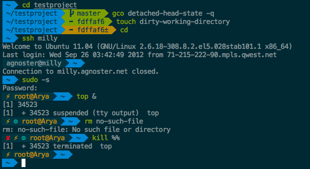
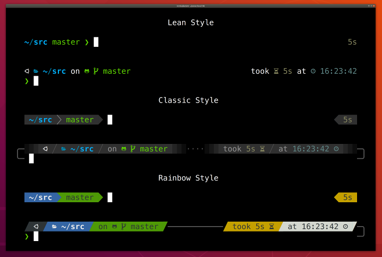

# Customizing Your Shell with Oh-My-Zsh: Color Schemes and Powerline

## Introduction to Shell Customization

The terminal is a powerful tool that many developers use daily. Customizing your shell can make it:

- More visually appealing
- Easier to read important information
- More efficient for your workflow

With Oh-My-Zsh already installed, you have access to a wealth of themes and plugins to enhance your terminal experience.

## Understanding Oh-My-Zsh Theme Structure

Oh-My-Zsh comes with many built-in themes that modify:

- Colors for different elements (commands, directories, errors)
- Prompt layout and information
- Special symbols and indicators

Themes are stored in the `~/.oh-my-zsh/themes/` directory, and each is a `.zsh-theme` file.

## Exploring and Changing Themes

Let's look at how to view available themes and change between them:

1. List available themes:

```bash
ls ~/.oh-my-zsh/themes/
```

2. To change your theme, edit the `.zshrc` file:

```bash
nano ~/.zshrc
```

3. Find the line that says:

```bash
ZSH_THEME="robbyrussell"
```

4. Change "robbyrussell" to the name of your preferred theme (without the .zsh-theme extension)

```bash
ZSH_THEME="gentoo"
```

5. Save the file and apply changes:

```bash
source ~/.zshrc
```

## Customizing the Prompt

Your prompt can display various useful information:

- Current user: `%n`
- Hostname: `%m`
- Current directory: `%~` (full path) or `%c` (just the current folder)
- Git branch: Using the git plugin
- Time: `%*` (24h) or `%T` (12h)
- Return status of last command: `%?`

### Example Prompt Customization

If you want to create a custom prompt without using a pre-built theme:

1. Edit your `.zshrc`:

```bash
nano ~/.zshrc
```

2. Add a custom PROMPT:

```bash
PROMPT='%F{green}%n@%m%f %F{blue}%~%f $(git_prompt_info) %# '
```

3. Customize colors:

```bash
# Syntax: %F{color}text%f
# color can be: black, red, green, yellow, blue, magenta, cyan, white
PROMPT='%F{cyan}%n%f@%F{yellow}%m%f %F{green}%~%f $(git_prompt_info) %# '
```

### Practical Examples

#### Server Admin Prompt

Highlights user, hostname, and path for server administration:

```bash
# Add to your .zshrc file
PROMPT='%F{red}%n@%m%f %F{yellow}%~%f %# '
```

This creates a prompt that looks like:

```bash
root@server-name /var/log #
```

#### Developer Prompt

Shows project directory, Git branch, and time:

```bash
# Add to your .zshrc file
# Requires the git plugin to be enabled
autoload -Uz vcs_info
precmd() { vcs_info }
zstyle ':vcs_info:git:*' formats '%b'
PROMPT='%F{blue}%~%f %F{green}${vcs_info_msg_0_}%f %F{cyan}%*%f %# '
```

This creates a prompt that looks like:

```bash
~/dev/project feature-branch 14:42 $
```

## Popular Oh-My-Zsh Themes

Let's look at some popular themes:

### Robbyrussell (Default)

Simple, informative, and clean:

```bash
➜ ~/projects git:(master) ✗
```

### Agnoster

[Agnoster](https://github.com/agnoster/agnoster-zsh-theme) has rich information with visual separators:



### Powerlevel10k

[Powerlevel10k](https://github.com/romkatv/powerlevel10k) is highly customizable with excellent performance:



## Installing Powerline Fonts

Many advanced themes use special symbols that require Powerline fonts:

1. Clone the Powerline fonts repository:

```bash
git clone https://github.com/powerline/fonts.git --depth=1
```

2. Install the fonts:

```bash
cd fonts
./install.sh
```

3. Clean up:

```bash
cd ..
rm -rf fonts
```

4. Configure your terminal to use a Powerline font:

   - Open your terminal preferences
   - Select a font that ends with "for Powerline" (e.g., "DejaVu Sans Mono for Powerline")

## Installing and Configuring Powerlevel10k

Powerlevel10k is a highly recommended theme with excellent features:

1. Install the theme:

```bash
git clone --depth=1 https://github.com/romkatv/powerlevel10k.git ${ZSH_CUSTOM:-$HOME/.oh-my-zsh/custom}/themes/powerlevel10k
```

2. Set it as your theme in `.zshrc`:

```bash
ZSH_THEME="powerlevel10k/powerlevel10k"
```

3. Restart your terminal or run:

```bash
source ~/.zshrc
```

4. Follow the configuration wizard that appears

## Common Prompt Segments with Powerlevel10k

With Powerlevel10k, you can customize which segments appear in your prompt:

```bash
# Add to .zshrc
POWERLEVEL9K_LEFT_PROMPT_ELEMENTS=(
  dir                     # Current directory
  vcs                     # Git status
)

POWERLEVEL9K_RIGHT_PROMPT_ELEMENTS=(
  status                  # Exit code of the last command
  command_execution_time  # Duration of the last command
  time                    # Current time
)
```

## Color Schemes for Your Terminal

Beyond Oh-My-Zsh themes, you can also set up color schemes for your terminal emulator:

1. Popular color schemes:
   - Solarized (Light/Dark)
   - Dracula
   - Nord
   - Monokai
   - Gruvbox

2. For iTerm2 (Mac):
   - Go to Preferences > Profiles > Colors
   - Import color presets or select from dropdown

3. For GNOME Terminal (Linux):
   - Install a theme manager like Gogh:

   ```bash
   bash -c "$(curl -sLo- https://git.io/vQgMr)"
   ```

## Putting It All Together

Let's create a complete customization:

1. Choose and set a theme in `.zshrc`:

```
ZSH_THEME="agnoster"
```

2. Ensure you have a compatible font set in your terminal

3. Customize your terminal's color scheme

4. Source your changes:

```bash
source ~/.zshrc
```

## Troubleshooting Common Issues

### Broken Characters or Boxes

- Make sure you've installed and selected a Powerline font
- Check that your terminal supports Unicode characters

### Slow Prompt

- Some themes can slow down your terminal
- Consider using Powerlevel10k which is optimized for speed
- Reduce the number of elements in your prompt

### Colors Not Working

- Verify your terminal supports the colors you're trying to use
- Some terminals require additional configuration for 256 colors:

```bash
export TERM="xterm-256color"
```

## Quiz

1. What file do you need to edit to change your Oh-My-Zsh theme?
   a) ~/.zsh
   b) ~/.zshrc
   c) ~/.oh-my-zsh/config
   d) ~/.bash_profile

2. What are Powerline fonts used for in shell customization?
   a) To make text appear larger
   b) To render special characters and symbols used by themes
   c) To improve terminal performance
   d) To change the color of the terminal background

3. After changing your theme in the configuration file, what command should you run to apply changes?
   a) zsh --reload
   b) source ~/.zshrc
   c) oh-my-zsh update
   d) restart terminal

4. Which Oh-My-Zsh theme is known for its high customizability and performance?
   a) Agnoster
   b) Robbyrussell
   c) Powerlevel10k
   d) Spaceship

**Answers:**

1. b) ~/.zshrc
2. b) To render special characters and symbols used by themes
3. b) source ~/.zshrc
4. c) Powerlevel10k

## Resources

- [Oh-My-Zsh GitHub Repository](https://github.com/ohmyzsh/ohmyzsh)
- [Powerlevel10k GitHub Repository](https://github.com/romkatv/powerlevel10k)
- [Powerline Fonts GitHub Repository](https://github.com/powerline/fonts)
- [Nerd Fonts (More Symbol Fonts)](https://www.nerdfonts.com/)
- [Terminal Color Schemes Collection](https://github.com/mbadolato/iTerm2-Color-Schemes)